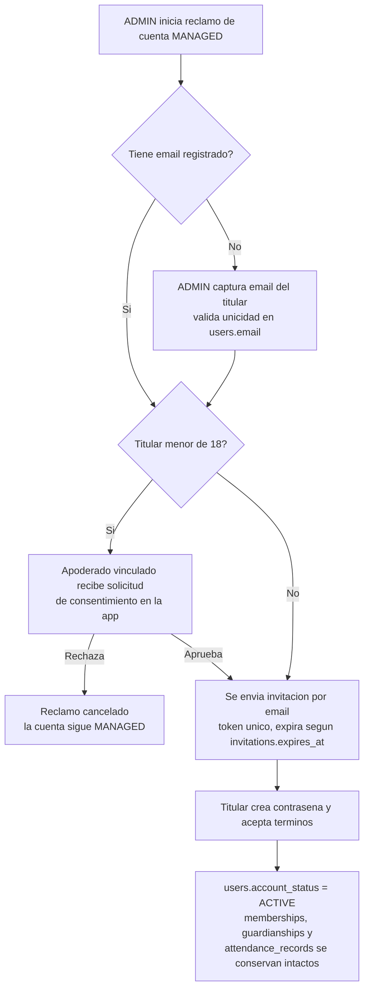

# Roles y permisos

**Proyecto:** Asisteam · **Fecha:** 2026-07-03 · **Documentos relacionados:** 01-vision-y-alcance.md, 03-modulos-y-flujos.md, 04-modelo-de-datos.md, 07-api-y-backend.md, 08-reportes-y-estadisticas.md, 10-historias-de-usuario.md, 11-legal-seguridad-privacidad.md

Este documento define el modelo de autorización de Asisteam: los tres roles del MVP, la matriz completa de permisos por acción, las reglas especiales para menores de edad, las reglas de visibilidad de asistencia y los casos borde que la implementación debe resolver de forma verificable.

## 1. Modelo de roles

Los roles se asignan **por membresía en cada grupo (club/equipo)**, nunca de forma global: la tabla `memberships` tiene una fila por combinación única `(user_id, group_id, role)`. Un usuario puede tener roles distintos en grupos distintos y más de un rol en el mismo grupo (una fila de `membership` por rol). Cuando un usuario acumula varios roles en un grupo, sus permisos efectivos son la **unión** de los permisos de cada rol (ver CB-01).

| Rol (`memberships.role`) | Nombre visible | Descripción | Alcance |
|---|---|---|---|
| `ADMIN` | Administrador | Gestiona el grupo: configuración, integrantes, apoderados, actividades, asistencia y reportes. En el MVP es el único rol que toma y edita asistencia. | [P0] |
| `ATHLETE` | Deportista/Integrante | Es convocado a actividades; consulta sus grupos, actividades, historial y porcentaje propio. | [P0] |
| `GUARDIAN` | Apoderado | Adulto responsable de uno o más deportistas menores de edad (`guardianships`); consulta perfil, actividades e historial de sus pupilos. | [P0] |
| `COACH` | Entrenador | Rol con permisos limitados (tomar asistencia sin administrar el grupo). **No existe en el MVP.** | [P2] |

Estados de cuenta (`users.account_status`): `ACTIVE` (credenciales propias), `INVITED` (creada por invitación por email, pendiente de completar registro), `MANAGED` (gestionada por un ADMIN, sin credenciales; típica para menores).

## 2. Matriz de permisos

Valores: **Sí** / **No** / **Cond. (Cn)** (condicional, ver notas al pie) / **N/A** (la acción no tiene sentido para el rol). Salvo indicación, todas las acciones son [P0] y operan solo dentro de los grupos donde el usuario tiene una `membership` con estado `ACTIVE`.

| # | Acción | ADMIN | ATHLETE | GUARDIAN | Alcance |
|---|---|---|---|---|---|
| 1 | Crear grupo (quien crea recibe `membership` ADMIN `ACTIVE`) | Sí (C1) | Sí (C1) | Sí (C1) | [P0] |
| 2 | Editar configuración del grupo (`name`, `sport`, `description`, `logo_url`) | Sí | No | No | [P0] |
| 3 | Configurar toggles de visibilidad (`settings.athletes_can_view_group_stats`, `settings.guardians_can_view_group_stats`) | Sí | No | No | [P0] |
| 4 | Eliminar grupo | Cond. (C2) | No | No | [P0] |
| 5 | Generar/regenerar `invite_code` del grupo | Sí | No | No | [P0] |
| 6 | Ver y compartir el `invite_code` | Sí | No | No | [P0] |
| 7 | Unirse a un grupo por código/enlace (siempre como ATHLETE) | Sí (C3) | Sí (C3) | No | [P0] |
| 8 | Invitar por email con rol específico (ATHLETE o GUARDIAN) | Sí | No | No | [P0] |
| 9 | Aprobar membresías `PENDING` (menores incorporados por código) | Sí | No | No | [P0] |
| 10 | Crear cuentas gestionadas (`account_status = MANAGED`) | Sí | No | No | [P0] |
| 11 | Iniciar conversión de cuenta MANAGED a ACTIVE (invitación de reclamo) | Sí (C4) | No | Cond. (C4) | [P0] |
| 12 | Editar el perfil propio (`users.full_name`, `phone`, `avatar_url`) | Sí | Sí | Sí | [P0] |
| 13 | Editar el perfil de un integrante MANAGED de su grupo | Sí | No | Cond. (C5) | [P0] |
| 14 | Desactivar integrante (`membership.status → INACTIVE`) | Sí (C6) | No | No | [P0] |
| 15 | Reactivar integrante desactivado | Sí | No | No | [P0] |
| 16 | Agregar o quitar roles a un miembro del grupo (filas de `membership`) | Sí (C6) | No | No | [P0] |
| 17 | Promover a otro miembro a ADMIN | Sí | No | No | [P0] |
| 18 | Salir del grupo (propia `membership → INACTIVE`) | Cond. (C7) | Cond. (C8) | Cond. (C15) | [P0] |
| 19 | Registrar apoderado (invitación dirigida o registro directo) | Sí | No | No | [P0] |
| 20 | Vincular apoderado-pupilo (crear `guardianship`) | Sí | No | No | [P0] |
| 21 | Desvincular apoderado-pupilo (eliminar `guardianship`) | Sí (C9) | No | No | [P0] |
| 22 | Ver perfil básico del pupilo (nombre, grupos, actividades) | Sí | No | Sí (C10) | [P0] |
| 23 | Crear/editar/eliminar actividades (incl. recurrencia semanal simple) | Sí | No | No | [P0] |
| 24 | Crear/editar/desactivar tipos de actividad personalizados del grupo | Sí | No | No | [P0] |
| 25 | Ver calendario de actividades del grupo | Sí | Sí | Cond. (C10) | [P0] |
| 26 | Tomar asistencia (4 estados + nota opcional por deportista) | Sí | No | No | [P0] |
| 27 | Editar asistencia pasada (cambiar estado o nota de un `attendance_record`) | Sí | No | No | [P0] |
| 28 | Ver historial y porcentaje de asistencia propio | Cond. (C11) | Sí | N/A | [P0] |
| 29 | Ver historial y porcentaje de asistencia del pupilo | Sí | No | Sí (C10) | [P0] |
| 30 | Ver notas de asistencia individuales | Sí | Cond. (C12) | Cond. (C12) | [P0] |
| 31 | Ver reportes completos del grupo (por deportista, tipo de actividad, periodo) | Sí | No | No | [P0] |
| 32 | Ver estadísticas agregadas del grupo (nombre + % de cada integrante) | Sí | Cond. (C13) | Cond. (C14) | [P0] |
| 33 | Ver datos de contacto y fecha de nacimiento de otros usuarios del grupo | Sí | No | No | [P0] |
| 34 | Exportar reportes a CSV | Sí | No | No | [P1] |
| 35 | Recibir notificaciones push (recordatorio de actividad; aviso de ausencia del pupilo al apoderado) | Sí | Sí | Sí | [P1] |
| 36 | Justificación de inasistencias con flujo de solicitud/aprobación | Sí (aprueba) | Sí (solicita) | Sí (solicita por su pupilo) | [P2] |
| 37 | Autoregistro de asistencia con QR o geocerca | No | Sí | No | [P2] |

### Notas de condiciones

- **C1** — Crear grupo es una acción global disponible para cualquier usuario con `account_status = ACTIVE` (no depende de rol previo). Cuentas `INVITED` y `MANAGED` no pueden crear grupos. El creador queda registrado en `groups.created_by` y recibe automáticamente `membership` con `role = ADMIN`, `status = ACTIVE`.
- **C2** — Eliminar grupo exige confirmación escribiendo el nombre exacto del grupo. Es borrado lógico con retención de 30 días antes de la purga definitiva (ver 11-legal-seguridad-privacidad.md).
- **C3** — El código/enlace solo incorpora con rol ATHLETE. Adulto con cuenta `ACTIVE`: la membresía queda `ACTIVE` de inmediato. Menor de edad: queda `PENDING` hasta tener al menos un apoderado vinculado **y** confirmación del ADMIN (acción #9). Un ADMIN de otro grupo puede unirse por código como ATHLETE de este (soporte multi-grupo).
- **C4** — Solo el ADMIN inicia la invitación de reclamo. Si el titular es menor de edad, la activación requiere el consentimiento previo de un apoderado vinculado (aprobación registrada en la app); el GUARDIAN no inicia el flujo, solo otorga o deniega ese consentimiento. Detalle en CB-06.
- **C5** — El apoderado ve el perfil del pupilo pero **no lo edita** en el MVP; las correcciones se solicitan al ADMIN del grupo.
- **C6** — No aplicable sobre la última `membership` ADMIN `ACTIVE` del grupo: el sistema bloquea desactivar o quitarle el rol al último ADMIN (ver CB-05).
- **C7** — El último ADMIN del grupo no puede salir: primero debe promover a otro ADMIN (acción #17) o eliminar el grupo (acción #4).
- **C8** — Un ATHLETE adulto con cuenta `ACTIVE` sale libremente. Un ATHLETE menor de edad (cuenta `ACTIVE` o `MANAGED`) no puede salir por sí mismo: la baja la ejecuta el ADMIN, a solicitud del apoderado si corresponde.
- **C9** — No se puede eliminar el último `guardianship` de un ATHLETE menor de edad con membresía `ACTIVE` o `PENDING` en algún grupo: primero se vincula un apoderado de reemplazo o se desactiva la membresía del menor.
- **C10** — Solo respecto de pupilos con `guardianship` vigente (pupilo menor de 18 años) y solo en los grupos donde el pupilo tiene `membership` ATHLETE `ACTIVE`.
- **C11** — Un ADMIN solo tiene historial propio si además posee `membership` ATHLETE en el grupo (se le toma asistencia por esa membresía, ver CB-01).
- **C12** — Cada usuario ve las notas de **sus propios** registros de asistencia; el GUARDIAN, las de su pupilo. Nunca se ven notas de terceros (regla V5).
- **C13** — Requiere `groups.settings.athletes_can_view_group_stats = true` en ese grupo.
- **C14** — Requiere `groups.settings.guardians_can_view_group_stats = true` en ese grupo y `guardianship` vigente con al menos un pupilo miembro del grupo.
- **C15** — Un GUARDIAN no puede salir de un grupo mientras tenga un pupilo con `membership` ATHLETE `ACTIVE` o `PENDING` en él: su membresía GUARDIAN garantiza la regla V2 y solo se auto-crea al crear el `guardianship` o al aprobarse el ingreso del pupilo (ver CB-02), nunca tras una salida voluntaria. Queda libre de salir cuando el pupilo se desactiva o cumple 18 años. La API rechaza la auto-desactivación con 422 `guardian_has_active_wards` (ver 07-api-y-backend.md).

## 3. Reglas especiales para menores de edad

Menor de edad = menos de 18 años, calculado desde `users.birthdate` en zona horaria America/Santiago. `birthdate` es **obligatorio** para todo perfil con rol ATHLETE (sin fecha de nacimiento no se puede evaluar la regla de apoderado obligatorio ni la visibilidad del apoderado).

### 3.1 Creación y vínculo obligatorio con apoderado [P0]

- Todo ATHLETE menor de edad **debe** tener al menos un `guardianship` activo antes de que su membresía pase a `ACTIVE`. El sistema lo exige en los tres flujos de incorporación:
  1. **Por código/enlace:** el menor queda `PENDING`; la app le pide los datos de su apoderado (o el ADMIN los registra). Solo cuando existe el vínculo y el ADMIN confirma (acción #9), pasa a `ACTIVE`.
  2. **Por invitación dirigida:** el formulario de invitación a un menor exige indicar apoderado (existente en el grupo o nuevo, que recibe su propia invitación dirigida con rol GUARDIAN).
  3. **Cuenta gestionada:** el formulario exige vincular apoderado y declarar su autorización en el mismo flujo. El menor queda `PENDING`, fuera de asistencia, hasta que el apoderado acepte su invitación y otorgue `DATA_PROCESSING_MINOR` en la app; esa confirmación activa la membresía. El alta del ADMIN constituye su aprobación, sin un segundo paso de aprobación. Los adultos quedan `ACTIVE` de inmediato.
- Restricción verificable: la API rechaza toda transición de `membership` ATHLETE a `ACTIVE` si el usuario es menor y no existe al menos un `guardianship` activo **con consentimiento `DATA_PROCESSING_MINOR` vigente** en la tabla `consents` (fila con `revoked_at IS NULL`; ver 07-api-y-backend.md regla R1 y 11-legal-seguridad-privacidad.md §3.1-3.2 y checklist C-03).
- El GUARDIAN solo puede estar a cargo de menores de edad: no se puede crear un `guardianship` hacia un usuario con 18 años o más.

### 3.2 Cuentas gestionadas (MANAGED) [P0]

- Perfil creado por un ADMIN sin credenciales de acceso (`users.email` puede ser NULL). Uso típico: menores sin correo propio.
- El menor MANAGED no inicia sesión; su información la consultan el ADMIN (todo) y su apoderado (según reglas de visibilidad).
- Conversión a `ACTIVE`: por invitación por email + creación de contraseña, con consentimiento del apoderado si sigue siendo menor (ver CB-06).

### 3.3 Quién acepta términos y condiciones [P0]

| Situación | Quién acepta / consiente | Registro |
|---|---|---|
| Adulto se registra (cualquier rol) | El propio usuario acepta términos y política de privacidad | Timestamp + versión aceptada |
| Menor activa cuenta por invitación | El menor acepta las condiciones de uso **y** un apoderado vinculado otorga consentimiento para el tratamiento de sus datos antes de habilitar credenciales | Consentimiento del apoderado con timestamp, en la app |
| ADMIN crea cuenta MANAGED de un menor | El ADMIN declara contar con autorización del apoderado (checkbox obligatorio); el apoderado **ratifica** en «Consentimientos de mis pupilos» tras aceptar su invitación dirigida | Declaración del ADMIN separada del consentimiento versionado del apoderado; hasta ratificar, ATHLETE permanece PENDING |

Marco: Ley 19.628 y Ley 21.719 (vigencia diciembre 2026), con estándar tipo GDPR para datos de menores. Detalle en 11-legal-seguridad-privacidad.md.

### 3.4 Transición al cumplir 18 años [P0]

Un job diario (00:30 America/Santiago) detecta deportistas que cumplen 18 según `users.birthdate` y aplica:

1. Los `guardianships` hacia ese usuario dejan de otorgar visibilidad. El job persiste la transición: `UPDATE guardianships SET status = 'INACTIVE', deactivated_at = now()` para los pupilos que cumplen 18 (columnas definidas en 04-modelo-de-datos.md §2.4); la fila se conserva como histórico, no se elimina. Como defensa en profundidad entre ejecuciones del job, la verificación de permisos también evalúa la edad desde `users.birthdate`, pero la fuente persistida es `guardianships.status`.
2. El ex-apoderado deja de ver perfil, actividades, historial y estadísticas del ex-pupilo desde ese día. Si su `membership` GUARDIAN en un grupo quedó sin pupilos vigentes, pasa a `INACTIVE`.
3. Se notifica por email al deportista y al apoderado [P0]; push [P1].
4. Si la cuenta es `MANAGED` al cumplir 18: se notifica al ADMIN para que inicie el reclamo de cuenta (CB-06); mientras tanto el ADMIN mantiene la gestión y el ex-apoderado ya no ve los datos.
5. Membresías `PENDING` de un menor que cumple 18: deja de exigirse apoderado; sigue pendiente solo la confirmación del ADMIN.

## 4. Reglas de visibilidad de asistencia

Las seis reglas canónicas (V1-V6), con su comportamiento exacto en pantalla. Todas son [P0].

- **V1 — ATHLETE siempre ve lo propio.** Sus grupos, las actividades de sus grupos y su propio historial y porcentaje de asistencia (métrica canónica: `(PRESENT + LATE) / (convocadas − EXCUSED) × 100`, 1 decimal; filtros semana/mes/rango/temporada, ver 08-reportes-y-estadisticas.md). Esto no depende de ningún toggle.
- **V2 — GUARDIAN siempre ve a sus pupilos.** Perfil, actividades e historial de asistencia de cada pupilo vigente, en los grupos donde el pupilo es miembro. Tampoco depende de toggles.
- **V3 — GUARDIAN solo de menores.** Al cumplir el pupilo 18 años el vínculo pasa a inactivo (sección 3.4) y el deportista gestiona su propia cuenta.
- **V4 — Estadísticas agregadas del grupo por toggle.** Con `athletes_can_view_group_stats = true`, los ATHLETE ven la tabla/gráfico agregado del grupo (nombre de cada integrante + porcentaje de asistencia y totales). Ídem `guardians_can_view_group_stats` para GUARDIAN. Toggles independientes, por grupo, por defecto `false`.
- **V5 — Datos que NUNCA ve un no-ADMIN**, aunque los toggles estén activos: datos de contacto de otros usuarios (`email`, `phone`), fechas de nacimiento, notas de asistencia individuales de terceros, datos de apoderados de terceros. Solo nombre + métricas agregadas.
- **V6 — Aislamiento entre grupos.** ADMIN ve todo dentro de sus grupos. Nadie ve nada de grupos donde no es miembro; toda consulta valida la `membership ACTIVE` del solicitante en el `group_id` consultado.

### 4.1 Ejemplo: deportista con toggle off vs on

Grupo "Atlético Ñuñoa", deportista Martina (ATHLETE, adulta). En junio fue convocada a 10 actividades: 7 `PRESENT`, 1 `LATE`, 1 `ABSENT`, 1 `EXCUSED`. Su porcentaje: (7+1)/(10−1) = **88,9%**, con 1 atraso reportado aparte como indicador de puntualidad.

| Pantalla | `athletes_can_view_group_stats = false` (defecto) | `= true` |
|---|---|---|
| Calendario del grupo | Sí, completo | Sí, completo |
| Historial propio | Sí: cada actividad con su estado, notas propias y 88,9% | Igual |
| Reportes del grupo | Solo sus propias métricas; sin datos de terceros | Además, tabla agregada: una fila por integrante con nombre y % (ej.: "Benjamín Rojas — 92,3%"), totales del grupo y desglose por tipo de actividad |
| Lo que nunca ve | Emails, teléfonos, fechas de nacimiento, notas de terceros, apoderados de terceros | Igual: solo nombre + métricas |

### 4.2 Ejemplo: apoderado con toggle off vs on

Carmen es GUARDIAN de Benjamín (14 años, ATHLETE del mismo grupo).

| Pantalla | `guardians_can_view_group_stats = false` (defecto) | `= true` |
|---|---|---|
| Datos de Benjamín | Siempre (V2): perfil básico, calendario, historial con estados y notas de Benjamín, su % | Igual |
| Reportes del grupo | Solo métricas de Benjamín | Además, la misma tabla agregada del grupo (nombres + %) |
| Otros deportistas | Nada individual | Solo nombre + métricas agregadas; jamás contacto, nacimiento ni notas |
| Aviso de ausencia | — | Push cuando Benjamín es marcado `ABSENT` [P1] |

Si el grupo activa el toggle de deportistas pero no el de apoderados, Martina ve la tabla agregada y Carmen no (toggles independientes).

## 5. Casos borde

### CB-01 — Usuario con múltiples roles en un mismo grupo

Ej.: Rodrigo es ADMIN y también juega (ATHLETE) en "Atlético Ñuñoa". Se modela con **dos filas** de `memberships` (`ADMIN` y `ATHLETE`). Sus permisos efectivos son la unión (opera como ADMIN en toda la app). Aparece en la lista de toma de asistencia por su membresía ATHLETE y su historial propio se calcula sobre ella (`attendance_records.membership_id` referencia siempre la membresía ATHLETE, nunca la ADMIN). Puede editar sus propios registros de asistencia (es ADMIN); la auditoría completa de cambios es [P2].

### CB-02 — Apoderado con pupilos en distintos grupos

Carmen tiene un `guardianship` por pupilo (única por `(guardian_user_id, athlete_user_id)`; el vínculo es por persona, no por grupo). Para cumplir a la vez V2 ("siempre ve a sus pupilos") y V6 ("nadie ve grupos donde no es miembro"), el sistema **crea automáticamente** la `membership` GUARDIAN `ACTIVE` de Carmen en cada grupo donde un pupilo suyo tiene membresía ATHLETE activa, tanto al crear el vínculo como cuando el pupilo entra a un grupo nuevo (equivale a registro directo del ADMIN que aprueba al menor; los GUARDIAN nunca entran por código). Como contraparte, Carmen no puede salir de un grupo mientras tenga ahí un pupilo con membresía ATHLETE `ACTIVE` o `PENDING` (condición C15): la membresía GUARDIAN no se recrea tras una salida voluntaria. En su inicio, Carmen ve una sección por pupilo y por grupo; las estadísticas agregadas se evalúan con el toggle de **cada** grupo por separado.

### CB-03 — Deportista en varios grupos

Martina es ATHLETE en "Atlético Ñuñoa" y en "Club de Corredores Maipú": una membresía por grupo, independientes. Historial y porcentaje se calculan **por grupo** (el periodo "temporada" es todo el historial de ese grupo); nunca se mezclan métricas entre grupos ni existe un porcentaje global en el MVP. Un `EXCUSED` en un grupo no afecta el denominador del otro. La membresía de un grupo puede quedar `INACTIVE` sin tocar las demás.

### CB-04 — Apoderado que además es deportista adulto del mismo grupo

Pedro (adulto) entrena en el grupo y es apoderado de su hija Sofía (12): dos filas de `membership` (`ATHLETE` y `GUARDIAN`) más el `guardianship` hacia Sofía. Ve su propio historial por V1 y el de Sofía por V2. Los toggles se evalúan por rol y los permisos se unen: con `athletes_can_view_group_stats = true` y `guardians_can_view_group_stats = false`, Pedro ve la tabla agregada (le basta su rol ATHLETE). Se le toma asistencia solo por su membresía ATHLETE; Sofía tiene la suya propia.

### CB-05 — Último ADMIN del grupo

Invariante: todo grupo activo tiene **al menos una** `membership` ADMIN `ACTIVE`. La API rechaza (HTTP 409, código `LAST_ADMIN`) que el último ADMIN: salga del grupo, pase su membresía ADMIN a `INACTIVE`, o elimine su fila de rol ADMIN; la UI deshabilita esas opciones con el mensaje "Eres el único administrador: promueve a otro administrador o elimina el grupo". Salidas válidas: promover a otro miembro a ADMIN (acción #17) y luego salir, o eliminar el grupo (acción #4). La eliminación de la cuenta del último ADMIN (derecho de supresión, ver 11-legal-seguridad-privacidad.md) exige resolver antes esta condición.

### CB-06 — Deportista MANAGED que reclama su cuenta

Puntos verificables: (a) el `user.id` no cambia, por lo que todo el historial (`attendance_records` vía `membership_id`) se conserva; (b) si el titular es menor, el `guardianship` sigue vigente tras la activación y el apoderado mantiene visibilidad hasta los 18; (c) si el email capturado ya pertenece a otra cuenta, el flujo se detiene y el caso de fusión de cuentas queda fuera del MVP (se resuelve por soporte); (d) el token de invitación es de un solo uso y expira (`invitations.status → EXPIRED`).

## 6. Resumen de referencias

- Flujos completos de incorporación y toma de asistencia: 03-modulos-y-flujos.md.
- Esquema de tablas y restricciones de unicidad: 04-modelo-de-datos.md.
- Validación de permisos en la API (middleware por `group_id` + rol): 07-api-y-backend.md.
- Métrica de asistencia y reportes condicionados por toggles: 08-reportes-y-estadisticas.md.
- Consentimiento, datos de menores y derechos ARCO: 11-legal-seguridad-privacidad.md.
