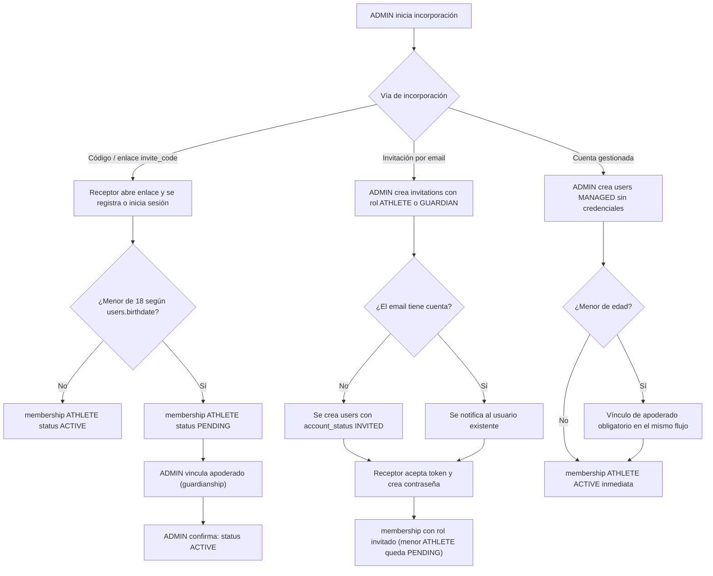
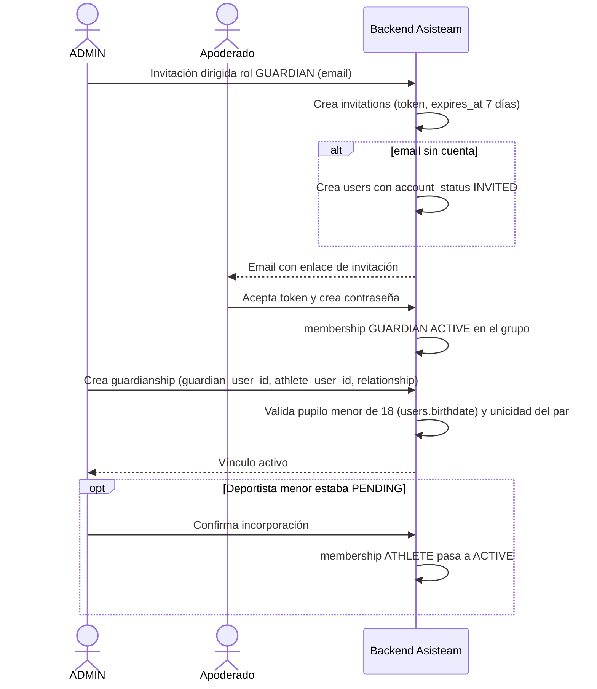
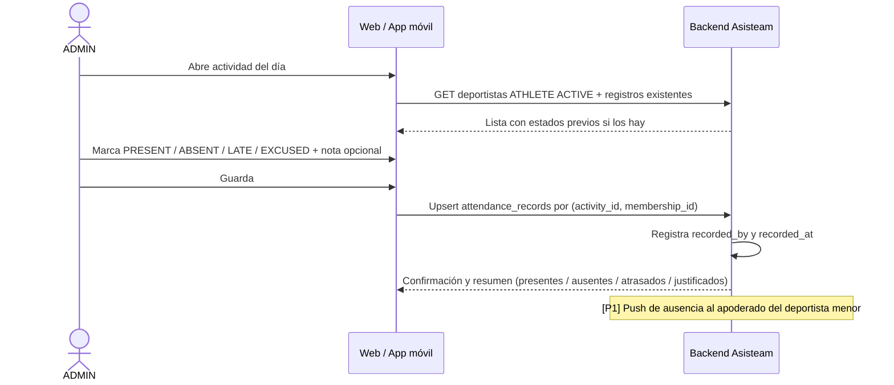
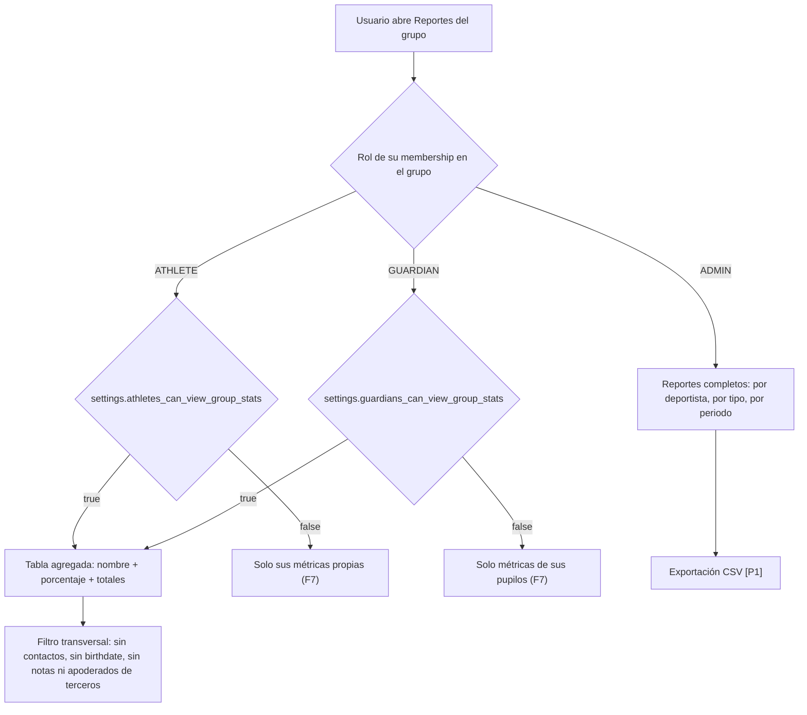

# Módulos principales y flujos de usuario

> **Proyecto:** Asisteam · **Fecha:** 2026-07-03 · **Documentos relacionados:** 01-vision-y-alcance.md, 02-roles-y-permisos.md, 04-modelo-de-datos.md, 05-pantallas.md, 07-api-y-backend.md, 08-reportes-y-estadisticas.md, 10-historias-de-usuario.md

Este documento descompone Asisteam en **9 módulos funcionales (M1–M9)** y describe los **8 flujos de usuario nucleares (F1–F8)**. Toda funcionalidad lleva su etiqueta de alcance [P0]/[P1]/[P2] según el canon del producto. Los identificadores técnicos (tablas, campos, estados) corresponden al modelo definido en 04-modelo-de-datos.md.

---

## Parte 1 — Módulos

### M1. Autenticación y registro

**Responsabilidad:** gestionar la identidad del usuario, sus credenciales, la sesión y el ciclo de vida de la cuenta (`users.account_status`: `ACTIVE | INVITED | MANAGED`). Es la puerta de entrada de toda la plataforma.

**Funciones clave:**

- Registro con email + contraseña, con validación de email único en `users.email` [P0].
- Login con email + contraseña y emisión de sesión/token [P0].
- Recuperación de contraseña por email (token de un solo uso, vigencia 60 minutos) [P0].
- Perfil básico: edición de `full_name`, `phone`, `birthdate`, `avatar_url` [P0].
- Activación de cuenta `INVITED`: el usuario acepta la invitación (token de `invitations`), crea contraseña y pasa a `ACTIVE` [P0].
- Conversión de cuenta `MANAGED` a `ACTIVE`: invitación por email + creación de contraseña; si el titular es menor de edad, requiere consentimiento del apoderado vinculado (ver 11-legal-seguridad-privacidad.md) [P0].
- Login social Google/Apple [P2].

**Dependencias:** ninguna entrante (módulo base). Todos los demás módulos dependen de M1 para identificar al actor.

### M2. Gestión de grupos

**Responsabilidad:** ciclo de vida del grupo (club/equipo): creación, configuración, código de invitación y soporte multi-grupo.

**Funciones clave:**

- Crear grupo con `name`, `sport`, `description`, `logo_url`; el creador queda con membership `ADMIN` `ACTIVE` automática [P0].
- Editar datos del grupo (solo ADMIN) [P0].
- Generar y regenerar `invite_code` único (regenerar invalida el código anterior) [P0].
- Selector multi-grupo: un usuario navega entre todos los grupos donde tiene membership, con el rol correspondiente en cada uno [P0].
- Panel multi-club para federaciones [P2].

**Dependencias:** M1 (usuario autenticado). Provee contexto de grupo a M3–M9.

### M3. Gestión de integrantes

**Responsabilidad:** administrar las `memberships` del grupo: altas, invitaciones, estados (`INVITED | PENDING | ACTIVE | INACTIVE`) y cuentas gestionadas.

**Funciones clave:**

- CRUD de integrantes del grupo: listar, ver ficha, editar datos gestionados, desactivar (membership a `INACTIVE`, nunca borrado físico si existen `attendance_records`) [P0].
- Incorporación por código/enlace `invite_code` (solo rol ATHLETE) [P0].
- Invitación dirigida por email con rol específico ATHLETE o GUARDIAN (`invitations` con `token` único y `expires_at`) [P0].
- Creación de cuentas gestionadas (`account_status = MANAGED`, sin credenciales; membership `ACTIVE` inmediata) [P0].
- Regla de menores: todo ATHLETE con menos de 18 años (según `users.birthdate`) debe tener al menos una `guardianship` activa antes de quedar `ACTIVE`; el sistema bloquea la activación si no se cumple [P0].
- Reenvío y expiración de invitaciones (`status` `PENDING → ACCEPTED | EXPIRED`) [P0].
- Rol COACH con permisos limitados [P2].

**Dependencias:** M1 (cuentas), M2 (grupo e `invite_code`), M4 (validación de apoderado para menores).

### M4. Gestión de apoderados

**Responsabilidad:** administrar los vínculos apoderado–deportista (`guardianships`) y el acceso del rol GUARDIAN.

**Funciones clave:**

- Registro de apoderado por invitación dirigida o creación directa del ADMIN; los GUARDIAN **nunca** entran por código de grupo [P0].
- Crear vínculo `guardianship` (`guardian_user_id`, `athlete_user_id`, `relationship`); único por par apoderado–deportista [P0].
- Validación: solo se permite vincular pupilos menores de 18 años; al cumplir 18, el vínculo pasa a inactivo y el deportista gestiona su propia cuenta (transición detallada en 02-roles-y-permisos.md y 11-legal-seguridad-privacidad.md) [P0].
- Un apoderado puede tener varios pupilos, incluso en grupos distintos; un pupilo puede tener más de un apoderado [P0].
- Vista del apoderado: perfil, actividades e historial de asistencia de sus pupilos [P0].

**Dependencias:** M1, M3 (membership GUARDIAN en el grupo), alimenta a M7/M8 (visibilidad del apoderado) y M9 (reglas de visibilidad).

### M5. Gestión de actividades

**Responsabilidad:** CRUD de `activities` y de `activity_types`, incluida la recurrencia semanal simple.

**Funciones clave:**

- Crear/editar/eliminar actividades: `title`, `description`, `location`, `starts_at`, `ends_at`, `activity_type_id` (solo ADMIN) [P0].
- Tipos de sistema sembrados: `TRAINING`, `PHYSICAL_PREP`, `COMPETITION`, `MEETING`; tipos personalizados por grupo (`activity_types.group_id`) con `name`, `color`, `is_active` [P0].
- Recurrencia semanal simple (`recurrence_rule`: días de semana + fecha fin); se materializan instancias individuales en `activities` [P0].
- Edición de serie recurrente con opciones "solo esta actividad" o "esta y las futuras" [P0].
- Calendario/agenda de actividades del grupo, visible para todos los roles del grupo [P0].
- Notificación push de recordatorio de actividad [P1].

**Dependencias:** M2 (grupo), M1 (`created_by`). Provee la base de convocatoria a M6, M7 y M8.

### M6. Registro de asistencia

**Responsabilidad:** toma y edición de asistencia por actividad (`attendance_records`), única por `(activity_id, membership_id)`.

**Funciones clave:**

- Toma de asistencia: lista de deportistas `ACTIVE` del grupo con los 4 estados `PRESENT | ABSENT | LATE | EXCUSED` + `note` opcional por deportista (solo ADMIN) [P0].
- Atajo "marcar todos como presentes" y ajuste individual posterior [P0].
- Guardado como upsert: se registra `recorded_by` y `recorded_at`; los deportistas sin estado marcado no generan registro (no se asume ABSENT automático) [P0].
- Edición posterior de cualquier registro por ADMIN, sin límite de tiempo en MVP [P0].
- Toma de asistencia desde la app móvil [P1].
- Aviso push de ausencia al apoderado del deportista menor [P1].
- Justificación de inasistencias con flujo solicitud/aprobación [P2]; modo offline con sincronización [P2]; autoregistro con QR o geocerca [P2]; auditoría completa de cambios [P2].

**Dependencias:** M5 (actividad), M3 (memberships ATHLETE), M1 (`recorded_by`). Alimenta a M7 y M8.

### M7. Historial de asistencia

**Responsabilidad:** consulta cronológica de registros de asistencia a nivel individual, según el rol del consultante.

**Funciones clave:**

- Historial individual del deportista: lista de actividades con estado, nota (solo visible para el propio deportista, su apoderado y el ADMIN), tipo de actividad y fecha en hora local America/Santiago [P0].
- Filtros por periodo (semana, mes, rango personalizado, temporada) y por tipo de actividad [P0].
- Vistas por rol: ATHLETE ve su propio historial; GUARDIAN el de sus pupilos; ADMIN el de cualquier integrante de sus grupos [P0].
- Porcentaje de asistencia individual del periodo filtrado, con la métrica canónica (ver 08-reportes-y-estadisticas.md) [P0].

**Dependencias:** M6 (registros), M4 (vínculo apoderado–pupilo), M9 (reglas de visibilidad).

### M8. Reportes y estadísticas

**Responsabilidad:** métricas agregadas del grupo y por deportista. Fórmula canónica: `(PRESENT + LATE) / (convocadas − EXCUSED) × 100`, redondeo a 1 decimal; los LATE se reportan aparte como indicador de puntualidad.

**Funciones clave:**

- Reportes del grupo para ADMIN: porcentaje por deportista, por tipo de actividad y por periodo (semana, mes, rango personalizado, temporada) [P0].
- Pantalla de reportes para ATHLETE/GUARDIAN condicionada por los toggles de visibilidad de M9: tabla/gráfico con nombre de cada integrante + porcentaje y totales, sin datos sensibles de terceros [P0].
- Indicador de puntualidad (conteo y proporción de LATE) por deportista [P0].
- Exportación CSV de reportes [P1].
- Ranking gamificado [P2].

**Dependencias:** M6 (datos), M7 (drill-down individual), M9 (condiciones de acceso).

### M9. Configuración de privacidad/visibilidad

**Responsabilidad:** administrar los toggles de `groups.settings` y hacer cumplir de forma transversal las 6 reglas de visibilidad del canon.

**Funciones clave:**

- Toggles independientes por grupo: `athletes_can_view_group_stats` y `guardians_can_view_group_stats` (JSONB en `groups.settings`), ambos `false` por defecto; solo ADMIN los edita [P0].
- Enforcement transversal: aunque los toggles estén activos, nunca se expone a no-ADMIN datos de contacto, `birthdate`, notas de asistencia de terceros ni datos de apoderados de terceros [P0].
- Garantía de aislamiento multi-tenant: nadie ve nada de grupos donde no es miembro (se aplica en la capa API, ver 07-api-y-backend.md) [P0].

**Dependencias:** M2 (settings del grupo). Es dependencia transversal de M7 y M8.

### Tabla resumen de dependencias entre módulos

| Módulo | Depende de | Es requerido por |
|---|---|---|
| M1 Autenticación y registro | — | M2–M9 (identidad del actor) |
| M2 Gestión de grupos | M1 | M3, M5, M9 |
| M3 Gestión de integrantes | M1, M2, M4 | M5, M6, M7, M8 |
| M4 Gestión de apoderados | M1, M3 | M3 (activación de menores), M7, M8, M9 |
| M5 Gestión de actividades | M1, M2 | M6, M7, M8 |
| M6 Registro de asistencia | M1, M3, M5 | M7, M8 |
| M7 Historial de asistencia | M4, M6, M9 | M8 (drill-down) |
| M8 Reportes y estadísticas | M6, M7, M9 | — |
| M9 Configuración de privacidad/visibilidad | M2 | M7, M8 |

---

## Parte 2 — Flujos de usuario

### F1. Registro de usuario [P0]

**Actor:** persona sin cuenta (futuro ADMIN, ATHLETE adulto o GUARDIAN).
**Precondiciones:** email no registrado en `users.email`.

1. El usuario abre la web y elige "Crear cuenta".
2. Ingresa `full_name`, `email`, contraseña y opcionalmente `phone` y `birthdate`.
3. El sistema valida unicidad del email y fortaleza mínima de la contraseña.
4. Se crea `users` con `account_status = ACTIVE` y se inicia sesión.
5. Pantalla de inicio sin grupos: se ofrece "Crear un grupo" o "Unirme con un código".

**Resultado:** cuenta `ACTIVE` con sesión iniciada, sin memberships aún.
**Variantes:** si el usuario llega desde un enlace de invitación o un `invite_code`, tras registrarse continúa automáticamente en F3. La recuperación de contraseña [P0] reutiliza este módulo: email con token de un solo uso (60 min) y formulario de nueva contraseña.

### F2. Creación de grupo [P0]

**Actor:** usuario autenticado (pasa a ser ADMIN del grupo).
**Precondiciones:** sesión activa.

1. El usuario elige "Crear grupo (club/equipo)".
2. Completa `name`, `sport`, `description` y opcionalmente `logo_url`.
3. El sistema crea `groups` con `invite_code` único autogenerado y `settings` por defecto (`athletes_can_view_group_stats = false`, `guardians_can_view_group_stats = false`).
4. Se crea la membership del creador: rol `ADMIN`, `status = ACTIVE`.
5. Se muestra el panel del grupo con el `invite_code` y accesos a invitar integrantes (F3) y crear actividades (F5).

**Resultado:** grupo operativo con un ADMIN; el creador puede además agregarse una membership `ATHLETE` en el mismo grupo si también entrena (una fila de membership por rol).

### F3. Invitación e incorporación de integrantes [P0]

**Actor:** ADMIN (emisor) y usuario incorporado (receptor).
**Precondiciones:** grupo creado; el ADMIN tiene membership `ADMIN` `ACTIVE`.

**Variante A — Código/enlace de grupo (solo ATHLETE):**

1. El ADMIN comparte el `invite_code` o el enlace `/join/{invite_code}`.
2. El receptor abre el enlace; si no tiene cuenta, completa F1 primero.
3. El sistema calcula la edad desde `users.birthdate` (si falta, la solicita en este paso).
4. Adulto: se crea membership `ATHLETE` con `status = ACTIVE`. Menor: queda `PENDING`.
5. Para el menor `PENDING`: el ADMIN vincula al menos un apoderado (F4) y luego confirma la incorporación; la membership pasa a `ACTIVE`.

**Variante B — Invitación dirigida por email (ATHLETE o GUARDIAN):**

1. El ADMIN ingresa email y rol; el sistema crea `invitations` (`token` único, `status = PENDING`, `expires_at` = 7 días).
2. Si el email no existe en `users`, se crea la cuenta con `account_status = INVITED`.
3. El receptor recibe el email, abre el enlace con token, crea contraseña (si era `INVITED`) o inicia sesión.
4. Al aceptar: `invitations.status = ACCEPTED`, se crea membership con el rol invitado y `status = ACTIVE` (menor ATHLETE: `PENDING` hasta cumplir la regla de apoderado, como en la variante A).

**Variante C — Cuenta gestionada (típico para menores):**

1. El ADMIN elige "Agregar integrante sin cuenta" e ingresa `full_name` y `birthdate` (email opcional).
2. Se crea `users` con `account_status = MANAGED` y membership `ATHLETE` `ACTIVE` inmediata.
3. Si es menor de edad, el mismo formulario **obliga** a vincular al menos un apoderado (F4) antes de guardar.
4. Posteriormente [P0], el perfil MANAGED puede convertirse a `ACTIVE` por invitación email + contraseña, con consentimiento del apoderado si es menor.

**Resultado:** membership creada en el estado correcto según variante y edad; los GUARDIAN solo pueden entrar por la variante B o por registro directo del ADMIN, nunca por código.

### F4. Asociación apoderado–deportista menor [P0]

**Actor:** ADMIN (crea el vínculo); apoderado (acepta invitación si no tiene cuenta).
**Precondiciones:** el deportista existe como `users` (ACTIVE, INVITED, MANAGED o PENDING en el grupo) y es menor de 18 años.

1. Desde la ficha del deportista menor, el ADMIN elige "Vincular apoderado".
2. Si el apoderado no tiene cuenta: el ADMIN lo invita por email con rol GUARDIAN (variante B de F3) o crea su perfil directamente.
3. El sistema crea o reutiliza la membership `GUARDIAN` del apoderado en el grupo del pupilo.
4. El ADMIN registra la `guardianship`: `guardian_user_id`, `athlete_user_id`, `relationship` (madre/padre/tutor…).
5. El sistema valida: el pupilo es menor de 18; el par (apoderado, pupilo) no existe ya (restricción única).
6. Si el deportista estaba `PENDING` por ser menor, el ADMIN puede ahora confirmar su membership a `ACTIVE`.

**Resultado:** vínculo activo; el GUARDIAN ve perfil, actividades e historial del pupilo en los grupos donde el pupilo es miembro. Al cumplir el pupilo 18 años, el vínculo pasa a inactivo (ver 02-roles-y-permisos.md).

### F5. Creación de actividad, incluida recurrente semanal [P0]

**Actor:** ADMIN.
**Precondiciones:** grupo activo; al menos un `activity_type` disponible (los 4 de sistema existen siempre).

1. El ADMIN elige "Nueva actividad" en el calendario del grupo.
2. Completa `title`, `activity_type_id` (de sistema o personalizado del grupo), `location`, `starts_at`, `ends_at` y `description` opcional. Las horas se ingresan en hora local America/Santiago y se almacenan en UTC.
3. (Opcional) Activa recurrencia semanal simple: selecciona días de la semana y fecha de término (`recurrence_rule`).
4. Al guardar una actividad recurrente, el sistema materializa una fila de `activities` por cada ocurrencia hasta la fecha fin (horizonte máximo 26 semanas), todas con el mismo `recurrence_rule`.
5. La actividad aparece en el calendario de todos los miembros del grupo; recordatorio push [P1].

**Resultado:** actividad(es) creadas y visibles según rol. Al editar una instancia de serie, el ADMIN elige "solo esta actividad" o "esta y las futuras" [P0]; eliminar una instancia no afecta a las demás.

### F6. Toma de asistencia [P0]

**Actor:** ADMIN (único rol que toma y edita asistencia en MVP; COACH es [P2]).
**Precondiciones:** actividad existente; deportistas con membership `ATHLETE` `ACTIVE` en el grupo.

1. El ADMIN abre la actividad (típicamente desde "actividades de hoy").
2. El sistema lista todos los ATHLETE `ACTIVE` del grupo, con los registros ya guardados si los hay.
3. El ADMIN marca cada deportista: `PRESENT`, `ABSENT`, `LATE` o `EXCUSED`, con `note` opcional (ej. motivo del atraso). Atajo disponible: "marcar todos como presentes".
4. Al guardar, el sistema hace upsert de `attendance_records` por `(activity_id, membership_id)`, registrando `recorded_by` y `recorded_at`; los deportistas sin marcar no generan registro.
5. Edición posterior: el ADMIN reabre la actividad y modifica cualquier estado o nota, sin límite de tiempo en MVP [P0]; auditoría completa de cambios es [P2].
6. [P1] Si un menor queda `ABSENT`, se envía push al apoderado vinculado.

**Resultado:** asistencia persistida y disponible de inmediato en historial (F7) y reportes (F8/M8).

### F7. Consulta de asistencia individual [P0]

**Actor:** ATHLETE (su propio historial), GUARDIAN (el de sus pupilos), ADMIN (cualquier integrante de sus grupos).
**Precondiciones:** existir registros de asistencia; para GUARDIAN, `guardianship` activa con el pupilo.

1. El actor abre "Mi asistencia" (ATHLETE), la ficha del pupilo (GUARDIAN) o la ficha del deportista (ADMIN).
2. Selecciona grupo (si pertenece a varios) y filtra por periodo: semana, mes, rango personalizado o temporada; opcionalmente por tipo de actividad.
3. El sistema muestra la lista cronológica de actividades convocadas con estado, tipo, fecha/hora local y nota (la nota solo es visible para el propio deportista, su apoderado y el ADMIN).
4. Se muestra el porcentaje de asistencia del periodo con la métrica canónica `(PRESENT + LATE) / (convocadas − EXCUSED) × 100` (1 decimal) y el indicador de puntualidad (conteo de LATE).

**Resultado:** visión individual completa sin exponer datos de terceros. Una actividad cuenta como "convocada" para un deportista solo si existe `attendance_record` suyo en ella.

### F8. Consulta de asistencia general condicionada por visibilidad [P0]

**Actor:** ADMIN, ATHLETE o GUARDIAN.
**Precondiciones:** membership `ACTIVE` en el grupo; para no-ADMIN, el toggle correspondiente de `groups.settings` determina el acceso.

1. El actor abre "Reportes" del grupo.
2. El sistema resuelve el rol de la membership del actor en ese grupo.
3. ADMIN: acceso completo a M8 (porcentaje por deportista, por tipo de actividad, por periodo; exportación CSV [P1]).
4. ATHLETE: si `athletes_can_view_group_stats = true`, ve la tabla/gráfico agregado del grupo (nombre de cada integrante + porcentaje de asistencia y totales); si es `false`, solo ve sus métricas propias (F7).
5. GUARDIAN: ídem con `guardians_can_view_group_stats`, aplicado a los grupos donde su pupilo es miembro; si es `false`, solo ve las métricas de sus pupilos.
6. En todo caso, para no-ADMIN el sistema **nunca** incluye datos de contacto, `birthdate`, notas de asistencia individuales de terceros ni datos de apoderados de terceros: solo nombre + métricas agregadas.

**Resultado:** cada rol ve exactamente lo permitido por las reglas de visibilidad canónicas; los toggles son independientes, por grupo y `false` por defecto (configurables solo por ADMIN en M9).

---

## Trazabilidad módulo ↔ flujo

| Flujo | Módulos involucrados | Historias de usuario relacionadas (ver 10-historias-de-usuario.md) |
|---|---|---|
| F1 Registro de usuario | M1 | HU-GEN-* |
| F2 Creación de grupo | M1, M2 | HU-ADM-* |
| F3 Incorporación de integrantes | M1, M2, M3, M4 | HU-ADM-*, HU-DEP-* |
| F4 Asociación apoderado–menor | M1, M3, M4 | HU-ADM-*, HU-APO-* |
| F5 Creación de actividad | M2, M5 | HU-ADM-* |
| F6 Toma de asistencia | M3, M5, M6 | HU-ADM-* |
| F7 Consulta individual | M4, M6, M7, M9 | HU-DEP-*, HU-APO-* |
| F8 Consulta general condicionada | M8, M9 | HU-DEP-*, HU-APO-*, HU-ADM-* |
