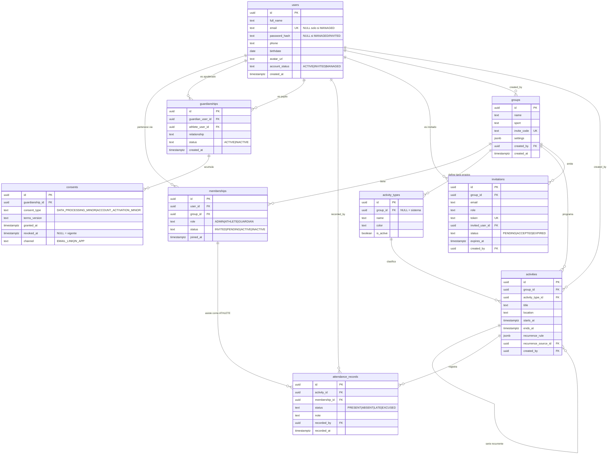

# Modelo de datos

**Proyecto:** Asisteam · **Fecha:** 2026-07-03 · **Documentos relacionados:** 02-roles-y-permisos.md, 03-modulos-y-flujos.md, 06-arquitectura-y-stack.md, 07-api-y-backend.md, 08-reportes-y-estadisticas.md, 11-legal-seguridad-privacidad.md

Este documento define el esquema PostgreSQL del MVP [P0], sus constraints, índices y DDL de ejemplo, más las reglas de integridad que se validan en la capa de aplicación y el esbozo de tablas futuras [P1]/[P2].

## 1. Convenciones generales

- Motor: PostgreSQL 15+ (ver 06-arquitectura-y-stack.md).
- Claves primarias: `uuid` generadas con `gen_random_uuid()` (extensión `pgcrypto`).
- Fechas/horas: `timestamptz`, siempre almacenadas en UTC; la presentación en `America/Santiago` es responsabilidad del frontend/API (ver 07-api-y-backend.md).
- Identificadores de tablas y columnas en inglés, `snake_case`.
- Enums: se implementan como `text` + `CHECK` (no `CREATE TYPE`) para facilitar migraciones incrementales con 2-3 desarrolladores.
- Borrado: los usuarios y miembros con historial **no se eliminan físicamente**; se desactivan (`memberships.status = INACTIVE`) o se anonimizan (ver 11-legal-seguridad-privacidad.md). Las políticas `ON DELETE` de la sección 4 asumen este principio.
- Columnas `updated_at` en tablas mutables, mantenidas por trigger genérico `set_updated_at()`.

## 2. Entidades canónicas [P0]

### 2.1 users

Personas: administradores, deportistas y apoderados. Un mismo registro puede tener roles distintos en grupos distintos (los roles viven en `memberships`).

| Columna | Tipo PostgreSQL | Obligatorio | Default | Descripción |
|---|---|---|---|---|
| id | uuid | Sí (PK) | gen_random_uuid() | Identificador. |
| full_name | text | Sí | — | Nombre completo. |
| email | text | No* | — | Único (case-insensitive). NULL solo permitido si `account_status = MANAGED`. |
| password_hash | text | No | — | Hash Argon2id. NULL en cuentas `MANAGED` e `INVITED` (aún sin credenciales). |
| phone | text | No | — | Teléfono de contacto (formato E.164 recomendado). |
| birthdate | date | No* | — | Fecha de nacimiento. La aplicación la exige para todo ATHLETE (determina minoría de edad: < 18 años). |
| avatar_url | text | No | — | URL de avatar en storage de objetos. |
| account_status | text | Sí | 'ACTIVE' | `ACTIVE` \| `INVITED` \| `MANAGED`. |
| created_at | timestamptz | Sí | now() | Fecha de creación. |
| updated_at | timestamptz | Sí | now() | Última modificación. |

### 2.2 groups

Grupo (club/equipo). Raíz del multi-tenant: todo dato operativo cuelga de un grupo.

| Columna | Tipo PostgreSQL | Obligatorio | Default | Descripción |
|---|---|---|---|---|
| id | uuid | Sí (PK) | gen_random_uuid() | Identificador. |
| name | text | Sí | — | Nombre del grupo. |
| sport | text | No | — | Deporte/disciplina (texto libre en MVP). |
| description | text | No | — | Descripción. |
| logo_url | text | No | — | Logo. |
| invite_code | text | Sí | — | Código único de incorporación (8 caracteres alfanuméricos, regenerable por ADMIN). |
| settings | jsonb | Sí | ver abajo | `{"athletes_can_view_group_stats": false, "guardians_can_view_group_stats": false}`. |
| created_by | uuid | Sí (FK users) | — | Usuario creador (primer ADMIN). |
| created_at | timestamptz | Sí | now() | Fecha de creación. |
| updated_at | timestamptz | Sí | now() | Última modificación. |

### 2.3 memberships

Pertenencia de un usuario a un grupo con un rol. Un usuario con dos roles en el mismo grupo tiene dos filas.

| Columna | Tipo PostgreSQL | Obligatorio | Default | Descripción |
|---|---|---|---|---|
| id | uuid | Sí (PK) | gen_random_uuid() | Identificador. |
| user_id | uuid | Sí (FK users) | — | Usuario miembro. |
| group_id | uuid | Sí (FK groups) | — | Grupo. |
| role | text | Sí | — | `ADMIN` \| `ATHLETE` \| `GUARDIAN`. |
| status | text | Sí | — | `INVITED` \| `PENDING` \| `ACTIVE` \| `INACTIVE`. Lo fija siempre la aplicación según el flujo de incorporación (ver 03-modulos-y-flujos.md). |
| joined_at | timestamptz | No | — | Momento en que la membresía pasó a `ACTIVE` (NULL mientras no se active). |
| created_at | timestamptz | Sí | now() | Fecha de creación de la fila. |
| updated_at | timestamptz | Sí | now() | Última modificación. |

Única por `(user_id, group_id, role)`.

### 2.4 guardianships

Vínculo apoderado–deportista. Es global (no depende del grupo): el GUARDIAN ve a su pupilo en todos los grupos donde el pupilo es miembro (regla de visibilidad 2).

| Columna | Tipo PostgreSQL | Obligatorio | Default | Descripción |
|---|---|---|---|---|
| id | uuid | Sí (PK) | gen_random_uuid() | Identificador. |
| guardian_user_id | uuid | Sí (FK users) | — | Apoderado. |
| athlete_user_id | uuid | Sí (FK users) | — | Deportista menor de edad. |
| relationship | text | Sí | — | Parentesco: madre/padre/tutor, etc. (texto libre). |
| status | text | Sí | 'ACTIVE' | `ACTIVE` \| `INACTIVE`. Pasa a `INACTIVE` cuando el pupilo cumple 18 años (ver 02-roles-y-permisos.md). |
| created_at | timestamptz | Sí | now() | Fecha de creación. |
| deactivated_at | timestamptz | No | — | Momento de desactivación del vínculo. |

Única por `(guardian_user_id, athlete_user_id)`. `CHECK (guardian_user_id <> athlete_user_id)`.

### 2.5 activity_types

Tipos de actividad. Los de sistema tienen `group_id = NULL` y se siembran por migración con UUID fijos: `TRAINING` (Entrenamiento), `PHYSICAL_PREP` (Preparación física), `COMPETITION` (Competencia), `MEETING` (Reunión). Los personalizados [P0] apuntan a su grupo.

| Columna | Tipo PostgreSQL | Obligatorio | Default | Descripción |
|---|---|---|---|---|
| id | uuid | Sí (PK) | gen_random_uuid() | Identificador (fijo en seeds de sistema). |
| group_id | uuid | No (FK groups) | NULL | NULL = tipo de sistema; con valor = tipo personalizado del grupo. |
| name | text | Sí | — | Nombre visible (español). |
| color | text | Sí | '#6B7280' | Color hex para calendario y reportes. |
| is_active | boolean | Sí | true | Los tipos en desuso se desactivan, nunca se borran si tienen actividades. |

### 2.6 activities

Actividades convocadas del grupo. Las recurrencias semanales simples [P0] se **materializan**: cada ocurrencia es una fila propia (necesario porque la asistencia es única por actividad).

| Columna | Tipo PostgreSQL | Obligatorio | Default | Descripción |
|---|---|---|---|---|
| id | uuid | Sí (PK) | gen_random_uuid() | Identificador. |
| group_id | uuid | Sí (FK groups) | — | Grupo dueño. |
| activity_type_id | uuid | Sí (FK activity_types) | — | Tipo (de sistema o del grupo). |
| title | text | Sí | — | Título. |
| description | text | No | — | Descripción. |
| location | text | No | — | Lugar (texto libre en MVP). |
| starts_at | timestamptz | Sí | — | Inicio (UTC). |
| ends_at | timestamptz | Sí | — | Fin (UTC). `CHECK (ends_at > starts_at)`. |
| recurrence_rule | jsonb | No | — | Solo recurrencia semanal simple: `{"freq":"WEEKLY","by_weekday":["MO","WE"],"until":"2026-12-31"}`. Se copia en cada ocurrencia generada. |
| recurrence_source_id | uuid | No (FK activities) | — | Autorreferencia a la primera actividad de la serie; NULL en actividades sueltas y en la primera de la serie. Permite editar/eliminar "toda la serie". |
| created_by | uuid | Sí (FK users) | — | ADMIN creador. |
| created_at | timestamptz | Sí | now() | Fecha de creación. |
| updated_at | timestamptz | Sí | now() | Última modificación. |

### 2.7 attendance_records

Registro de asistencia por deportista y actividad.

| Columna | Tipo PostgreSQL | Obligatorio | Default | Descripción |
|---|---|---|---|---|
| id | uuid | Sí (PK) | gen_random_uuid() | Identificador. |
| activity_id | uuid | Sí (FK activities) | — | Actividad. |
| membership_id | uuid | Sí (FK memberships) | — | Membresía con rol ATHLETE **del mismo grupo** de la actividad (regla validada en aplicación + trigger, sección 6). |
| status | text | Sí | — | `PRESENT` \| `ABSENT` \| `LATE` \| `EXCUSED`. |
| note | text | No | — | Nota opcional del ADMIN (nunca visible para no-ADMIN de terceros, regla de visibilidad 5). |
| recorded_by | uuid | Sí (FK users) | — | ADMIN que registró/editó por última vez. |
| recorded_at | timestamptz | Sí | now() | Momento del último registro/edición. |

Única por `(activity_id, membership_id)`: la edición posterior [P0] es un `UPDATE`, no una fila nueva (la auditoría completa de cambios es [P2], sección 7).

### 2.8 invitations

Invitaciones dirigidas por email y su ciclo de vida.

| Columna | Tipo PostgreSQL | Obligatorio | Default | Descripción |
|---|---|---|---|---|
| id | uuid | Sí (PK) | gen_random_uuid() | Identificador. |
| group_id | uuid | Sí (FK groups) | — | Grupo que invita. |
| email | text | No | — | Email invitado; NULL cuando la invitación se emite contra un usuario existente ya identificado. |
| role | text | Sí | — | `ATHLETE` \| `GUARDIAN` (por código de grupo solo se incorpora ATHLETE; los co-administradores se suman promoviendo a un miembro existente, ver acción #17 de 02-roles-y-permisos.md y `rpc/set_member_roles` en 07-api-y-backend.md, nunca por invitación). |
| token | text | Sí | — | Token único, aleatorio, de un solo uso. |
| invited_user_id | uuid | No (FK users) | — | Usuario creado/asociado (con `account_status = INVITED` si no existía). |
| activation_membership_id | uuid | No (FK memberships) | — | Cuenta MANAGED que se reclama desde una membership existente; la aceptación conserva todas sus membresías y su historial. NULL en invitaciones de incorporación. |
| status | text | Sí | 'PENDING' | `PENDING` \| `ACCEPTED` \| `EXPIRED`. |
| expires_at | timestamptz | Sí | — | Vencimiento; la aplicación fija now() + 7 días. |
| created_by | uuid | Sí (FK users) | — | ADMIN emisor. |
| created_at | timestamptz | Sí | now() | Fecha de emisión. |

### 2.9 consents

Consentimientos del apoderado sobre el tratamiento de datos de su pupilo menor de edad (requisito [P0] del flujo de alta de menores y del claim MANAGED → ACTIVE; ver 11-legal-seguridad-privacidad.md §3.2 y regla R1/R11 de 07-api-y-backend.md).

| Columna | Tipo PostgreSQL | Obligatorio | Default | Descripción |
|---|---|---|---|---|
| id | uuid | Sí (PK) | gen_random_uuid() | Identificador. |
| guardianship_id | uuid | Sí (FK guardianships) | — | Vínculo apoderado–pupilo al que corresponde el consentimiento. |
| consent_type | text | Sí | — | `DATA_PROCESSING_MINOR` \| `ACCOUNT_ACTIVATION_MINOR`. |
| terms_version | text | Sí | — | Versión de los términos aceptados (evidencia de licitud). |
| granted_at | timestamptz | Sí | now() | Momento del otorgamiento. |
| revoked_at | timestamptz | No | — | Momento de revocación; NULL = vigente. |
| channel | text | No | — | `EMAIL_LINK` \| `IN_APP`. |
| allows_avatar | boolean | Sí | false | Cláusula explícita de autorización de imagen dentro de `DATA_PROCESSING_MINOR`; sin aceptación no se habilita la foto del menor. |

Los consentimientos se conservan como evidencia aunque el vínculo se desactive (`ON DELETE RESTRICT` desde `guardianship_id`); la revocación es un `UPDATE` de `revoked_at`, nunca un `DELETE` (ver 11-legal-seguridad-privacidad.md §3.4).

### 2.10 Correcciones de fecha de nacimiento (HU-GEN-04)

`birthdate_change_requests` conserva `user_id`, `old_birthdate`, `requested_birthdate`, `status`, `created_at` y `resolved_at`. Solo una solicitud `PENDING`/`APPROVED` por usuario; `APPROVED` es un estado transaccional que el trigger consume al aplicar la fecha. Los estados finales son `APPLIED`, `REJECTED` o `CANCELLED`.

`birthdate_change_approvals` registra `(request_id, group_id)` como PK, `approved_by` y `approved_at`. Se requiere un ADMIN vigente por cada grupo ATHLETE `ACTIVE`/`PENDING`, sin autoaprobación. Las tablas son evidencia del flujo de corrección, no un audit log genérico. Solo se escriben mediante RPC; los ADMIN acceden a proyecciones de su grupo, mientras el titular ve sus propias solicitudes.

## 3. Relaciones y cardinalidades

- **users 1—N memberships N—1 groups**: un usuario pertenece a 0..N grupos; cada pertenencia (usuario, grupo, rol) es una fila. Un grupo tiene 1..N membresías (al menos el ADMIN creador).
- **users 1—N guardianships (como guardian) / users 1—N guardianships (como athlete)**: relación N:M entre apoderados y pupilos sobre la misma tabla `users`; un apoderado puede tener varios pupilos y un pupilo varios apoderados.
- **groups 1—N activities**; **groups 0—N activity_types** (los de sistema no pertenecen a ningún grupo).
- **activity_types 1—N activities**: toda actividad tiene exactamente un tipo.
- **activities 1—N attendance_records N—1 memberships**: la asistencia conecta una ocurrencia concreta con la membresía ATHLETE; máximo un registro por par.
- **activities 0—N activities (recurrence_source_id)**: autorreferencia de serie recurrente.
- **groups 1—N invitations**; **users 0—N invitations** como invitado (`invited_user_id`) y como emisor (`created_by`).
- **guardianships 1—N consents**: cada vínculo apoderado–pupilo acumula sus consentimientos (por tipo y versión de términos); el vigente es el que tiene `revoked_at IS NULL`.



## 4. Constraints e índices

### 4.1 Uniques canónicos

| Tabla | Unique | Motivo |
|---|---|---|
| users | `lower(email)` (índice único parcial `WHERE email IS NOT NULL`) | Email único case-insensitive; múltiples NULL permitidos (cuentas MANAGED). |
| groups | `invite_code` | Código de incorporación. |
| memberships | `(user_id, group_id, role)` | Una fila por rol por grupo. |
| guardianships | `(guardian_user_id, athlete_user_id)` | Un vínculo por par. |
| attendance_records | `(activity_id, membership_id)` | Un registro por deportista por actividad. |
| invitations | `token` | Token de un solo uso. |
| activity_types | `(group_id, name)` parcial `WHERE group_id IS NOT NULL`; `name` parcial `WHERE group_id IS NULL` | Evita tipos duplicados por grupo y entre los de sistema. |

### 4.2 Foreign keys y política ON DELETE (razonada)

| FK | Política | Razonamiento |
|---|---|---|
| memberships.user_id → users | CASCADE | Solo se borran físicamente usuarios sin historial; si tienen asistencia, el RESTRICT de attendance_records lo bloquea igual. |
| memberships.group_id → groups | CASCADE | Borrar un grupo elimina todo su contenido (acción explícita del ADMIN con doble confirmación en UI). |
| guardianships.* → users | CASCADE | Vínculo puro, sin valor histórico independiente. |
| activity_types.group_id → groups | CASCADE | Tipos personalizados mueren con el grupo. |
| activities.group_id → groups | CASCADE | Ídem. |
| activities.activity_type_id → activity_types | RESTRICT | Un tipo con actividades no se borra; se desactiva (`is_active = false`). |
| activities.recurrence_source_id → activities | SET NULL | Borrar la primera de la serie no debe arrastrar las demás. |
| activities.created_by → users | RESTRICT | El borrado de usuarios con actividad creada es lógico (anonimización), no físico. |
| attendance_records.activity_id → activities | CASCADE | Borrar una actividad (o su grupo) elimina su asistencia: sin actividad el registro no significa nada. |
| attendance_records.membership_id → memberships | RESTRICT | Protege el historial: los miembros se pasan a `INACTIVE`, no se borran. |
| attendance_records.recorded_by → users | RESTRICT | Ídem created_by. |
| invitations.group_id → groups | CASCADE | Invitaciones mueren con el grupo. |
| invitations.invited_user_id → users | SET NULL | La invitación puede sobrevivir como registro aunque se borre el usuario provisional. |
| invitations.created_by → users | RESTRICT | Ídem created_by. |
| groups.created_by → users | RESTRICT | Ídem. |
| consents.guardianship_id → guardianships | RESTRICT | Los consentimientos se conservan como evidencia de licitud del tratamiento (11-legal-seguridad-privacidad.md §3.4); la revocación es un UPDATE de `revoked_at`, no un borrado. |

### 4.3 Índices recomendados para reportes [P0]

Las consultas de 08-reportes-y-estadisticas.md siguen el patrón: `attendance_records JOIN activities` filtrando por `activities.group_id` + rango de `starts_at`, agregando por `membership_id`, `status` y `activity_type_id`.

| Índice | Definición | Consulta que sirve |
|---|---|---|
| idx_activities_group_starts | `activities (group_id, starts_at)` | Calendario del grupo y reportes por período (semana/mes/rango/temporada). |
| idx_activities_type | `activities (activity_type_id)` | Reporte por tipo de actividad. |
| uq_attendance (implícito) | `attendance_records (activity_id, membership_id)` UNIQUE | Toma de asistencia de una actividad; lado izquierdo cubre búsquedas por `activity_id`. |
| idx_attendance_membership | `attendance_records (membership_id, status)` | Historial individual y porcentaje del deportista. |
| idx_memberships_group | `memberships (group_id, role, status)` | Lista de deportistas del grupo (toma de asistencia, reportes). |
| idx_memberships_user | `memberships (user_id)` | "Mis grupos" multi-grupo. |
| idx_guardianships_athlete | `guardianships (athlete_user_id) WHERE status = 'ACTIVE'` | Resolución de permisos del GUARDIAN y chequeo "menor sin apoderado". |
| idx_guardianships_guardian | `guardianships (guardian_user_id) WHERE status = 'ACTIVE'` | Vista "mis pupilos". |
| idx_invitations_group | `invitations (group_id, status)` | Panel de invitaciones pendientes del ADMIN. |
| idx_activities_source | `activities (recurrence_source_id) WHERE recurrence_source_id IS NOT NULL` | Edición/borrado de series recurrentes. |

Con volúmenes de MVP (grupos de 15-40 deportistas, 2-6 actividades semanales) estos índices bastan; no se requieren particiones ni materialized views en [P0].

## 5. DDL SQL de ejemplo (PostgreSQL) [P0]

```sql
CREATE EXTENSION IF NOT EXISTS pgcrypto;

CREATE TABLE users (
    id              uuid PRIMARY KEY DEFAULT gen_random_uuid(),
    full_name       text NOT NULL,
    email           text,
    password_hash   text,
    phone           text,
    birthdate       date,
    avatar_url      text,
    account_status  text NOT NULL DEFAULT 'ACTIVE'
                    CHECK (account_status IN ('ACTIVE','INVITED','MANAGED')),
    created_at      timestamptz NOT NULL DEFAULT now(),
    updated_at      timestamptz NOT NULL DEFAULT now(),
    CONSTRAINT users_email_required_unless_managed
        CHECK (account_status = 'MANAGED' OR email IS NOT NULL)
);
CREATE UNIQUE INDEX uq_users_email ON users (lower(email)) WHERE email IS NOT NULL;

CREATE TABLE groups (
    id          uuid PRIMARY KEY DEFAULT gen_random_uuid(),
    name        text NOT NULL,
    sport       text,
    description text,
    logo_url    text,
    invite_code text NOT NULL UNIQUE,
    settings    jsonb NOT NULL DEFAULT
        '{"athletes_can_view_group_stats": false, "guardians_can_view_group_stats": false}',
    created_by  uuid NOT NULL REFERENCES users(id) ON DELETE RESTRICT,
    created_at  timestamptz NOT NULL DEFAULT now(),
    updated_at  timestamptz NOT NULL DEFAULT now()
);

CREATE TABLE memberships (
    id         uuid PRIMARY KEY DEFAULT gen_random_uuid(),
    user_id    uuid NOT NULL REFERENCES users(id)  ON DELETE CASCADE,
    group_id   uuid NOT NULL REFERENCES groups(id) ON DELETE CASCADE,
    role       text NOT NULL CHECK (role IN ('ADMIN','ATHLETE','GUARDIAN')),
    status     text NOT NULL CHECK (status IN ('INVITED','PENDING','ACTIVE','INACTIVE')),
    joined_at  timestamptz,
    created_at timestamptz NOT NULL DEFAULT now(),
    updated_at timestamptz NOT NULL DEFAULT now(),
    CONSTRAINT uq_memberships UNIQUE (user_id, group_id, role)
);
CREATE INDEX idx_memberships_group ON memberships (group_id, role, status);
CREATE INDEX idx_memberships_user  ON memberships (user_id);

CREATE TABLE guardianships (
    id                uuid PRIMARY KEY DEFAULT gen_random_uuid(),
    guardian_user_id  uuid NOT NULL REFERENCES users(id) ON DELETE CASCADE,
    athlete_user_id   uuid NOT NULL REFERENCES users(id) ON DELETE CASCADE,
    relationship      text NOT NULL,
    status            text NOT NULL DEFAULT 'ACTIVE' CHECK (status IN ('ACTIVE','INACTIVE')),
    created_at        timestamptz NOT NULL DEFAULT now(),
    deactivated_at    timestamptz,
    CONSTRAINT uq_guardianships UNIQUE (guardian_user_id, athlete_user_id),
    CONSTRAINT chk_guardian_not_self CHECK (guardian_user_id <> athlete_user_id)
);
CREATE INDEX idx_guardianships_athlete  ON guardianships (athlete_user_id)  WHERE status = 'ACTIVE';
CREATE INDEX idx_guardianships_guardian ON guardianships (guardian_user_id) WHERE status = 'ACTIVE';

CREATE TABLE activity_types (
    id        uuid PRIMARY KEY DEFAULT gen_random_uuid(),
    group_id  uuid REFERENCES groups(id) ON DELETE CASCADE,
    name      text NOT NULL,
    color     text NOT NULL DEFAULT '#6B7280',
    is_active boolean NOT NULL DEFAULT true
);
CREATE UNIQUE INDEX uq_activity_types_group ON activity_types (group_id, name) WHERE group_id IS NOT NULL;
CREATE UNIQUE INDEX uq_activity_types_system ON activity_types (name) WHERE group_id IS NULL;

CREATE TABLE activities (
    id                   uuid PRIMARY KEY DEFAULT gen_random_uuid(),
    group_id             uuid NOT NULL REFERENCES groups(id) ON DELETE CASCADE,
    activity_type_id     uuid NOT NULL REFERENCES activity_types(id) ON DELETE RESTRICT,
    title                text NOT NULL,
    description          text,
    location             text,
    starts_at            timestamptz NOT NULL,
    ends_at              timestamptz NOT NULL,
    recurrence_rule      jsonb,
    recurrence_source_id uuid REFERENCES activities(id) ON DELETE SET NULL,
    created_by           uuid NOT NULL REFERENCES users(id) ON DELETE RESTRICT,
    created_at           timestamptz NOT NULL DEFAULT now(),
    updated_at           timestamptz NOT NULL DEFAULT now(),
    CONSTRAINT chk_activity_range CHECK (ends_at > starts_at)
);
CREATE INDEX idx_activities_group_starts ON activities (group_id, starts_at);
CREATE INDEX idx_activities_type         ON activities (activity_type_id);
CREATE INDEX idx_activities_source       ON activities (recurrence_source_id)
    WHERE recurrence_source_id IS NOT NULL;

CREATE TABLE attendance_records (
    id            uuid PRIMARY KEY DEFAULT gen_random_uuid(),
    activity_id   uuid NOT NULL REFERENCES activities(id)  ON DELETE CASCADE,
    membership_id uuid NOT NULL REFERENCES memberships(id) ON DELETE RESTRICT,
    status        text NOT NULL CHECK (status IN ('PRESENT','ABSENT','LATE','EXCUSED')),
    note          text,
    recorded_by   uuid NOT NULL REFERENCES users(id) ON DELETE RESTRICT,
    recorded_at   timestamptz NOT NULL DEFAULT now(),
    CONSTRAINT uq_attendance UNIQUE (activity_id, membership_id)
);
CREATE INDEX idx_attendance_membership ON attendance_records (membership_id, status);

CREATE TABLE invitations (
    id              uuid PRIMARY KEY DEFAULT gen_random_uuid(),
    group_id        uuid NOT NULL REFERENCES groups(id) ON DELETE CASCADE,
    email           text,
    role            text NOT NULL CHECK (role IN ('ATHLETE','GUARDIAN')),
    token           text NOT NULL UNIQUE,
    invited_user_id uuid REFERENCES users(id) ON DELETE SET NULL,
    status          text NOT NULL DEFAULT 'PENDING'
                    CHECK (status IN ('PENDING','ACCEPTED','EXPIRED')),
    expires_at      timestamptz NOT NULL,
    created_by      uuid NOT NULL REFERENCES users(id) ON DELETE RESTRICT,
    created_at      timestamptz NOT NULL DEFAULT now()
);
CREATE INDEX idx_invitations_group ON invitations (group_id, status);

CREATE TABLE consents (
    id              uuid PRIMARY KEY DEFAULT gen_random_uuid(),
    guardianship_id uuid NOT NULL REFERENCES guardianships(id) ON DELETE RESTRICT,
    consent_type    text NOT NULL
                    CHECK (consent_type IN ('DATA_PROCESSING_MINOR','ACCOUNT_ACTIVATION_MINOR')),
    terms_version   text NOT NULL,
    granted_at      timestamptz NOT NULL DEFAULT now(),
    revoked_at      timestamptz,
    channel         text CHECK (channel IN ('EMAIL_LINK','IN_APP'))
);
CREATE INDEX idx_consents_guardianship ON consents (guardianship_id) WHERE revoked_at IS NULL;

-- Defensa en profundidad para la regla 3 de la sección 6 (opcional pero recomendado en [P0]):
CREATE OR REPLACE FUNCTION check_attendance_membership() RETURNS trigger AS $$
BEGIN
    IF NOT EXISTS (
        SELECT 1
        FROM memberships m
        JOIN activities a ON a.id = NEW.activity_id
        WHERE m.id = NEW.membership_id
          AND m.role = 'ATHLETE'
          AND m.group_id = a.group_id
    ) THEN
        RAISE EXCEPTION 'membership_id % no es ATHLETE del grupo de la actividad %',
            NEW.membership_id, NEW.activity_id;
    END IF;
    RETURN NEW;
END;
$$ LANGUAGE plpgsql;

CREATE TRIGGER trg_attendance_membership
    BEFORE INSERT OR UPDATE OF activity_id, membership_id ON attendance_records
    FOR EACH ROW EXECUTE FUNCTION check_attendance_membership();
```

Seed de migración: insertar los 4 `activity_types` de sistema (`group_id = NULL`) con UUID fijos documentados en el repositorio, nombres "Entrenamiento", "Preparación física", "Competencia", "Reunión".

## 6. Reglas de integridad de negocio que la BD no garantiza sola

| # | Regla | Por qué la BD no basta | Dónde se valida |
|---|---|---|---|
| 1 | **Menor sin apoderado** [P0]: todo ATHLETE menor de 18 años (según `users.birthdate`) debe tener al menos una `guardianship` con `status = ACTIVE` **y consentimiento `DATA_PROCESSING_MINOR` vigente en `consents` (`revoked_at IS NULL`)** antes de activar su membresía o crear su cuenta MANAGED. | Es una condición entre 4 tablas dependiente de la fecha actual (la minoría de edad cambia con el tiempo). | Capa de servicio del backend, en los casos de uso "crear cuenta gestionada", "activar membresía PENDING" y "eliminar guardianship" (bloquea dejar al menor sin ningún apoderado activo). Ver 07-api-y-backend.md (regla R1) y 11-legal-seguridad-privacidad.md (checklist C-03). |
| 2 | **Último ADMIN** [P0]: un grupo debe tener siempre al menos una membresía ADMIN con `status = ACTIVE`; no se puede desactivar/eliminar la última ni degradar su rol. | Requiere un conteo condicional transaccional sobre `memberships`. | Capa de servicio, dentro de la misma transacción del cambio (`SELECT ... FOR UPDATE` sobre las membresías ADMIN del grupo). |
| 3 | **Coherencia de asistencia** [P0]: `attendance_records.membership_id` debe ser una membresía con `role = ATHLETE` y `group_id` igual al de la actividad. | Una FK simple no puede comparar columnas de dos tablas padre distintas. | Capa de servicio (validación primaria) + trigger `trg_attendance_membership` como defensa en profundidad (DDL sección 5). |
| 4 | **Guardianship solo hacia menores** [P0]: al crear el vínculo, `athlete_user_id` debe corresponder a un usuario menor de 18 años; al cumplir 18, el vínculo pasa a `INACTIVE` y el deportista gestiona su propia cuenta. | Depende de `CURRENT_DATE` (un CHECK con funciones no inmutables no es fiable) y de una transición temporal. | Creación: capa de servicio. Transición a los 18: job diario programado (cron del backend) que ejecuta `UPDATE guardianships SET status='INACTIVE', deactivated_at=now() WHERE status='ACTIVE' AND athlete cumple 18`; detalle del flujo en 02-roles-y-permisos.md y 11-legal-seguridad-privacidad.md. |
| 5 | **Estados de asistencia solo sobre membresías activas al momento de la toma** [P0]: no se registra asistencia a membresías `INACTIVE`. | El estado de la membresía cambia en el tiempo; la BD no conoce el instante lógico de la toma. | Capa de servicio al construir la lista de toma de asistencia. |
| 6 | **Visibilidad** (reglas 1-6 del canon) [P0]: toggles `settings.*_can_view_group_stats`, ocultamiento de contactos, fechas de nacimiento y notas de terceros. | Es autorización por rol/relación, no integridad de datos. | Middleware de autorización y serializadores de la API (ver 02-roles-y-permisos.md y 07-api-y-backend.md). |
| 7 | **Consistencia de invitaciones** [P0]: un token `PENDING` vencido se trata como `EXPIRED` aunque el job de limpieza no haya corrido. | `expires_at` requiere evaluación contra now() en cada uso. | Capa de servicio al canjear el token; job diario marca `EXPIRED` los vencidos. |

## 7. Evolución del esquema: tablas futuras

Estas tablas **no se crean en [P0]**; se documentan para que el diseño actual no las bloquee.

### 7.1 push_tokens y notifications [P1]

Soporte de notificaciones push (recordatorio de actividad; aviso de ausencia al apoderado).

- `push_tokens`: `id`, `user_id` (FK users), `platform` (`IOS` | `ANDROID` | `WEB`), `token` (único), `created_at`, `last_seen_at`. Un usuario, N dispositivos. Nombre alineado con 06-arquitectura-y-stack.md y con `POST /api/v1/users/me/push-tokens` de 07-api-y-backend.md §2.11.
- `notifications`: `id`, `user_id` (FK users), `type` (`ACTIVITY_REMINDER` | `ABSENCE_ALERT`), `payload` (jsonb: activity_id, group_id, athlete_user_id...), `sent_at`, `read_at`. Historial y centro de notificaciones in-app.

### 7.2 justification_requests [P2]

Flujo de solicitud/aprobación de justificaciones de inasistencia.

- `justification_requests`: `id`, `activity_id` (FK activities), `membership_id` (FK memberships), `requested_by` (FK users; el ATHLETE o su GUARDIAN), `reason` (text), `attachment_url`, `status` (`PENDING` | `APPROVED` | `REJECTED`), `resolved_by` (FK users), `resolved_at`, `created_at`. Al aprobarse, el backend fija `attendance_records.status = EXCUSED`.

### 7.3 payments [P2]

Gestión de pagos/cuotas del grupo.

- `payments`: `id`, `group_id` (FK groups), `membership_id` (FK memberships), `concept` (text), `amount` (numeric(12,2)), `currency` (default `'CLP'`), `due_date` (date), `paid_at`, `status` (`PENDING` | `PAID` | `OVERDUE` | `CANCELLED`), `created_at`.

### 7.4 audit_log [P2]

Auditoría completa de cambios (hoy solo se conserva el último estado de asistencia con `recorded_by`/`recorded_at`).

- `audit_log`: `id`, `actor_user_id` (FK users), `group_id` (FK groups), `entity` (text: `attendance_records`, `memberships`...), `entity_id` (uuid), `action` (`INSERT` | `UPDATE` | `DELETE`), `before` (jsonb), `after` (jsonb), `created_at`. Tabla append-only; candidata a particionado por mes si el volumen lo exige.

Notas de compatibilidad: la exportación CSV [P1] no requiere tablas nuevas (consulta sobre el esquema [P0]); el rol COACH [P2] reutiliza `memberships.role` agregando el valor `COACH` al CHECK; el modo offline [P2] requerirá una columna `client_generated_id` (uuid, única) en `attendance_records` para idempotencia de sincronización.
