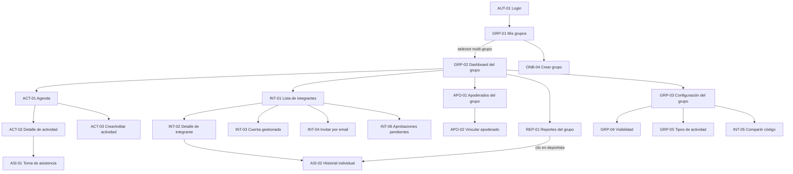
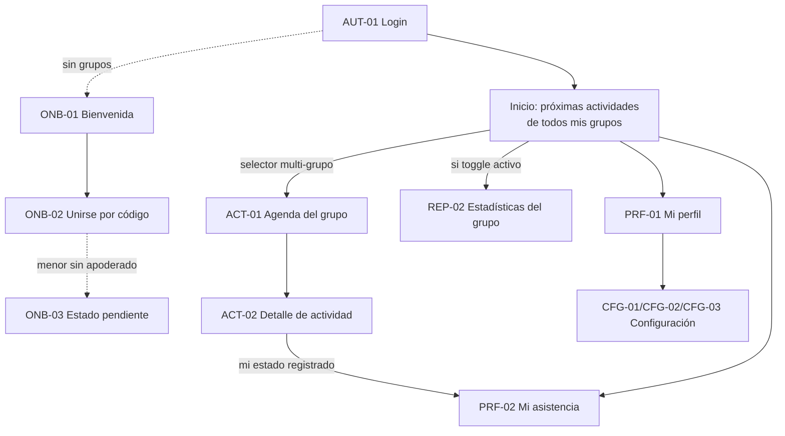
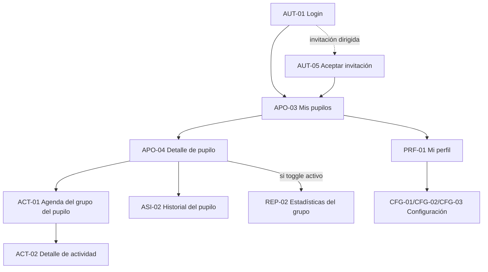

# Pantallas web y móvil

**Proyecto:** Asisteam · **Fecha:** 2026-07-03 · **Documentos relacionados:** 02-roles-y-permisos.md, 03-modulos-y-flujos.md, 04-modelo-de-datos.md, 06-arquitectura-y-stack.md, 08-reportes-y-estadisticas.md, 10-historias-de-usuario.md

Este documento inventaría todas las pantallas de Asisteam para web y app móvil, define la navegación por rol y detalla las pantallas críticas. Cada pantalla lleva un código estable (`AUT-01`, `ASI-01`, …) que se usa como referencia cruzada en 03-modulos-y-flujos.md y 10-historias-de-usuario.md.

## 1. Convenciones

- **Columnas Web / Móvil:** indican con qué prioridad llega la pantalla a cada plataforma (`[P0]`, `[P1]`, `[P2]`) o `—` si no existe en esa plataforma en el horizonte del plan.
- **Columna Prioridad:** prioridad de la funcionalidad en el producto (la más temprana entre plataformas).
- **Rutas web:** en inglés, con el grupo activo en la URL: `/groups/:groupId/...`. Pantallas fuera de contexto de grupo cuelgan de raíz (`/login`, `/profile`).
- **Regla de plataforma:** la app móvil [P1] cubre solo las funciones núcleo (consulta para todos los roles + toma de asistencia para ADMIN). Toda pantalla de **gestión** (crear grupo, CRUD de integrantes, invitaciones dirigidas, configuración del grupo) es solo web en v1.0 y llega a móvil recién en [P2].
- **Excepciones a la regla de plataforma en [P1]:** además de las pantallas de consulta y ASI-01, llegan a móvil [P1] las pantallas de acceso y onboarding imprescindibles para operar la app desde el dispositivo (AUT-01/02/03/05, ONB-01/02/03), CFG-01 (cuenta propia, no gestión del grupo) e INT-05 (compartir código, usa el share sheet nativo). Ninguna implica gestión de datos del grupo. AUT-04 y AUT-06 se derivan siempre a web para simplificar el manejo de tokens por enlace de email.
- **Multi-rol:** si un usuario tiene más de un rol en el grupo activo (ej.: ADMIN + ATHLETE), la interfaz muestra la vista del rol más permisivo (ADMIN) y agrega una sección "Mi asistencia" con sus datos de ATHLETE.

## 2. Inventario de pantallas

### 2.1 Autenticación

| Código | Pantalla | Rol(es) | Web | Móvil | Prioridad | Descripción breve |
|---|---|---|---|---|---|---|
| AUT-01 | Login (`/login`) | Todos | [P0] | [P1] | [P0] | Email + contraseña; enlaces a registro y recuperación. |
| AUT-02 | Registro (`/register`) | Todos | [P0] | [P1] | [P0] | Crea `users` ACTIVE: full_name, email, contraseña, birthdate, phone opcional. |
| AUT-03 | Recuperar contraseña (`/forgot-password`) | Todos | [P0] | [P1] | [P0] | Solicita email; envía enlace de restablecimiento. |
| AUT-04 | Restablecer contraseña (`/reset-password?token=`) | Todos | [P0] | — | [P0] | Nueva contraseña desde enlace de email; siempre abre en web. |
| AUT-05 | Aceptar invitación (`/invitations/:token`) | Todos | [P0] | [P1] | [P0] | Valida token de `invitations`; si el email no tiene cuenta ACTIVE, encadena registro/activación. |
| AUT-06 | Activación de cuenta gestionada | ATHLETE | [P0] | — | [P0] | Convierte `account_status` MANAGED → ACTIVE: creación de contraseña; si es menor, requiere consentimiento del apoderado (ver 11-legal-seguridad-privacidad.md). |
| AUT-07 | Login social Google/Apple | Todos | [P2] | [P2] | [P2] | Botones OAuth en AUT-01/AUT-02. |

### 2.2 Onboarding

| Código | Pantalla | Rol(es) | Web | Móvil | Prioridad | Descripción breve |
|---|---|---|---|---|---|---|
| ONB-01 | Bienvenida sin grupos (`/welcome`) | Todos | [P0] | [P1] | [P0] | Usuario sin memberships: opciones "Crear un grupo" o "Unirme con código". |
| ONB-02 | Unirse por código (`/join`) | ATHLETE | [P0] | [P1] | [P0] | Ingreso de `invite_code` (o deep link); solo incorpora ATHLETE. Adulto → ACTIVE; menor → PENDING. |
| ONB-03 | Estado pendiente | ATHLETE menor | [P0] | [P1] | [P0] | Aviso al menor con membership PENDING: falta apoderado vinculado y/o confirmación del ADMIN. |
| ONB-04 | Crear grupo (wizard, `/groups/new`) | ADMIN | [P0] | [P2] | [P0] | Pasos: datos del grupo (name, sport, description, logo_url) → toggles de visibilidad → invitar. Crea membership ADMIN del creador. |

### 2.3 Grupos

| Código | Pantalla | Rol(es) | Web | Móvil | Prioridad | Descripción breve |
|---|---|---|---|---|---|---|
| GRP-01 | Mis grupos (`/groups`) | Todos | [P0] | [P1] | [P0] | Lista de grupos del usuario con rol y estado de membership; punto de entrada del selector multi-grupo. |
| GRP-02 | Dashboard del grupo (`/groups/:groupId`) | ADMIN | [P0] | [P1] | [P0] | Home ADMIN: próximas actividades, accesos rápidos (tomar asistencia, integrantes, reportes), pendientes de aprobación. En móvil [P1] solo consulta + acceso a toma de asistencia. |
| GRP-03 | Configuración del grupo (`/groups/:groupId/settings`) | ADMIN | [P0] | [P2] | [P0] | Edita name, sport, description, logo; muestra y regenera `invite_code`. |
| GRP-04 | Configuración de visibilidad (`/groups/:groupId/settings/visibility`) | ADMIN | [P0] | [P2] | [P0] | Toggles `athletes_can_view_group_stats` y `guardians_can_view_group_stats` (detalle en §5.7). |
| GRP-05 | Tipos de actividad (`/groups/:groupId/settings/activity-types`) | ADMIN | [P0] | [P2] | [P0] | Lista tipos de sistema (solo lectura) + CRUD de tipos personalizados (name, color, is_active). |

### 2.4 Integrantes

| Código | Pantalla | Rol(es) | Web | Móvil | Prioridad | Descripción breve |
|---|---|---|---|---|---|---|
| INT-01 | Lista de integrantes (`/groups/:groupId/members`) | ADMIN | [P0] | [P1] | [P0] | Tabla/lista con filtros por rol y estado (detalle en §5.2). Móvil [P1]: solo consulta. |
| INT-02 | Detalle de integrante (`/groups/:groupId/members/:membershipId`) | ADMIN | [P0] | [P1] | [P0] | Perfil, roles en el grupo, apoderados vinculados (si es menor), resumen de asistencia. |
| INT-03 | Crear cuenta gestionada (`/groups/:groupId/members/new`) | ADMIN | [P0] | [P2] | [P0] | Alta de perfil MANAGED (típico menores); si birthdate indica menor, exige vincular apoderado en el mismo flujo. Membership queda ACTIVE. |
| INT-04 | Invitar por email (`/groups/:groupId/invitations/new`) | ADMIN | [P0] | [P2] | [P0] | Invitación dirigida con rol ATHLETE o GUARDIAN; crea `invitations` y, si no existe cuenta, `users` INVITED. |
| INT-05 | Compartir código/enlace | ADMIN | [P0] | [P1] | [P0] | Muestra `invite_code` + enlace + QR para compartir; en móvil usa el share sheet nativo. |
| INT-06 | Aprobaciones pendientes (`/groups/:groupId/members/pending`) | ADMIN | [P0] | [P2] | [P0] | Menores PENDING por código: verificar apoderado vinculado y confirmar o rechazar. |

### 2.5 Apoderados

| Código | Pantalla | Rol(es) | Web | Móvil | Prioridad | Descripción breve |
|---|---|---|---|---|---|---|
| APO-01 | Apoderados del grupo (`/groups/:groupId/guardians`) | ADMIN | [P0] | [P2] | [P0] | Lista de GUARDIAN con sus pupilos en el grupo; acceso a vincular/desvincular. |
| APO-02 | Vincular apoderado-deportista | ADMIN | [P0] | [P2] | [P0] | Crea `guardianships` (guardian_user_id, athlete_user_id, relationship); valida que el pupilo sea menor de 18. |
| APO-03 | Mis pupilos (`/wards`) | GUARDIAN | [P0] | [P1] | [P0] | Home del apoderado: tarjetas por pupilo con próximas actividades y % de asistencia (detalle en §5.6). |
| APO-04 | Detalle de pupilo (`/wards/:athleteUserId`) | GUARDIAN | [P0] | [P1] | [P0] | Perfil del pupilo, grupos donde es miembro, historial de asistencia por grupo. |

### 2.6 Actividades

| Código | Pantalla | Rol(es) | Web | Móvil | Prioridad | Descripción breve |
|---|---|---|---|---|---|---|
| ACT-01 | Agenda del grupo (`/groups/:groupId/activities`) | Todos | [P0] | [P1] | [P0] | Lista/calendario semanal-mensual de actividades; filtro por activity_type; hora local America/Santiago. |
| ACT-02 | Detalle de actividad (`/groups/:groupId/activities/:activityId`) | Todos | [P0] | [P1] | [P0] | Datos de la actividad + resumen de asistencia según rol (detalle en §5.3). |
| ACT-03 | Crear/editar actividad (`/groups/:groupId/activities/new`) | ADMIN | [P0] | [P2] | [P0] | Formulario: title, activity_type_id, description, location, starts_at, ends_at; recurrencia semanal simple (días de semana + fecha fin). |
| ACT-04 | Editar serie recurrente | ADMIN | [P0] | [P2] | [P0] | Diálogo al editar/eliminar una actividad con `recurrence_rule`: "solo esta" o "esta y las siguientes". |

### 2.7 Asistencia

| Código | Pantalla | Rol(es) | Web | Móvil | Prioridad | Descripción breve |
|---|---|---|---|---|---|---|
| ASI-01 | Toma de asistencia (`/groups/:groupId/activities/:activityId/attendance`) | ADMIN | [P0] | [P1] | [P0] | Lista de deportistas del grupo con 4 estados + nota opcional; misma pantalla sirve para edición posterior (detalle en §5.1). |
| ASI-02 | Historial individual (`/groups/:groupId/members/:membershipId/history` y `/me/history`) | ATHLETE, GUARDIAN, ADMIN | [P0] | [P1] | [P0] | Historial de asistencia de un deportista con filtros de período (detalle en §5.5). |
| ASI-03 | Solicitud de justificación | ATHLETE, GUARDIAN | [P2] | [P2] | [P2] | Flujo solicitud/aprobación de inasistencias justificadas. |
| ASI-04 | Autoregistro QR/geocerca | ATHLETE | — | [P2] | [P2] | Check-in del deportista por QR o geocerca. |
| ASI-05 | Toma de asistencia offline | ADMIN | — | [P2] | [P2] | Modo offline con sincronización posterior sobre ASI-01 móvil. |

### 2.8 Reportes

| Código | Pantalla | Rol(es) | Web | Móvil | Prioridad | Descripción breve |
|---|---|---|---|---|---|---|
| REP-01 | Reportes del grupo (`/groups/:groupId/reports`) | ADMIN | [P0] | [P1] | [P0] | % de asistencia por deportista, por tipo de actividad y por período (detalle en §5.4). Móvil [P1]: consulta. |
| REP-02 | Estadísticas del grupo para no-ADMIN (`/groups/:groupId/stats`) | ATHLETE, GUARDIAN | [P0] | [P1] | [P0] | Tabla/gráfico agregado (nombre + % por integrante); visible solo si el toggle correspondiente de `groups.settings` está activo. |
| REP-03 | Exportación CSV | ADMIN | [P1] | [P1] | [P1] | Botón "Exportar CSV" en REP-01 con los filtros aplicados. |
| REP-04 | Ranking gamificado | Todos | [P2] | [P2] | [P2] | Ranking de asistencia con logros. |

### 2.9 Configuración

| Código | Pantalla | Rol(es) | Web | Móvil | Prioridad | Descripción breve |
|---|---|---|---|---|---|---|
| CFG-01 | Cuenta y seguridad (`/settings/account`) | Todos | [P0] | [P1] | [P0] | Cambio de contraseña; cierre de sesión en todos los dispositivos. El email se muestra pero no es editable en el MVP (P0/P1); el cambio de email queda fuera de alcance (ver HU-GEN-04 en 10-historias-de-usuario.md). |
| CFG-02 | Preferencias de notificaciones (`/settings/notifications`) | Todos | [P1] | [P1] | [P1] | Activar/desactivar push: recordatorio de actividad (todos), aviso de ausencia del pupilo (GUARDIAN). |
| CFG-03 | Privacidad y eliminación de cuenta (`/settings/privacy`) | Todos | [P0] | [P2] | [P0] | Solicitud de eliminación de cuenta y solicitud de copia de datos personales tramitada vía soporte (respuesta ≤ 15 días hábiles) [P0]; autoservicio "Descargar mis datos" [P2] (Ley 19.628 / 21.719; ver 11-legal-seguridad-privacidad.md). |

### 2.10 Perfil

| Código | Pantalla | Rol(es) | Web | Móvil | Prioridad | Descripción breve |
|---|---|---|---|---|---|---|
| PRF-01 | Mi perfil (`/profile`) | Todos | [P0] | [P1] | [P0] | Ver/editar full_name, phone, birthdate, avatar_url. El email se muestra pero no es editable en el MVP (ver HU-GEN-04). |
| PRF-02 | Mi asistencia (`/me/history`) | ATHLETE | [P0] | [P1] | [P0] | Acceso directo a ASI-02 con la propia membership; selector de grupo si pertenece a varios. |

## 3. Mapas de navegación por rol

### 3.1 ADMIN

### 3.2 ATHLETE (Deportista)

### 3.3 GUARDIAN (Apoderado)

## 4. Diferencias web vs móvil

### 4.1 Pantallas móvil-first

Aunque el MVP [P0] es solo web responsive, estas pantallas se diseñan **móvil-first** desde el día 1 porque su uso real ocurre de pie, en la cancha, con una mano:

- **ASI-01 Toma de asistencia:** objetivo de usabilidad: marcar 20 deportistas en menos de 60 segundos en un navegador móvil [P0]. Botones de estado de mínimo 44×44 px, sin scroll horizontal, guardado por fila sin recargar.
- **ACT-01 Agenda / ACT-02 Detalle:** consulta rápida "¿a qué hora es el entrenamiento?"; carga inicial < 2 s en 4G.
- **ASI-02 / PRF-02 Historial:** consulta del deportista o apoderado tras la actividad.

Las pantallas de gestión (ONB-04, GRP-03/04/05, INT-03/04/06, APO-01/02, ACT-03/04) se optimizan para escritorio, manteniendo responsividad básica.

### 4.2 Home según rol

| Rol en el grupo activo | Home web | Home móvil [P1] |
|---|---|---|
| ADMIN | GRP-02 Dashboard del grupo | Pestaña Inicio: próxima actividad del día con botón directo "Tomar asistencia" (ASI-01) |
| ATHLETE | Inicio: próximas actividades de todos sus grupos + % de asistencia del mes | Pestaña Inicio: misma vista |
| GUARDIAN | APO-03 Mis pupilos | Pestaña Inicio: APO-03 |
| Multi-rol (ej. ADMIN+ATHLETE) | Home del rol más permisivo (ADMIN) con sección "Mi asistencia" | Ídem |

Navegación móvil [P1]: barra inferior de 4-5 pestañas — Inicio, Agenda (ACT-01), Asistencia (solo visible para ADMIN, entra a ASI-01 de la próxima actividad), Reportes (REP-01/REP-02 según rol y toggles), Perfil (PRF-01 + configuración).

### 4.3 Selector multi-grupo

- **Web [P0]:** dropdown permanente en la barra superior con nombre + logo del grupo activo; al cambiar, se navega a la ruta equivalente del nuevo `groupId`. Opción "Ver todos mis grupos" abre GRP-01.
- **Móvil [P1]:** el encabezado de la pestaña Inicio muestra el grupo activo; al tocarlo se abre un bottom sheet con la lista de grupos (nombre, logo, rol) y la opción "Unirme con código" (ONB-02).
- El último grupo activo se persiste por cuenta y dispositivo (cookie de preferencia en web / preferencias de la app) y se restaura al iniciar sesión solo si la membership sigue ACTIVE. Esta preferencia no contiene tokens ni concede permisos.
- El rol se resuelve **por grupo**: al cambiar de grupo puede cambiar la navegación completa (ej.: ADMIN en grupo A, ATHLETE en grupo B).
- GUARDIAN puro (sin otra membership propia) no usa selector de grupo sino selector de **pupilo** en APO-03; los grupos se derivan de las memberships del pupilo.
- Los deep links y notificaciones push [P1] siempre incluyen `groupId` y fijan el grupo activo al abrirse.

## 5. Detalle funcional de pantallas críticas

### 5.1 ASI-01 — Toma de asistencia [P0] (móvil [P1])

**Ruta:** `/groups/:groupId/activities/:activityId/attendance` · **Rol:** ADMIN.

**Elementos**
- Encabezado: título de la actividad, tipo (chip con color de `activity_types`), fecha/hora local, contador en vivo `Presentes X · Atrasados X · Ausentes X · Justificados X · Sin marcar X`.
- Lista de deportistas: todas las memberships ATHLETE con status ACTIVE del grupo, orden alfabético por full_name; cada fila: avatar, nombre, 4 botones segmentados de estado (PRESENT / LATE / ABSENT / EXCUSED con colores verde/amarillo/rojo/gris) e ícono de nota.
- Buscador por nombre (filtra en cliente).
- Acción masiva: "Marcar todos como Presente" (los ya marcados no se sobrescriben; pide confirmación).
- Nota opcional por fila: bottom sheet / popover con textarea (máx. 500 caracteres), guarda en `attendance_records.note`.

**Estados vacíos:** sin deportistas ACTIVE → "Este grupo aún no tiene deportistas activos" con CTA a INT-03/INT-04 (solo web). Actividad futura (> 2 h antes de `starts_at`) → banner "Esta actividad aún no comienza; puedes registrar asistencia anticipada" (se permite, con esa advertencia).

**Acciones y comportamiento**
- Cada toque guarda de inmediato el `attendance_record` (upsert por `(activity_id, membership_id)`) con feedback visual < 300 ms; sin botón global "Guardar".
- Tocar el estado ya seleccionado lo deselecciona (elimina el registro → vuelve a "sin marcar").
- Edición posterior [P0]: la misma pantalla, reabierta en cualquier momento, muestra los estados guardados y permite cambiarlos; cada cambio actualiza `recorded_by` y `recorded_at`.

**Validaciones visibles:** solo ADMIN del grupo accede (403 → pantalla "No tienes permisos"); pérdida de conexión → toast "Sin conexión: el cambio no se guardó" y la fila vuelve al estado anterior (el modo offline es ASI-05 [P2]).

### 5.2 INT-01 — Lista de integrantes [P0] (móvil consulta [P1])

**Ruta:** `/groups/:groupId/members` · **Rol:** ADMIN.

**Elementos:** buscador por nombre; filtros por rol (ADMIN/ATHLETE/GUARDIAN) y status de membership (ACTIVE/PENDING/INVITED/INACTIVE); tabla web (avatar, full_name, rol(es) como chips, edad calculada desde birthdate con badge "Menor" si < 18, status con color, % de asistencia de la temporada, apoderados vinculados si es menor) / tarjetas en móvil; contador "N integrantes"; badge en filtro PENDING si hay menores esperando aprobación (INT-06).

**Estados vacíos:** grupo nuevo → ilustración + "Aún no hay integrantes" con 3 CTA: compartir código (INT-05), invitar por email (INT-04), crear cuenta gestionada (INT-03).

**Acciones:** fila → INT-02; menú por fila (web): editar, desactivar membership (status → INACTIVE, con confirmación; no borra historial), reenviar invitación si INVITED; botón primario "Agregar integrante" (INT-03/INT-04/INT-05).

**Validaciones visibles:** un ATHLETE menor sin guardianship activa muestra advertencia "Sin apoderado vinculado" y no puede pasarse a ACTIVE hasta resolverlo; al desactivar al último ADMIN del grupo la acción se bloquea con mensaje explicativo.

### 5.3 ACT-02 — Detalle de actividad [P0] (móvil [P1])

**Ruta:** `/groups/:groupId/activities/:activityId` · **Roles:** todos los miembros del grupo.

**Elementos:** título, chip de tipo con color, description, location (enlace a mapa si hay dirección), fecha y horario local (`starts_at`–`ends_at`), indicador "Se repite semanalmente hasta DD-MM-AAAA" si tiene `recurrence_rule`.
- **Vista ADMIN:** resumen de asistencia (contadores por estado + % de la actividad), botón primario "Tomar asistencia" (ASI-01) o "Editar asistencia" si ya hay registros, menú editar/eliminar (con diálogo ACT-04 si es recurrente).
- **Vista ATHLETE:** su propio estado registrado (chip PRESENT/LATE/ABSENT/EXCUSED con su nota si existe) o "Asistencia aún no registrada".
- **Vista GUARDIAN:** ídem pero del pupilo; si tiene varios pupilos en el grupo, uno por fila.

**Estados vacíos:** sin asistencia registrada y actividad pasada → ADMIN ve CTA destacado "Registrar asistencia pendiente".

**Validaciones visibles:** ATHLETE y GUARDIAN nunca ven estados ni notas de otros deportistas (regla de visibilidad 5); si `ends_at` < `starts_at` el formulario ACT-03 lo impide antes de llegar aquí.

### 5.4 REP-01 — Reportes del grupo [P0] (móvil consulta [P1])

**Ruta:** `/groups/:groupId/reports` · **Rol:** ADMIN.

**Elementos**
- Filtros: período (semana | mes | rango personalizado | temporada), tipo de actividad (multiselección, sistema + personalizados).
- KPIs: % de asistencia promedio del grupo, total de actividades del período, deportista con mejor asistencia, % de atrasos (LATE) como indicador de puntualidad separado.
- Tabla por deportista: nombre, convocadas, PRESENT, LATE, ABSENT, EXCUSED, % de asistencia con 1 decimal según la métrica canónica `(PRESENT + LATE) / (convocadas − EXCUSED) × 100`; orden por % descendente; semáforo (≥ 85 % verde, 70–84,9 % amarillo, < 70 % rojo).
- Gráfico de barras: % por tipo de actividad [P0]; gráfico de línea de evolución semanal del % del grupo [P1] (08-reportes-y-estadisticas.md asigna la línea de tendencia a [P1]; en [P0] la tendencia se expone solo como tabla por período).
- Botón "Exportar CSV" [P1] con los filtros aplicados (ver 08-reportes-y-estadisticas.md).

**Estados vacíos:** sin actividades con asistencia en el período → "No hay asistencia registrada en este período" + CTA para cambiar el filtro; deportista sin convocatorias en el período → fila con "—" en vez de 0 %.

**Acciones:** clic en un deportista → ASI-02 con el mismo filtro de período aplicado.

**Validaciones visibles:** denominador 0 (todas EXCUSED) muestra "—" y tooltip explicativo; los cálculos usan hora local America/Santiago para los cortes de semana/mes.

### 5.5 ASI-02 — Historial individual de asistencia [P0] (móvil [P1])

**Rutas:** `/me/history` (ATHLETE), `/wards/:athleteUserId` sección historial (GUARDIAN), `/groups/:groupId/members/:membershipId/history` (ADMIN).

**Elementos:** encabezado con nombre del deportista y grupo (selector si pertenece a varios); KPI grande: % de asistencia del período (métrica canónica, 1 decimal) + desglose PRESENT / LATE / ABSENT / EXCUSED; filtros de período (semana | mes | rango | temporada) y tipo de actividad; línea de tiempo descendente: fecha, título de la actividad, chip de tipo, chip de estado; la nota de asistencia es visible para el propio ATHLETE, su GUARDIAN y el ADMIN (nunca para terceros).

**Estados vacíos:** deportista recién ingresado → "Aún no tienes actividades con asistencia registrada"; período sin datos → mensaje + acceso rápido a "temporada".

**Acciones:** tocar una fila → ACT-02; ADMIN además puede saltar a ASI-01 para corregir un registro puntual.

**Validaciones visibles:** ATHLETE solo accede a su propio historial; GUARDIAN solo al de sus pupilos vigentes (guardianship activa); cualquier otro acceso → 403.

### 5.6 APO-03 / APO-04 — Vista del apoderado [P0] (móvil [P1])

**Rutas:** `/wards` y `/wards/:athleteUserId` · **Rol:** GUARDIAN.

**Elementos (APO-03):** tarjeta por pupilo: avatar, nombre, edad, grupos donde es miembro, próxima actividad (fecha/hora local), % de asistencia del mes por grupo; banner por pupilo próximo a cumplir 18 ("En N días tu pupilo administrará su propia cuenta", ver 02-roles-y-permisos.md).

**Elementos (APO-04):** perfil del pupilo (sin datos de contacto de terceros), pestañas: Agenda (ACT-01 filtrada a los grupos del pupilo), Historial (ASI-02 del pupilo), Estadísticas del grupo (REP-02, solo si `guardians_can_view_group_stats = true` en ese grupo).

**Estados vacíos:** GUARDIAN sin pupilos vinculados → "Aún no tienes deportistas a tu cargo; pide al administrador del grupo que te vincule"; pupilo cuyo vínculo pasó a inactivo por mayoría de edad desaparece de la lista con aviso único informativo.

**Acciones:** cambiar de pupilo (selector superior si hay más de uno); activar aviso push de ausencia [P1] en CFG-02.

**Validaciones visibles:** todo el contenido se limita a los grupos donde el pupilo es miembro; no hay acceso a notas ni datos de otros deportistas (reglas de visibilidad 2 y 5).

### 5.7 GRP-04 — Configuración de visibilidad [P0]

**Ruta:** `/groups/:groupId/settings/visibility` · **Rol:** ADMIN.

**Elementos:** dos toggles independientes con texto explicativo y estado por defecto **desactivado**:
1. `athletes_can_view_group_stats` — "Los deportistas pueden ver las estadísticas del grupo (nombre y % de asistencia de cada integrante)".
2. `guardians_can_view_group_stats` — "Los apoderados pueden ver las estadísticas del grupo".
- Recuadro informativo fijo: "Aunque actives estas opciones, nunca se muestran datos de contacto, fechas de nacimiento, notas de asistencia individuales ni datos de apoderados de otros integrantes. Solo nombre y métricas agregadas."
- Vista previa: miniatura de cómo ve REP-02 un ATHLETE con el toggle activo.

**Estados vacíos:** no aplica (los toggles siempre existen); si el grupo no tiene asistencia registrada, la vista previa muestra datos de ejemplo marcados como tales.

**Acciones:** cambio de toggle guarda de inmediato en `groups.settings` (JSONB) con toast de confirmación y efecto inmediato en REP-02.

**Validaciones visibles:** solo ADMIN del grupo puede entrar; el cambio queda registrado con autor y fecha (auditoría completa de cambios es [P2]).

## 6. Resumen de prioridades por plataforma

| Corte | Pantallas incluidas |
|---|---|
| **MVP Web [P0]** | AUT-01…AUT-06, ONB-01…ONB-04, GRP-01…GRP-05, INT-01…INT-06, APO-01…APO-04, ACT-01…ACT-04, ASI-01, ASI-02, REP-01, REP-02, CFG-01, CFG-03, PRF-01, PRF-02 — todas en web responsive, con ASI-01/ACT-01/ASI-02 diseñadas móvil-first. |
| **App móvil + mejoras [P1]** | En móvil: AUT-01/02/03/05, ONB-01/02/03, GRP-01, GRP-02 (consulta), INT-01/INT-02 (consulta), INT-05, APO-03/04, ACT-01/02, ASI-01, ASI-02, REP-01 (consulta), REP-02, CFG-01, PRF-01/02. Nuevas en ambas plataformas: CFG-02 (preferencias push) y REP-03 (exportación CSV). |
| **Post-MVP [P2]** | AUT-07 (login social), ASI-03 (justificaciones), ASI-04 (QR/geocerca), ASI-05 (offline), REP-04 (ranking); y la llegada a móvil de las pantallas de gestión: ONB-04, GRP-03/04/05, INT-03/04/06, APO-01/02, ACT-03/04, CFG-03. Pantallas de rol COACH, anuncios/mensajería, pagos y panel multi-club se especificarán al planificar [P2]. |

**Criterio de cierre del MVP Web [P0]:** todas las pantallas marcadas [P0] en la columna Web operativas en navegador de escritorio y móvil, con los flujos de 03-modulos-y-flujos.md completos de extremo a extremo y las reglas de visibilidad verificadas por rol.
