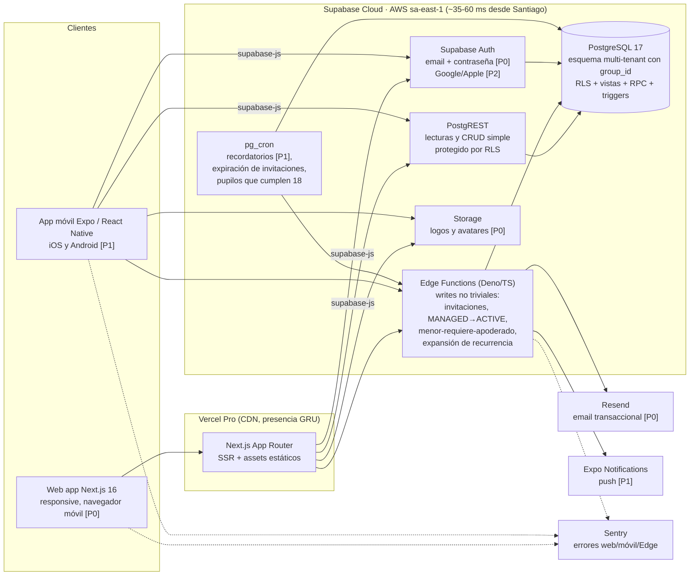

# Arquitectura y stack tecnológico

**Proyecto:** Asisteam · **Fecha:** 2026-07-03 · **Documentos relacionados:** 04-modelo-de-datos.md, 07-api-y-backend.md, 08-reportes-y-estadisticas.md, 09-roadmap.md, 11-legal-seguridad-privacidad.md

---

## 1. Decisión de arquitectura (resumen ejecutivo)

Se adopta la **Propuesta A del panel técnico: Supabase (PostgreSQL 17 + Auth + RLS + Edge Functions) como backend gestionado, Next.js 16 para el MVP Web [P0] y Expo/React Native para la app móvil [P1]**, organizados en un monorepo pnpm + Turborepo con un paquete compartido `packages/core`.

Razones dominantes (detalle comparativo en la sección 4):

1. **Tiempo a MVP Web [P0]:** ~9 semanas vs ~12 de las alternativas; auth, CRUD, storage y email de invitación vienen resueltos por la plataforma.
2. **Calce con el modelo canónico:** el dominio de Asisteam es fuertemente relacional (únicos compuestos en `attendance_records`, `memberships`, `guardianships`; enums; JSONB en `groups.settings`). Postgres lo expresa 1:1 y la métrica canónica de asistencia es una vista SQL testeable.
3. **Seguridad multi-tenant en la base:** las 6 reglas de visibilidad del canon se implementan con RLS + vistas/RPC de columnas explícitas; el aislamiento por grupo queda en la base de datos y no depende de la disciplina del frontend.
4. **Talento y mantenibilidad:** TypeScript + React + SQL es el pool full-stack más grande de Chile/Latam; cero servidores que administrar para un equipo de 2-3 devs.

Injertos adoptados de las propuestas descartadas: monorepo con `packages/core` (métrica canónica + schemas Zod compartidos) de la Propuesta B; testing de políticas RLS con pgTAP + seeds por rol en CI, y la convención "lectura = RLS + vistas/RPC; escritura con efectos = Edge Function/RPC" de la Propuesta C.

## 2. Arquitectura elegida



### 2.1 Convención obligatoria de acceso a datos (regla de equipo desde el día 1)

| Operación | Camino | Ejemplos |
|---|---|---|
| Lectura y CRUD trivial | PostgREST + RLS, o vistas/RPC con **columnas explícitas** (nunca `SELECT *` sobre `users` hacia no-ADMIN) | listar actividades del grupo, ver historial propio, editar título de actividad |
| Escritura con efectos o invariantes | Edge Function o RPC (PL/pgSQL transaccional) | invitación por email/código, creación de cuenta MANAGED, conversión MANAGED→ACTIVE con consentimiento, validación "menor requiere apoderado", expansión de `recurrence_rule` semanal, toma de asistencia en lote |
| Invariantes de datos | Constraints + triggers como red de seguridad | únicos compuestos del canon, FK, checks de enums |
| Tareas programadas | pg_cron → Edge Function idempotente | recordatorio de actividad [P1], aviso de ausencia al apoderado [P1], invitaciones EXPIRED, guardianships inactivas al cumplir 18 el pupilo |

La métrica canónica de asistencia `(PRESENT + LATE) / (convocadas − EXCUSED) × 100` (redondeo a 1 decimal) vive en **dos capas con una sola fuente por capa**: vistas SQL para reportes servidos por la base, y `packages/core` para cálculo en cliente; ambas se testean contra el mismo set de casos canónicos (ver 08-reportes-y-estadisticas.md).

## 3. Stack por capa y justificación

| Capa | Elección | Justificación |
|---|---|---|
| **Web [P0]** | Next.js 16 (App Router, React 19, TypeScript 5) + Tailwind CSS 4 + shadcn/ui; supabase-js 2 + TanStack Query 5; react-hook-form + Zod (schemas desde `packages/core`); tipos generados con `supabase gen types` | HTML nativo con SSR: tablas de reportes con copiar/pegar y Ctrl+F, carga <1 s, accesibilidad estándar. El requisito [P0] explícito es web responsive usable en navegador móvil; React + TS es el perfil de contratación más abundante en Chile/Latam. |
| **Móvil [P1]** | Expo SDK 54+ (React Native, TypeScript) con expo-router; EAS Build/Submit + OTA updates; push con Expo Notifications | Reutiliza supabase-js, tipos generados, TanStack Query y `packages/core` del monorepo: solo se reescribe la UI. EAS elimina la infraestructura de builds nativas para un equipo de 2-3 devs. |
| **Backend** | Supabase: PostgREST + RLS para lecturas [P0]; Edge Functions (Deno/TS) y RPC (PL/pgSQL) para writes no triviales; triggers + constraints; pg_cron | Cero servidores; el aislamiento multi-tenant vive en la base. Los 3 flujos complejos del canon (menor-requiere-apoderado, MANAGED→ACTIVE, recurrencia semanal) se concentran en Edge Functions/RPC testeables. |
| **Base de datos** | PostgreSQL 17 (Supabase Cloud, AWS sa-east-1); esquema único multi-tenant con `group_id`; enums nativos; JSONB para `groups.settings`; `timestamptz` en UTC con presentación America/Santiago; vistas SQL para la métrica canónica | Calce 1:1 con el modelo canónico de 04-modelo-de-datos.md. sa-east-1 da ~35-60 ms desde Santiago. Datos en Postgres estándar: `pg_dump` portable (salida de emergencia del lock-in). |
| **Autenticación** | Supabase Auth: email+contraseña y recuperación [P0]; `inviteUserByEmail` para invitaciones dirigidas (estado INVITED); `public.users` desacoplada de `auth.users` (FK opcional) para cuentas MANAGED sin credenciales; Google/Apple [P2] sin cambiar de proveedor | Resuelve registro, login, recuperación y verificación de email sin código propio. El desacople `public.users` ↔ `auth.users` es la pieza a medida que habilita cuentas gestionadas para menores y el flujo de claim con consentimiento del apoderado (ver 11-legal-seguridad-privacidad.md). RLS consume `auth.uid()` vía helpers SECURITY DEFINER: `is_member(group_id)`, `is_group_admin(group_id)`, `is_guardian_of(athlete_user_id)`. |
| **Hosting / infra** | Vercel Pro (frontend, CDN con presencia GRU) + Supabase Cloud Pro + Resend (email transaccional) + Sentry (free/dev) + GitHub Actions (CI con supabase CLI local y pgTAP) + EAS al iniciar [P1] | Todo gestionado; ~USD 45-70/mes en [P0]. GitHub Actions corre los tests de RLS contra Supabase local en Docker, sin tocar producción. |
| **Monorepo** | pnpm + Turborepo: `apps/web` [P0], `apps/mobile` [P1], `packages/core`, `packages/db` (tipos generados), `supabase/` (migraciones, funciones, seeds, tests pgTAP) | Una sola fuente para la métrica canónica, los schemas Zod y los tipos de dominio, consumida por web, móvil y Edge Functions. |

Estructura del repositorio:

```
asisteam/
├── apps/
│   ├── web/          # Next.js 16 [P0]
│   └── mobile/       # Expo [P1]
├── packages/
│   ├── core/         # métrica canónica, schemas Zod, tipos de dominio, constantes de enums
│   └── db/           # tipos generados con `supabase gen types typescript`
├── supabase/
│   ├── migrations/   # SQL versionado (tablas, enums, RLS, vistas, triggers, RPC)
│   ├── functions/    # Edge Functions (Deno)
│   ├── seeds/        # seeds por rol para pgTAP y entornos de prueba
│   └── tests/        # pgTAP: políticas RLS y vistas de métrica
└── turbo.json / pnpm-workspace.yaml
```

## 4. Alternativas evaluadas

| Criterio | **A. BaaS: Supabase + Next.js + Expo (GANADORA)** | B. Backend propio: NestJS + Next.js + Expo | C. UI unificada: Flutter + Supabase |
|---|---|---|---|
| **Tiempo a MVP Web [P0]** | **~9 semanas** — auth, CRUD, storage y email resueltos por la plataforma | ~12 semanas — 1,5-2,5 semanas de plumbing (auth, CI/CD, staging) antes de la primera feature | ~12 semanas — y el P0 sale sobre Flutter web, la plataforma más débil del framework |
| **Mantenibilidad (2-3 devs)** | **Alta** — cero servidores; foco en dominio, RLS y UI | Media — upgrades, backups, parches e incidentes recaen en el equipo sin plataforma | Media — sin servidores, pero UI canvas + lógica en 3 capas (RLS, PL/pgSQL, Deno) |
| **Talento en Chile/Latam** | **Máximo** — TypeScript + React + SQL, el pool full-stack más grande | Máximo — mismo perfil, con curva NestJS (~1 semana) | Limitado — pool Flutter 3-5x menor; Dart backend inexistente (igual se trabaja en 2 lenguajes) |
| **Costo infra [P0]** | **USD 45-70/mes**; con [P1] ~150-170 | USD 60-120/mes; con [P1] +EAS | USD 40-55/mes (el más bajo); con [P1] ~80-150 |
| **Escalabilidad a cientos de grupos** | **Sí** — esquema compartido + `group_id` + RLS; escala con compute add-on sin rediseño | Sí — pool model equivalente; escala en contenedores | Sí — mismo patrón de datos que A |
| **Reutilización web↔móvil** | Alta — supabase-js, tipos generados, TanStack Query y `packages/core` compartidos; solo se reescribe la UI en Expo [P1] | Media-alta — misma API REST + api-client OpenAPI + `packages/core`; UI móvil desde cero | **Máxima (~90%)** — una sola base Dart; [P1] en 3-4 semanas |
| **Riesgo de lock-in** | Medio — PostgREST/Auth/Edge Functions propietarios, pero datos en Postgres estándar (`pg_dump` → RDS/Neon); `packages/core` portable | **Mínimo** — contenedores y Postgres estándar, auth self-hosted | Medio — mismo lock-in Supabase que A, más riesgo de plataforma Flutter web |
| **Reglas de negocio del canon (permisos por membership, visibilidad, menor-requiere-apoderado)** | **Muy buen calce** — constraints + RLS declarativa + vistas SQL para la métrica; MANAGED exige desacoplar `public.users` (patrón conocido) | Muy buen calce — dominio tipado y testeable en NestJS, pero el aislamiento multi-tenant depende de disciplina de guards (RLS termina siendo necesaria igual) | Buen calce en datos, pero lógica repartida en RLS + PL/pgSQL + Edge Functions, más difícil de testear |
| **Calidad UX del MVP Web [P0]** | **Excelente** — HTML nativo, tablas de reportes con copiar/pegar, SSR, carga <1 s | Excelente — mismo frontend Next.js | Débil — payload 2-6 MB, arranque 3-8 s en 4G, tablas canvas sin Ctrl+F ni copiar a Excel, accesibilidad frágil |
| **Veredicto** | **Elegida: gana en los criterios de mayor peso (tiempo, talento, calce del canon, UX del P0) con lock-in aceptable** | Descartada como inicio; es la ruta de evolución si se supera el BaaS | Descartada: optimiza [P1] sacrificando el [P0], que es lo que valida el negocio |

**Por qué se descartaron:** la Propuesta C invierte las prioridades — su fortaleza (reutilización ~90% web/móvil) beneficia al [P1], pero degrada el [P0] (web responsive con reportes tabulares del ADMIN, el corazón del producto que valida el negocio). La Propuesta B paga ~3 semanas extra y una superficie operativa (servidores, backups, parches) injustificable con 2-3 devs; queda documentada como **ruta de salida**: si algún día se supera el BaaS, se migra el esquema SQL con `pg_dump` y se reemplaza solo la capa PostgREST/Auth, llevándose `packages/core` tal cual.

## 5. Web + móvil: código compartido, paridad y orden de construcción

### 5.1 Código compartido

| Compartido (una sola fuente) | Específico por plataforma |
|---|---|
| `packages/core`: métrica canónica de asistencia, schemas Zod (formularios y payloads), tipos de dominio, constantes de enums y etiquetas en español (PRESENT=Presente, etc.) | UI: componentes shadcn/ui (web) vs componentes React Native (móvil) |
| `packages/db`: tipos generados desde el esquema con `supabase gen types` | Navegación: App Router (web) vs expo-router (móvil) |
| Cliente supabase-js 2 (auth, PostgREST, Storage, invocación de Edge Functions) | Notificaciones push [P1] (solo móvil); las mismas reglas de negocio se disparan desde pg_cron + Edge Functions |
| Hooks de datos con TanStack Query 5 (queries y mutaciones tipadas, claves de cache comunes) | Manejo de sesión persistente (cookies SSR en web; SecureStore en móvil) |

### 5.2 Paridad funcional entre plataformas

- **Web [P0]:** funcionalidad completa — administración de grupos, integrantes, apoderados, actividades, toma y edición de asistencia, reportes, configuración de visibilidad.
- **Móvil [P1]:** funciones núcleo — consulta para todos los roles (actividades, historial propio o de pupilos, reportes según toggles) + toma de asistencia para ADMIN + notificaciones push (recordatorio de actividad; aviso de ausencia al apoderado).
- Regla de paridad: la administración avanzada (configuración de grupo, gestión de invitaciones, edición de tipos de actividad) permanece solo-web en [P1]; la web es responsive, así que nada queda inaccesible desde un teléfono. Ampliar paridad móvil es decisión de roadmap post-v1.0 (ver 09-roadmap.md).

### 5.3 Orden de construcción

1. **[P0] Semanas 1-9:** esquema SQL + RLS + pgTAP primero (contrato de datos estable), luego web Next.js consumiendo PostgREST/Edge Functions. La "API" queda definida por el esquema, las vistas/RPC y las Edge Functions — no hay una capa API separada que versionar (ver 07-api-y-backend.md).
2. **[P1]:** la app Expo consume **exactamente los mismos** endpoints PostgREST, vistas, RPC y Edge Functions, sin cambios de backend; el esfuerzo es solo UI móvil + push. Esto es verificable: las únicas migraciones SQL nuevas requeridas para el arranque de [P1] son las dos tablas de notificaciones definidas en 04-modelo-de-datos.md §7.1 — `push_tokens` (registro de tokens de Expo Notifications) y `notifications` (historial y centro de notificaciones), esta última entregable dentro de la semana de push de la Fase 2 (ver 09-roadmap.md).
3. **[P2]:** login social, modo offline con sincronización, QR/geocerca, etc., se montan sobre la misma base sin rediseño.

## 6. Multi-tenancy y escalamiento a múltiples clubes

### 6.1 Aislamiento lógico

- **Esquema único compartido** con discriminador `group_id` en `memberships`, `activities`, `activity_types` (nullable para tipos de sistema), `attendance_records` (vía `activity_id`) e `invitations`.
- **Autorización por membership:** toda política RLS resuelve pertenencia con los helpers `is_member(group_id)`, `is_group_admin(group_id)` e `is_guardian_of(athlete_user_id)` (SECURITY DEFINER, `STABLE`, cacheables por statement). Nadie ve nada de grupos donde no es miembro (regla de visibilidad 6).
- **Regla de visibilidad 5 en la base:** los no-ADMIN solo acceden a `users` de terceros a través de vistas con columnas explícitas (`id`, `full_name`, `avatar_url` + métricas agregadas); `email`, `phone`, `birthdate`, notas de asistencia de terceros y datos de apoderados de terceros jamás se proyectan. Prohibición de `SELECT *` sobre `users` hacia no-ADMIN, verificada con pgTAP en CI.

### 6.2 Índices (mínimos comprometidos en [P0], además de los únicos del canon)

| Tabla | Índice | Uso |
|---|---|---|
| `memberships` | `(group_id, role, status)` | lista de deportistas para toma de asistencia; conteos por rol |
| `memberships` | `(user_id)` | "mis grupos" multi-grupo |
| `activities` | `(group_id, starts_at DESC)` | calendario y listados por período |
| `attendance_records` | `(membership_id, recorded_at)` | historial individual y métrica por período |
| `attendance_records` | único `(activity_id, membership_id)` (canon) | también cubre la lectura por actividad |
| `invitations` | único `(token)`; `(group_id, status)` | aceptación de invitación; panel del ADMIN |
| `guardianships` | `(athlete_user_id)` y único `(guardian_user_id, athlete_user_id)` (canon) | validación "menor requiere apoderado"; vistas del apoderado |

### 6.3 Paginación, cache de reportes y límites

- **Paginación [P0]:** PostgREST con `limit`/`offset` y `Prefer: count=estimated`; página por defecto 50, máximo 100. Listados de alto crecimiento (actividades, historial de asistencia) migran a keyset por `(starts_at, id)` cuando un grupo supere ~1.000 actividades.
- **Cache de reportes [P0]:** las vistas de métrica se calculan en vivo (el volumen del MVP lo permite: un grupo típico genera <5.000 `attendance_records`/año) + cache de cliente con TanStack Query (`staleTime` 60 s). **Criterio verificable de escalado:** si el p95 de la vista de reportes del grupo supera 500 ms, se introduce una vista materializada por grupo refrescada por pg_cron cada hora y tras cada cierre de toma de asistencia. No se agrega Redis ni capa de cache externa en [P0]/[P1].
- **Límites razonables (validados en Edge Functions/RPC y declarados en 07-api-y-backend.md):** máx. 500 memberships ACTIVE por grupo; máx. 30 grupos por usuario; expansión de `recurrence_rule` semanal limitada a 6 meses o 150 instancias por regla (lo que ocurra primero); toma de asistencia en lote máx. 500 registros por llamada (coincide con el máximo de memberships por grupo: un grupo lleno se toma en una sola llamada, ver 07-api-y-backend.md §4); rate limit de invitaciones: 50 por grupo por día (mismo valor que 07-api-y-backend.md §7.2).

### 6.4 Cómo crecer (sin rediseño)

| Escala | Acción |
|---|---|
| ~200 grupos activos (~6.000 usuarios, ~60.000 `attendance_records`/mes) | Compute add-on de Supabase (Small/Medium); vistas materializadas para reportes si se cruza el umbral p95 |
| Miles de grupos | Read replica de Supabase para vistas de reportes y exportaciones CSV [P1]; pooling con Supavisor en modo transacción |
| Notificaciones masivas [P1] | pg_cron encola en tabla `notification_jobs` (idempotente, con `status` y reintentos); una Edge Function consume el lote y llama a Expo Push / Resend — nunca envío síncrono dentro de la petición del usuario |
| Cliente institucional que exija residencia en Chile o aislamiento fuerte | Salida documentada: `pg_dump` a Postgres autogestionado + capa API propia (Propuesta B); el esquema y `packages/core` se llevan sin cambios |

## 7. Entornos, CI/CD, observabilidad y costos

### 7.1 Entornos

| Entorno | Frontend | Backend/DB | Datos |
|---|---|---|---|
| **dev (local)** | `next dev` | Supabase CLI sobre Docker (Postgres + Auth + PostgREST + Edge Functions locales) | seeds sintéticos por rol (los mismos de pgTAP) |
| **staging** | Vercel Preview (una URL por PR) + rama `staging` | Proyecto Supabase separado (plan Free), mismo esquema vía migraciones | datos sintéticos; **prohibido** copiar datos reales (datos de menores, ver 11-legal-seguridad-privacidad.md) |
| **prod** | Vercel Pro, dominio propio | Proyecto Supabase Pro en sa-east-1 | reales; backups diarios de Supabase + `pg_dump` semanal automatizado (GitHub Actions) hacia storage externo cifrado, fuera de Supabase |

Secretos por entorno en Vercel/Supabase/GitHub Actions; nunca en el repositorio. La `service_role key` solo existe en Edge Functions y CI, jamás en clientes.

### 7.2 CI/CD básico (GitHub Actions)

1. **En cada PR:** lint + typecheck (Turborepo, con cache remoto), tests unitarios de `packages/core` (Vitest, incluye los casos canónicos de la métrica), `supabase start` en Docker → aplica migraciones → corre **pgTAP** (políticas RLS con seeds por rol, vistas de métrica contra los mismos casos que Vitest) → tests de integración de Edge Functions.
2. **Merge a `main`:** deploy automático de frontend a staging (Vercel) + `supabase db push` y deploy de Edge Functions al proyecto staging.
3. **Release (tag `vX.Y.Z`):** mismos pasos contra producción, con aprobación manual (environment protegido de GitHub).
4. **[P1]:** EAS Build/Submit por tag; OTA updates (canal por entorno) para fixes de UI sin pasar por tiendas.

El hardening de este pipeline (Supabase CLI sobre Docker es más lento y frágil que un backend con DI) está presupuestado dentro de las 9 semanas de [P0], como señaló el panel.

### 7.3 Observabilidad mínima

- **Errores:** Sentry en web [P0], Edge Functions [P0] y móvil [P1]; release tracking por deploy; alertas a Slack/email en errores nuevos.
- **Logs estructurados:** Edge Functions loguean JSON (`{level, fn, group_id, user_id, event, duration_ms}`) — sin datos personales sensibles en logs (nunca email/phone/birthdate); consulta vía Supabase Logs.
- **Uptime:** monitor externo gratuito (Better Stack o UptimeRobot) sobre `https://app.../api/health` (verifica render + conexión a DB) y sobre el endpoint REST de Supabase; alerta si hay 2 fallos consecutivos.
- **Jobs programados:** cada ejecución de pg_cron escribe en una tabla `job_runs` (`job_name, started_at, finished_at, status, error`); una Edge Function diaria alerta si un job no corrió o falló — mitiga los fallos silenciosos señalados por el panel.
- **Métricas de negocio mínimas:** panel simple (SQL sobre la propia DB) con grupos activos, tomas de asistencia por semana y usuarios activos — suficiente para validar mercado en [P0], sin herramienta de producto adicional.

### 7.4 Costos estimados mensuales (USD)

| Ítem | MVP [P0] | v1.0 con [P1] | ~200 grupos activos |
|---|---|---|---|
| Vercel Pro | 20 | 20 | 20-40 (uso) |
| Supabase Pro (+ compute add-on en escala) | 25 | 25 | 85-135 (Small/Medium add-on) |
| Resend (email transaccional) | 0 (free, 3k/mes) | 20 | 20 |
| Sentry | 0 (free/dev) | 0-26 | 26 (Team) |
| EAS (builds/updates móvil) [P1] | — | 19-99 | 19-99 |
| Monitor de uptime | 0 | 0 | 0-10 |
| Backups externos (storage cifrado) | 1-5 | 1-5 | 5-10 |
| **Total** | **~46-70** | **~85-195 (típico ~150-170)** | **~175-340 (típico ~220-280)** |

Supuestos de la columna de escala: 200 grupos × ~30 miembros ≈ 6.000 usuarios, ~2.000 actividades/mes, ~60.000 `attendance_records`/mes (~720k/año) — volumen holgado para un Postgres con compute Small/Medium, sin rediseño.

## 8. Riesgos técnicos y mitigaciones (del panel, con dueño en este plan)

| Riesgo | Mitigación | Dónde se detalla |
|---|---|---|
| Dispersión de lógica entre SQL y TypeScript | Convención "lectura = RLS+vistas/RPC; write no trivial = Edge Function/RPC" desde el día 1; métrica testeada contra ambas capas con los mismos casos | Sección 2.1; 07-api-y-backend.md |
| RLS mal refactorizada filtra datos entre grupos o expone contacto/birthdate/notas (regla 5) | pgTAP + seeds por rol en CI bloqueando el merge; prohibición de `SELECT *` sobre `users` hacia no-ADMIN | Sección 6.1; 07-api-y-backend.md |
| Cuentas MANAGED no mapean a `auth.users` out-of-the-box | Desacople `public.users` ↔ `auth.users` diseñado y revisado temprano (semanas 1-2), con flujo de claim y consentimiento del apoderado | 04-modelo-de-datos.md; 11-legal-seguridad-privacidad.md |
| Dependencia de un único proveedor (Supabase) | Esquema SQL y `packages/core` portables; `pg_dump` semanal fuera de Supabase; Propuesta B documentada como ruta de salida | Secciones 4 y 7.1 |
| Edge Functions: cold starts, límites, observabilidad pobre en flujos programados | Sentry + pg_cron con colas idempotentes (`notification_jobs`, `job_runs`) y alerta diaria de jobs fallidos | Secciones 6.4 y 7.3 |
| Residencia de datos en sa-east-1 (Brasil), no en Chile | Declarado en política de privacidad; aceptable bajo Ley 19.628/21.719 con cláusulas adecuadas; evaluar residencia local solo si un cliente institucional la exige | 11-legal-seguridad-privacidad.md |
| CI sobre Supabase CLI/Docker lento o frágil | Hardening del pipeline presupuestado dentro de las 9 semanas de [P0]; cache de imágenes Docker en Actions | Sección 7.2; 09-roadmap.md |
| Deslizamiento de las 9 semanas por los 3 flujos no-CRUD complejos | Corte de alcance estricto a etiquetas [P0]; los flujos complejos se diseñan primero (semanas 1-3) | 09-roadmap.md |
