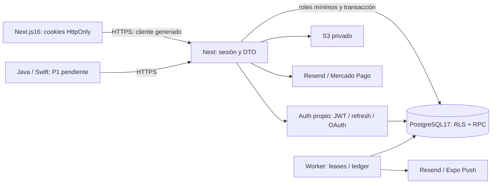

# Arquitectura y stack tecnológico

[Seguro] Vigencia MIG-24 (#168, 2026-10-10): Next.js16/React19 consume exclusivamente la API Nest/Node24. PostgreSQL17 independiente conserva dominio, RLS, RPC, constraints y triggers; Auth y S3 privados tienen autoridades propias. El repositorio no requiere SDK, CLI, proyecto ni fixtures Supabase. [Inventario y evidencia](migration/issue-168/README.md). El historial del stack anterior permanece en Git y en las evidencias fechadas de `docs/migration/`.

## 1. Arquitectura vigente

| Capa | Implementación |
|---|---|
| Web P0 | Next.js16 App Router, React19, TypeScript5, Tailwind4, formularios Zod/react-hook-form |
| API | Nest sobre Node24, DTO/schemas compartidos y cliente HTTP generado |
| Persistencia | PostgreSQL17; `packages/db/migrations`, catálogo y tipos propios |
| Auth | JWT HS256 propio de15min, refresh rotatorio hasheado, recuperación de60min, sesiones revocables; Google/Apple PKCE y vinculación explícita |
| Archivos | S3 privado; autorización Nest por propietario/apoderado y consentimiento; sin ACL pública ni URLs firmadas expuestas |
| Jobs | Worker Node con rol SQL mínimo, leases y ledger durables de mayoría/push |
| Integraciones | Resend, Mercado Pago, Expo Push transitorio; APNs/FCM móvil sigue P1 pendiente |
| Móvil P1 | Java/Android y Swift/iOS; no cliente implementado |
| Tooling | pnpm10, Turborepo, Vitest, pgTAP y Playwright/axe |

```mermaid
flowchart LR
  W[Next.js16: cookies HttpOnly] -->|HTTPS: cliente generado| A[Nest: sesión y DTO]
  M[Java / Swift: P1 pendiente] -->|HTTPS| A
  A -->|roles mínimos y transacción| P[(PostgreSQL17: RLS + RPC)]
  A --> N[Auth propio: JWT / refresh / OAuth]
  N --> P
  A --> S[S3 privado]
  A --> E[Resend / Mercado Pago]
  J[Worker: leases / ledger] --> P
  J --> X[Resend / Expo Push]
```

## 2. Autorización y escritura

[Seguro] Los roles de negocio pertenecen a memberships por grupo. `asisteam_api`, `asisteam_auth`, `asisteam_invitation`, `asisteam_billing` y `asisteam_jobs` no son propietarios ni BYPASSRLS. `asisteam_member` es un grupo NOLOGIN. El migrador separado instala el esquema y registra hashes; cambios/omisiones de migraciones aplicadas fallan.

[Seguro] Nest verifica sesión viva y fija claims de servidor dentro de la transacción. Las lecturas usan columnas explícitas y las escrituras no triviales delegan a RPC canónicas con autorización repetida. Se mantienen V1–V6, R1, métricas por grupo, consentimiento append-only, historial e idempotencia. La web carece de credenciales PostgreSQL o de almacenamiento.

[Seguro] `0001_baseline.sql` conserva su hash inmutable; `0002_retire_provider_entrypoints.sql` elimina entrypoints inactivos y limita autoridades a NATIVE/NEST/WORKER. FROZEN/DRAINING son mantenimiento, no fallback. El catálogo vigente es `packages/db/catalog.json`; el generador usa catálogos PostgreSQL directamente.

## 3. Entornos y configuración

[Seguro] API y Auth/invitaciones/billing apuntan a la misma base con credenciales distintas; Worker tiene su URL propia. S3 requiere bucket privado, TLS y credenciales separadas. Next requiere `ASISTEAM_API_ORIGIN`, `ASISTEAM_AUTH_WEB_ORIGIN`, `NATIVE_AUTH_PROXY_SECRET` e `INVITATION_PROXY_SECRET`; toda operación usa Nest. Secrets se provisionan fuera del repositorio. Los manifiestos, lockfile, bundles y trazas se verifican sin dependencias retiradas.

[Seguro] Desarrollo y CI crean contenedores PostgreSQL/S3 únicos con datos sintéticos y los destruyen al finalizar, también tras fallos controlados. Nunca se copian datos reales de menores a staging. Los proveedores externos son transportes sintéticos en esos ensayos; no acreditan contratos ni aceptación operacional.

## 4. CI y recuperación

[Seguro] `pnpm ci:checks` ejecuta lint, contratos/tipos, build, gate del artefacto y suites unitarias. `pnpm ci:backend` exige1646 assertions SQL de40 suites,50 guards nativas/métrica,80 casos originales y4 de recuperación nativa, APIs/Worker, tipos/catálogo, reconciliación de todas las tablas, backup lógico y PITR. `pnpm ci:extended` ejecuta todos los roles/módulos/responsive/axe sobre el stack nativo y el proxy de fallos. `pnpm ci:staging` ensaya publicación/rollback en infraestructura local propia; no despliega producción.

[Seguro] La recuperación posterior a escrituras usa snapshot completo en una base nueva congelada, reconcilia FKs/R1/filas/archivos y reabre un único escritor. Nunca sobrescribe una base con historia ni admite pérdida de escrituras comprometidas. El ensayo sintético incluye contraseñas, consentimientos, asistencia, pagos y jobs posteriores al snapshot.

## 5. Aceptación externa

[Seguro] Producción sigue NO-GO por entradas operativas pendientes, no por un runtime de coexistencia: entorno/proveedor y permisos, volumen/carga acordada, evidencias reales Google/Apple/Resend/MP/Expo, observabilidad, responsables, ventana y RPO/RTO aprobados. El cierre administrativo de #166/#167 no demuestra esos gates. [Matriz y handoff](migration/issue-168/operational-acceptance.md). No ejecutar corte/deploy real, apagar receptores remotos, destruir recursos/datos ni cerrar #168 sin autorización y evidencia correspondientes.
