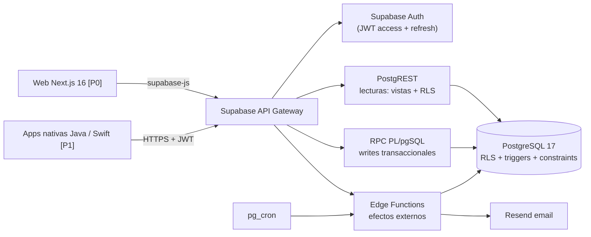

# API y backend

[Seguro] **MIG-18 (#162, 2026-10-08):** [Auth propio de Nest](migration/issue-162/README.md) añade siete operaciones HTTP/OpenAPI/SDK de registro/login/recovery/reset/refresh/logout/password. Access JWT propio dura 15 min y valida familia vigente en SQL; refresh rotatorio hasheado revoca familia ante replay. Web Auth=nest exige todos los transportes de dominio Nest, cookies HttpOnly/Secure/Lax y Origin. GoTrue/OAuth siguen coexistiendo hasta #163/#164; configuración, consentimiento MANAGED, rollback y límites de evidencia están en el runbook. La sección Auth Supabase original de abajo describe el transporte anterior, conservado por defecto.

[Seguro] **MIG-16 (#160, 2026-10-08):** [QR y llegada propia mediante Nest](migration/issue-160/README.md) añade cuatro operaciones HTTP/SDK y QR=nest sobre las mismas RPC/claves SQL. ASI-04 conserva emisión ADMIN, ajustes plegables/guardado explícito, renovación por reloj servidor, fragmento retirado, login, confirmación/registro anterior/vencido/no disponible y reintento manual. El transporte no amplía roles ni agrega pantallas; la evidencia local sintética se registra en el runbook.
**Proyecto:** Asisteam · **Fecha:** 2026-07-03 · **Documentos relacionados:** 02-roles-y-permisos.md, 03-modulos-y-flujos.md, 04-modelo-de-datos.md, 06-arquitectura-y-stack.md, 08-reportes-y-estadisticas.md, 11-legal-seguridad-privacidad.md

[Seguro] **MIG-01 (#145, 2026-10-06):** [matriz de contratos y destinos Nest propuestos](migration/issue-145/contracts.md), con consumidor, firma vigente, permiso, efecto, prueba y responsable. En el corte MIG-01 aún no había rutas Nest de producto; el contrato actual y las historias pendientes se distinguen en el [registro de decisiones](migration/issue-145/README.md).

[Seguro] **MIG-02 (#146, 2026-10-07):** [base ejecutable Nest/Node](migration/issue-146/README.md) con `apps/api`, sondas `/health` y `/ready`, pool pg, errores/logs seguros y contenedor probado localmente. Solo la infraestructura HTTP está implementada; las operaciones de producto siguen en Supabase. CI/staging, OpenAPI y sesión/RLS corresponden a #147–#149.

[Seguro] **MIG-04 (#148, 2026-10-07):** [OpenAPI/client/adaptador Next](migration/issue-148/README.md) especifica el primer contrato grupos/perfil y añade `/api/v1/health` y `/api/v1/ready` reales. En el corte MIG-04 las operaciones de dominio figuraban `contract-only`; La sesión/RLS se concreta en MIG-05; la implementación de grupos/perfil se registra después en MIG-07. Generación y divergencia forman parte de CI; la bandera por módulo conserva un ejecutor y el backend actual sigue atendiendo Supabase.


[Seguro] **MIG-05 (#149, 2026-10-07):** [sesión temporal Nest y contexto SQL](migration/issue-149/README.md) implementa `GET /api/v1/auth/session` → `{user_id}` y verificación Supabase/JWKS/GoTrue, perfil ACTIVE, revocación y transacción en una sola conexión `asisteam_api` sin ownership/BYPASSRLS. Los guards de membresía ACTIVE y proyecciones por rol se reutilizarán en #151–#160; las operaciones de dominio de la tabla siguen en Supabase. Ese corte distinguía sesión implementada y handlers `contract-only`; MIG-07 actualiza grupos/perfil. El [runbook API](../apps/api/README.md#sesión-temporal-y-rol-postgresql--mig-05) exige credenciales externas por rol, emisor fijo y configuración conjunta Auth/base; jobs/webhook no heredan permisos API. Tipos regenerados sin cambio de esquema público; pruebas RLS específicas verdes y un fallo pgTAP preexistente documentado.

---

[Seguro] **MIG-07 (#151, 2026-10-07):** [grupos/perfil y selector por Nest](migration/issue-151/README.md) implementa el primer recorrido de dominio con sesión temporal, consentimiento vigente, RLS, DTO por rol y RPC canónicas. OpenAPI/SDK generados y banderas GROUPS/PROFILE permiten el recorrido Next→Nest→PostgreSQL o el transporte Supabase sobre la misma base, sin fallback ni writes duplicados. Código/menores/revisión de edad/permisos de imagen conservan sus invariantes. Auth/Storage y otros módulos permanecen en su migración separada; evidencia local no acredita despliegue cloud.

[Seguro] **MIG-08 (#152, 2026-10-07):** [integrantes/apoderados/consentimientos por Nest](migration/issue-152/README.md) implementa 17 operaciones HTTP y SDK con MEMBERS=nest, sesión vigente, perfil ACTIVE y contexto RLS. Nómina ADMIN/búsqueda, alta/edición MANAGED, pendientes, bajas/reactivaciones, COACH, vínculo, onboarding, consentimiento de datos, pupilos y aceptación vigente reutilizan las RPC/vistas canónicas; no cambian esquema ni reglas SQL. Aceptación y consulta de consentimiento omiten únicamente su gate para poder completarlo. Envío de invitación/claim permanece #153; mayoría/revocación conservan sus jobs/RPC y visibilidad inmediata.

## 1. Enfoque general del backend

El stack base (ver 06-arquitectura-y-stack.md) es **Supabase (PostgreSQL 17 + Auth + RLS + PostgREST + Edge Functions)**. MIG-07/MIG-08 incorporan handlers Nest para grupos/perfil e integrantes/apoderados/consentimientos bajo banderas; reutilizan la misma base, RLS y RPC. Los módulos aún pendientes conservan la combinación de tres capas original y su convención de equipo:

| Capa | Uso | Regla |
|---|---|---|
| **PostgREST + RLS** | Lecturas y CRUD simple sin efectos colaterales [P0] | Toda lectura pasa por vistas o RPC con **columnas explícitas**; prohibido `SELECT *` sobre `users` hacia no-ADMIN |
| **Funciones RPC (PL/pgSQL, `SECURITY DEFINER` cuando corresponde)** | Escrituras transaccionales con reglas de negocio [P0] | Todo write no trivial pasa por RPC o Edge Function; nunca desde el cliente contra tablas base |
| **Edge Functions (Deno/TypeScript)** | Flujos con efectos externos: email de invitación, claim de cuentas MANAGED, push [P1] | Validan con schemas Zod de `packages/core`; idempotentes cuando las dispara `pg_cron` |

Para que el contrato sea legible y estable ante los clientes (web [P0] y móvil [P1]), la tabla de operaciones de la sección 2 usa la **notación lógica `/api/v1/...`**: cada fila indica en la columna *Implementación* si se resuelve vía PostgREST (tabla/vista), RPC (`rpc/nombre_funcion`) o Edge Function (`functions/v1/nombre`). Esta tabla es el contrato canónico; los nombres de RPC y vistas son los identificadores reales en la base.


```mermaid
flowchart LR
    W["Web Next.js 16 [P0]"] -->|supabase-js| GW[Supabase API Gateway]
    M["Apps nativas Java / Swift [P1]"] -->|HTTPS + JWT| GW
    GW --> AUTH["Supabase Auth\n(JWT access + refresh)"]
    GW --> PGRST["PostgREST\nlecturas: vistas + RLS"]
    GW --> RPC["RPC PL/pgSQL\nwrites transaccionales"]
    GW --> EF["Edge Functions\nefectos externos"]
    PGRST --> DB[(PostgreSQL 17\nRLS + triggers + constraints)]
    RPC --> DB
    EF --> DB
    EF --> RESEND[Resend email]
    CRON[pg_cron] --> EF
```

## 2. Tabla de operaciones (contrato canónico)

Convenciones: rutas lógicas `/api/v1/`, recursos en plural. Rol requerido = rol de la **membership del solicitante en el grupo afectado** (los roles no son globales; ver 02-roles-y-permisos.md). "Autenticado" = cualquier usuario con sesión válida.

### 2.1 Auth

| Método | Ruta lógica | Rol | Descripción | Implementación | Prioridad |
|---|---|---|---|---|---|
| POST | /api/v1/auth/register | Público | Registro con email + contraseña; crea `auth.users` y perfil en `public.users` (ACTIVE) | Supabase Auth `signUp` + trigger de perfil | [P0] |
| POST | /api/v1/auth/login | Público | Login email + contraseña; retorna access + refresh token | Supabase Auth `signInWithPassword` | [P0] |
| POST | /api/v1/auth/refresh | Sesión con refresh token | Renueva el access token | Supabase Auth `refreshSession` | [P0] |
| POST | /api/v1/auth/password-recovery | Público | Envía email de recuperación (respuesta siempre 200, sin revelar existencia del email) | Supabase Auth `resetPasswordForEmail` | [P0] |
| POST | /api/v1/auth/password-reset | Token de recuperación | Fija nueva contraseña | Supabase Auth `updateUser` | [P0] |
| POST | /api/v1/auth/logout | Autenticado | Revoca el refresh token de la sesión | Supabase Auth `signOut` | [P0] |
| POST | /api/v1/auth/social/{google,apple} | Público | Login social | Supabase Auth OAuth nativo, PKCE con callback web `/auth/callback` | [P2 autorizado, #59] |

#### Login Google/Apple (HU-GEN-08, #59)

- Web: botones en `/login`, `/register` y el acceso desde QR. La Server Action valida el proveedor (`google`/`apple`) e inicia `signInWithOAuth` con PKCE. El callback intercambia el código mediante `exchangeCodeForSession`, comprueba perfil `ACTIVE` y redirige a `/welcome`; esta pantalla envía a su grupo/selector a quien ya tenga membresías.
- La vinculación por el mismo email la realiza Supabase Auth. Se conserva `auth.users.id` y, por tanto, el perfil, roles e historial; no hay upsert de `public.users` por email en el cliente ni en el callback. Un email nuevo usa el trigger `handle_new_user` existente. Las colisiones con perfiles MANAGED/INVITED sin credenciales siguen exigiendo sus flujos de invitación y consentimiento.
- Google/Apple no aportan fecha de nacimiento y Apple OAuth no entrega nombre completo: el trigger conserva su fallback de nombre y deja `birthdate` vacío. La bienvenida ofrece **Mi perfil** para completarlos; las RPC siguen rechazando incorporación ATHLETE sin fecha y mantienen las reglas de menores. Un correo privado de Apple distinto del email registrado representa otra identidad; no se fusionan cuentas con emails diferentes.
- Sesión y verificador PKCE en cookies HttpOnly, SameSite=Lax y Secure en producción. El origen de retorno proviene de `ASISTEAM_SITE_URL`, nunca de cabeceras del navegador. Código de grupo/QR se conservan durante 10 minutos en una cookie HttpOnly limitada al callback; el token QR vuelve en fragmento. No se admiten URLs `next` arbitrarias. Cancelación, código vencido/reutilizado y errores responden con un mensaje genérico; el callback usa `private, no-store` y `no-referrer`.

**Configuración de despliegue:**

1. Definir `ASISTEAM_SITE_URL=https://dominio-del-entorno` en el servidor web (origen sin rutas). En desarrollo el valor predeterminado es `http://localhost:3000`. Configurar ese mismo Site URL en Supabase Auth y permitir exactamente `https://dominio-del-entorno/auth/callback` en Redirect URLs.
2. Google: crear un cliente OAuth de tipo web y registrar `https://<proyecto>.supabase.co/auth/v1/callback` como redirect URI del proveedor. Habilitar Google en Supabase con client ID y client secret propios.
3. Apple: configurar el App ID con Sign in with Apple, Services ID, dominio y retorno `https://<proyecto>.supabase.co/auth/v1/callback`. Habilitar Apple en Supabase con el Services ID y el secreto firmado con la clave `.p8`. Renovar el secreto antes de su vencimiento (máximo 6 meses). Apple web requiere el dominio/retorno HTTPS registrado.
4. Local: `supabase/config.toml` declara ambos proveedores deshabilitados hasta contar con credenciales. Para probarlos, habilitar el proveedor y suministrar `SUPABASE_AUTH_EXTERNAL_GOOGLE_CLIENT_ID`, `SUPABASE_AUTH_EXTERNAL_GOOGLE_CLIENT_SECRET`, `SUPABASE_AUTH_EXTERNAL_APPLE_CLIENT_ID` y `SUPABASE_AUTH_EXTERNAL_APPLE_SECRET` al proceso Supabase. Los secretos no se exponen como `NEXT_PUBLIC_*` ni se guardan en Git. La configuración cloud se realiza en cada proyecto Supabase.

**Validación:** Vitest cubre inicio/callback, PKCE real del SDK, cookies, errores y retorno desde código/QR; `supabase/tests/social_auth.test.sql` comprueba perfiles nuevos, incorporación de identidades al mismo UUID, unicidad, rechazo MANAGED/INVITED, RLS y fecha obligatoria. Antes de habilitar en producción, usar cuentas sintéticas de ambos proveedores para confirmar: email registrado conserva IDs e historial, email nuevo crea un único perfil ACTIVE y ve onboarding, cancelar/reutilizar callback no inicia sesión y Apple con correo privado conserva ese correo. Las pruebas locales no sustituyen el intercambio real con Google/Apple.

Referencias: [vinculación de identidades](https://supabase.com/docs/guides/auth/auth-identity-linking), [Google](https://supabase.com/docs/guides/auth/social-login/auth-google), [Apple](https://supabase.com/docs/guides/auth/social-login/auth-apple), [PKCE y SSR](https://supabase.com/docs/guides/auth/server-side/advanced-guide).

### 2.2 Users / perfil

| Método | Ruta lógica | Rol | Descripción | Implementación | Prioridad |
|---|---|---|---|---|---|
| GET | /api/v1/users/me | Autenticado | Perfil propio completo (incluye email, phone, birthdate) | PostgREST `users` + RLS `id = auth_user_id()` | [P0] |
| PATCH | /api/v1/users/me | Autenticado | Edita full_name, phone, birthdate, avatar_url | PostgREST + RLS; birthdate protegido por trigger si rompe invariante de menor (§5) | [P0] |
| GET | /api/v1/users/{id} | ADMIN del grupo común / GUARDIAN del pupilo | Perfil de tercero con columnas según rol (§6.3) | Vista `v_member_profiles` (columnas explícitas) | [P0] |
| POST | /api/v1/users/me/avatar | Autenticado | Sube avatar (JPEG/PNG/WebP ≤ 2 MB) | Supabase Storage bucket `avatars` + RLS por owner | [P0] |
| DELETE | /api/v1/users/me | Autenticado | Solicita eliminación de cuenta (ver 11-legal-seguridad-privacidad.md) | Edge Function `functions/v1/delete-account` | [P0] |

#### Correcciones de mayoría de edad y fotos (HU-GEN-04, #16)

- `rpc/request_birthdate_change(p_birthdate)` registra la corrección menor→adulto cuando hay memberships ATHLETE `ACTIVE` o `PENDING`. Conserva la fecha vigente hasta que **un ADMIN de cada grupo** confirme. Una persona no puede aprobar su propia solicitud; si es el único ADMIN debe incorporar otro mediante la gestión de roles. Las solicitudes nuevas o cambios posteriores de fecha invalidan las anteriores.
- `rpc/list_birthdate_reviews()` proyecta solo nombre, fechas y grupo que administra el solicitante. `rpc/review_birthdate_change(p_request_id,p_group_id,p_approve)` confirma o rechaza desde `/profile/birthdate-requests`. Revalida grupos actuales y que los aprobadores sigan siendo ADMIN `ACTIVE`; la última aprobación aplica la fecha, desactiva guardianships y memberships GUARDIAN sin otros pupilos, conservando historial. El rechazo conserva la fecha anterior.
- La edición directa menor→adulto rechazada por el trigger devuelve `birthdate_admin_confirmation_required`; la web registra la solicitud y guarda los demás campos por separado. `birthdate` no puede vaciarse si existe rol ATHLETE. Los límites de edad se calculan en `America/Santiago`.
- El bucket `avatars` es privado, con límite de 2 MiB y MIME JPEG/PNG/WebP. `avatar_url` guarda una URL relativa estable `/profile/avatar/{auth_user_id}/{archivo}`; el endpoint usa la sesión y RLS en cada lectura, sin cache ni enlaces públicos. La foto se comparte solo con roles autorizados por grupo (V1–V6); un menor requiere consentimiento de imagen vigente.
- `rpc/list_avatar_permissions()` y `rpc/set_avatar_permission(p_guardianship_id,p_allow)` permiten al apoderado gestionar en `/profile` la cláusula de imagen de un consentimiento `DATA_PROCESSING_MINOR` ya vigente. Cada decisión conserva su versión de términos, revoca la evidencia anterior y crea una nueva fila. No conceden el consentimiento general ni crean vínculos (flujos M3).
- Las tablas base `groups`, `memberships`, `guardianships` y `consents` son dependencias de autorización del perfil. Su CRUD permanece cerrado a clientes; las interfaces de gestión M2/M3 siguen en sus historias respectivas.

### 2.3 Groups

| Método | Ruta lógica | Rol | Descripción | Implementación | Prioridad |
|---|---|---|---|---|---|
| POST | /api/v1/groups | Autenticado | Crea grupo (club/equipo); el creador queda ADMIN ACTIVE; genera `invite_code` | RPC `rpc/create_group` | [P0] |
| GET | /api/v1/groups | Autenticado | Lista grupos donde el usuario tiene membership | Vista `v_my_groups` | [P0] |
| GET | /api/v1/groups/{id} | Miembro | Detalle del grupo (ADMIN ve además settings e invite_code) | Vista `v_group_detail` | [P0] |
| PATCH | /api/v1/groups/{id} | ADMIN | Edita name, sport, description, logo_url | PostgREST + RLS `is_group_admin(id)` | [P0] |
| PATCH | /api/v1/groups/{id}/settings | ADMIN | Toggles `athletes_can_view_group_stats`, `guardians_can_view_group_stats` (default false) | RPC `rpc/update_group_settings` (valida shape del JSONB con Zod/CHECK) | [P0] |
| POST | /api/v1/groups/{id}/invite-code/rotate | ADMIN | Regenera `invite_code` e invalida el anterior | RPC `rpc/rotate_invite_code` | [P0] |
| DELETE | /api/v1/groups/{id} | ADMIN | Desactiva/elimina el grupo (soft delete con confirmación) | RPC `rpc/deactivate_group` | [P0] |

**Visibilidad (HU-ADM-14, #33).** `/groups/:groupId/settings/visibility` guarda cada toggle mediante `update_group_settings(p_group_id, p_changes)`. Admite un objeto parcial no vacío que solo contenga los dos booleanos canónicos; combina el cambio con el valor actual en PostgreSQL, sin sobrescribir el otro toggle desde una pestaña desactualizada. Exige ADMIN ACTIVE, bloquea esa membresía durante la escritura y registra `settings_updated_by`/`settings_updated_at`. Los valores iniciales siguen siendo `false`. El autor y la fecha se muestran únicamente a ADMIN; no se crea auditoría histórica [P2]. `v_group_detail.can_view_group_stats` comunica el permiso efectivo sin exponer settings a otros roles.

### 2.4 Memberships

| Método | Ruta lógica | Rol | Descripción | Implementación | Prioridad |
|---|---|---|---|---|---|
| GET | /api/v1/groups/{id}/memberships | ADMIN (lista completa) / miembro (nómina reducida: nombre + rol) | Lista integrantes con filtros `role`, `status` | Vistas `v_group_members_admin` / `v_group_members_basic` | [P0] |
| POST | /api/v1/groups/{id}/memberships | ADMIN | Crea MANAGED sin credenciales; adulto ATHLETE ACTIVE, menor PENDING con apoderado y declaración ADMIN hasta consentimiento | RPC `rpc/create_managed_member` | [P0] |
| PATCH | /api/v1/memberships/{id}/approve | ADMIN | Aprueba membership PENDING → ACTIVE (valida invariante de menor) | RPC `rpc/approve_membership` | [P0] |
| PATCH | /api/v1/memberships/{id}/reject | ADMIN | Rechaza membership PENDING → INACTIVE conservando su fila e historial | RPC `rpc/reject_pending_membership` | [P0] |
| PATCH | /api/v1/memberships/{id}/role | ADMIN | Agrega/quita rol vía filas de membership por rol (nunca edita `role` in place) | RPC `rpc/set_member_roles` | [P0] |
| PATCH | /api/v1/memberships/{id}/deactivate | ADMIN, o el propio usuario (salir del grupo) | Marca INACTIVE; bloquea si es el último ADMIN ACTIVE (§5). La auto-desactivación se rechaza con 422 `minor_cannot_leave` si la membership es ATHLETE y el usuario es menor según `users.birthdate` (la baja de menores la ejecuta solo el ADMIN, nota C8 de 02-roles-y-permisos.md), y con 422 `guardian_has_active_wards` si es GUARDIAN con un pupilo ATHLETE ACTIVE o PENDING en el grupo (preserva la regla V2) | RPC `rpc/deactivate_membership` | [P0] |
| PATCH | /api/v1/memberships/{id}/reactivate | ADMIN | Reactiva INACTIVE → ACTIVE (revalida invariante de menor) | RPC `rpc/reactivate_membership` | [P0] |

#### Gestión de integrantes (HU-ADM-15, #34)

- `/groups/:groupId/members` permite al ADMIN listar por rol y estado, editar perfiles MANAGED y desactivar/reactivar cada membership. `list_group_members(p_group_id,p_role,p_status,p_offset)` pagina de 50 en 50 con columnas explícitas; los datos de contacto y nacimiento solo se devuelven a ADMIN ACTIVE del grupo. No habilita gestión de roles.
- `update_managed_member(p_group_id,p_membership_id,p_full_name,p_birthdate,p_email,p_phone)` edita únicamente cuentas MANAGED, sin credenciales ni cambio de identidad/estado de cuenta. El perfil es global y sus cambios se reflejan en todos sus grupos. Reutiliza las validaciones de perfil y R1; una corrección menor→adulto con memberships ATHLETE ACTIVE/PENDING registra la solicitud existente de confirmación por cada grupo y devuelve `BIRTHDATE_PENDING`, conservando la fecha anterior hasta aprobarse.
- `deactivate_membership(p_group_id,p_membership_id)` y `reactivate_membership(p_group_id,p_membership_id)` implementan aquí la gestión ADMIN de ACTIVE→INACTIVE e INACTIVE→ACTIVE. La salida voluntaria del titular sigue en su historia correspondiente. Bloquean grupo y personas para revalidar autorización, última ADMIN (409 `LAST_ADMIN`), límites de capacidad del grupo según suscripción/legacy (doc 12) y 30 grupos, y consentimiento vigente del menor, incluidos los apoderados auto-incorporados. No se desactiva un GUARDIAN con pupilos ACTIVE/PENDING para preservar V2 (`guardian_has_active_wards`).
- La baja conserva ID, `joined_at`, perfil, vínculos, consentimiento y asistencia. La reactivación conserva `joined_at` (o lo establece si nunca se activó); no crea registros retroactivos. Reactivar un GUARDIAN exige un pupilo menor vigente en el grupo (`guardian_requires_active_ward`). La nómina de asistencia excluye INACTIVE y los reportes históricos siguen disponibles con `include_inactive=true`. Un estado cambiado por otra operación responde 409 `membership_status_changed`; las memberships ajenas o inexistentes responden 404 `membership_not_found`.

#### Delegación de entrenador [P2] (HU-ADM-20, #55)

- `assign_member_coach(p_group_id,p_membership_id)` exige ADMIN ACTIVE y un integrante ACTIVE de ese mismo grupo. Agrega o reactiva una membership COACH, conserva los demás roles y `joined_at` previo, y no duplica al repetir la solicitud. Persona, grupo y permisos se bloquean siguiendo el orden de gestión de integrantes; el límite operativo sigue la suscripción/legacy (doc 12).
- COACH ACTIVE lee actividades y nómina operativa, toma/corrige estados con `record_attendance_bulk` / `update_attendance_record`, y consulta `get_group_attendance_report` y `get_group_stats` sin toggles. Desactivar/reactivar usa las RPC de memberships existentes.
- `v_attendance_operator` entrega identidad del registro, grupo, actividad, membership y estado; la nota solo se proyecta a ADMIN. COACH no puede enviar `note`, ni siquiera null (403 `attendance_notes_admin_required`), ni desmarcar (403 `attendance_clear_admin_required`). Cambiar estados conserva las notas almacenadas. Las vistas ADMIN y el detalle diario de reportes permanecen privados; los conteos compartidos viven en `app_private`, sin permisos cliente.
- Configuración, invitaciones, actividades e integrantes mantienen autorización ADMIN en el servidor. Las rutas web de gestión devuelven 403 para COACH del grupo y 404 para un grupo ajeno; ADMIN+COACH conserva la unión de permisos. Contacto, nacimiento y apoderados de terceros siguen sujetos a V5.

#### Aprobaciones pendientes (HU-ADM-07)

- INT-06, `/groups/:groupId/members/pending`, usa `list_pending_memberships(p_group_id,p_offset)` con páginas de 50. Proyecta ID, nombre, mayoría/minoría de edad en Chile, vínculo activo, consentimiento vigente y si corresponde ratificación MANAGED; solo ADMIN del grupo. `list_pending_athletes` conserva el resumen existente de inicio.
- `approve_membership(p_group_id,p_membership_id)` y `reject_pending_membership(p_group_id,p_membership_id)` revalidan ADMIN y estado `PENDING` bajo bloqueo. La aprobación fija `joined_at` al momento de activar, verifica R1 y capacidad incluyendo apoderados auto-incorporados (CB-02). El rechazo conserva ID, perfil, vínculos, consentimientos y fecha de ingreso previa; `updated_at` registra la transición. No admite reactivaciones ni cambios de otros roles.
- Un menor requiere vínculo activo **y** `DATA_PROCESSING_MINOR` vigente. Las altas MANAGED pendientes conservan la ratificación del apoderado designado mediante `consent_managed_member`; el ADMIN no puede sustituirla desde Aprobaciones. Si el pendiente ya cumplió 18, deja de exigirse vínculo/consentimiento y puede ser aprobado por ADMIN.
- Respuestas: 404 `membership_not_found` para membership ajena, inexistente o de otro rol; 409 `membership_not_pending` si otra decisión ya la resolvió; 422 para vínculo/consentimiento faltante o límites de capacidad. No crea asistencia retroactiva.

#### Alta MANAGED y consentimiento (HU-ADM-05)

- `/groups/:groupId/members/new` llama a `create_managed_member(p_group_id,p_full_name,p_birthdate,p_email,p_guardian)`. Para menores, `p_guardian` contiene nombre, email, vínculo y `authorized: true`; la declaración ADMIN queda en `app_private.managed_member_enrollments`, sin crear consentimiento ni credenciales. No se sobrescriben perfiles existentes encontrados por email.
- El envío reutiliza `send-invitation` con rol GUARDIAN. El apoderado obtiene membership al aceptar la invitación; vincularlo al perfil no abre por sí solo el grupo. Si falla el correo, el alta queda PENDING y la web dirige a las invitaciones para reenviar o emitir la que falte sin repetir el alta.
- `list_managed_member_consents(p_group_id,p_offset)` devuelve solo nombre, vínculo y membership de los pupilos pendientes del solicitante, en páginas de 50; exige membership ACTIVE en ese grupo. `/groups/:groupId/members/consent` solicita aceptación explícita de la versión `2026-09-21`.
- `consent_managed_member(p_membership_id,p_accepted)` solo permite al apoderado vinculado registrar `DATA_PROCESSING_MINOR` (`IN_APP`, sin foto). Activa ATHLETE y fija `joined_at` en la misma transacción, revalidando permisos y capacidad; repetir la confirmación no duplica evidencia. La cuenta del deportista sigue MANAGED. No aprueba solicitudes PENDING originadas por código ni habilita credenciales del menor.

### 2.5 Invitations y join por código

#### Activación de cuenta gestionada (HU-ADM-16, #35)

- «Activar cuenta propia» en `/groups/:groupId/members` llama a `request_managed_activation`. El ADMIN debe registrar primero un email único mediante la edición del perfil. Para adultos devuelve `READY`; para menores exige `DATA_PROCESSING_MINOR` vigente y registra una solicitud privada si falta `ACCOUNT_ACTIVATION_MINOR`.
- El apoderado vigente decide en `/groups/:groupId/members/consent` mediante `review_managed_activation`. Aprobar registra evidencia `ACCOUNT_ACTIVATION_MINOR`, versión `2026-09-21`, canal `IN_APP`; rechazar conserva la cuenta MANAGED. Un reintento de aprobación no duplica consentimiento. La lista solo proyecta nombre, vínculo, estado e identificadores necesarios del pupilo propio.
- La web envía `action: activate` a `send-invitation`, con grupo y membership; el destinatario siempre se obtiene en SQL. `issue_managed_activation`, reservada a Edge, autoriza al ADMIN o al apoderado que aprobó una solicitud de un ADMIN todavía activo. Reutiliza la cuota de 50 envíos diarios por grupo y el transporte de correo existentes. Un fallo del correo conserva el consentimiento y permite reintentar.
- `invitations.activation_membership_id` distingue el claim de una incorporación al grupo. El token aleatorio solo viaja por email, persiste como SHA-256, vence a los siete días y un nuevo envío de activación invalida los anteriores. Tanto la emisión genérica como el reenvío verifican el consentimiento específico del menor.
- El INSERT de Auth y su trigger vuelven a comprobar email, nacimiento y consentimientos. Actualizan el perfil existente a ACTIVE y consumen la invitación en una transacción; conservan `users.id` y todas las filas, estados y fechas de memberships, guardianships y asistencia. El consentimiento revocado antes del registro impide crear credenciales. `invitation_registration_result`, reservada a Edge, devuelve el estado real conservado para evitar redirigir a una membresía sin acceso.

| Método | Ruta lógica | Rol | Descripción | Implementación | Prioridad |
|---|---|---|---|---|---|
| POST | /api/v1/groups/{id}/invitations | ADMIN | Invitación dirigida por email con rol ATHLETE o GUARDIAN; crea `users` INVITED si no existe; envía email | Edge Function `functions/v1/send-invitation` (Resend) | [P0] |
| GET | /api/v1/groups/{id}/invitations | ADMIN | Lista invitaciones con status y expiración | PostgREST `invitations` + RLS | [P0] |
| DELETE | /api/v1/invitations/{id} | ADMIN | Revoca invitación PENDING | RPC `rpc/revoke_invitation` | [P0] |
| POST | /api/v1/invitations/{token}/accept | Autenticado (o registro en el mismo flujo) | Acepta invitación: crea/activa membership; si es claim de cuenta MANAGED exige consentimiento del apoderado para menores | Edge Function `functions/v1/accept-invitation` | [P0] |
| POST | /api/v1/groups/join | Autenticado | Unirse por `invite_code`: solo ATHLETE; adulto → ACTIVE, menor → PENDING hasta apoderado + confirmación ADMIN | RPC `rpc/join_group_by_code` | [P0] |
| GET | /api/v1/invite-codes/{code}/preview | Autenticado | Preview del grupo antes de unirse (solo name, sport, logo_url) | RPC `rpc/preview_invite_code` | [P0] |

### 2.6 Guardianships

| Método | Ruta lógica | Rol | Descripción | Implementación | Prioridad |
|---|---|---|---|---|---|
| POST | /api/v1/guardianships | ADMIN de un grupo del deportista | Vincula apoderado ↔ deportista menor con `relationship`; rechaza si el deportista es adulto | RPC `rpc/create_guardianship` | [P0] |
| GET | /api/v1/guardianships?athlete_user_id= | ADMIN del grupo / el propio GUARDIAN | Lista vínculos de un deportista | Vista `v_guardianships` | [P0] |
| GET | /api/v1/users/me/wards | GUARDIAN | Lista pupilos del apoderado autenticado | Vista `v_my_wards` | [P0] |
| DELETE | /api/v1/guardianships/{id} | ADMIN | Desvincula; bloquea si dejaría a un menor ACTIVE sin apoderado (§5) | RPC `rpc/remove_guardianship` | [P0] |
| — | (job diario) | Sistema | Al cumplir 18 el pupilo: vínculo pasa a inactivo, notifica a las partes | `pg_cron` → Edge Function `functions/v1/guardianship-majority` | [P0] |

#### Registro y vínculo de apoderados (HU-ADM-06)

- `/groups/:groupId/guardians` permite al ADMIN elegir un ATHLETE menor `ACTIVE` o `PENDING` de su grupo, indicar nombre/email del apoderado y `relationship`. `list_guardianship_athletes(p_group_id,p_search,p_offset)` ofrece búsqueda por nombre, páginas de 50 y solo ID/nombre/conteo; exige ADMIN del grupo.
- `create_guardianship(p_group_id,p_athlete_user_id,p_full_name,p_email,p_relationship)` registra el vínculo global y las memberships GUARDIAN `ACTIVE` en una transacción. Es el **registro directo del ADMIN**: incluye el grupo solicitado y los demás grupos donde el pupilo tenga ATHLETE `ACTIVE` (CB-02). Verifica autorización, edad según Chile y capacidad de suscripción/legacy por grupo (doc 12) y 30 grupos/apoderado bajo bloqueo.
- El email identifica al apoderado sin búsqueda global de usuarios. Un perfil nuevo queda `INVITED`, sin credenciales; un perfil existente se conserva. La web reutiliza `send-invitation` para que el destinatario complete su registro o acceda con su cuenta. Un fallo del correo conserva el vínculo y permite recuperar el envío desde Invitaciones.
- Respuestas: 404 `athlete_not_found` para pupilo inexistente o ajeno, 422 `guardian_only_for_minor` para adulto, 409 `guardianship_already_exists` si el par ya tiene vínculo, incluido su historial inactivo. No duplica ni reactiva vínculos históricos. Registrar el vínculo no crea consentimiento ni cambia la membership del deportista; los flujos pendientes conservan sus requisitos propios.

#### Mis pupilos y mayoría de edad (HU-APO-02, #46)

- `/wards` lista pupilos propios en páginas de 50 y `/wards/:athleteUserId` muestra su perfil deportivo y grupos. `v_my_wards` proyecta identificador, nombre, avatar autorizado, edad y días hasta cumplir 18; `v_my_ward_groups` proyecta identificador/nombre/deporte del grupo y estado de la membership ATHLETE. Exigen guardianship activa, minoría de edad en Chile y membership GUARDIAN ACTIVE compartida con el ATHLETE ACTIVE/PENDING. No exponen contacto, fecha de nacimiento, notas ni apoderados de terceros. La función auxiliar `list_my_wards` aplica la misma autorización.
- El middleware revalida la vista antes de iniciar la respuesta del perfil: pupilo ajeno (incluso del mismo grupo), vínculo inactivo, adulto e identificador inexistente devuelven el mismo HTTP 404. La web repite la comprobación al cargar los datos y no usa cache compartido. Los toggles de estadísticas no afectan al acceso a los pupilos propios. Agenda, historial y estadísticas del pupilo conservan sus historias respectivas.
- Cron despacha `guardianship-majority` desde las **00:30 America/Santiago**, con reintentos cada diez minutos si falta completar la fecha o entregar avisos. En un salto horario que omita esa hora se ejecuta en el primer intervalo disponible. La Edge Function, exclusiva para `service_role`, llama a `run_guardianship_majority`: persiste `INACTIVE`/`deactivated_at`, conserva vínculos y consentimientos y desactiva únicamente memberships GUARDIAN que ya no tengan otro pupilo menor ACTIVE/PENDING en ese grupo. La edad se verifica en cada lectura incluso antes de ejecutar el job.
- `job_runs` registra una ejecución transaccional por fecha chilena; no es accesible a clientes. Los recibos de correo son privados en `app_private.guardianship_majority_deliveries`. Se avisa al deportista y los antiguos apoderados; si la cuenta sigue MANAGED, también a sus ADMIN. Destinatarios sin email no se envían. La Edge reclama lotes de cinco con lease de diez minutos y confirma cada recibo solo tras la respuesta de Resend. Los reintentos mantienen la clave de idempotencia del recibo; la deduplicación del proveedor tiene una ventana de 24 horas. Un fallo del correo no revierte la baja.
- **Despliegue:** desplegar `guardianship-majority` con verificación JWT habilitada. Reutiliza `RESEND_API_KEY` e `INVITATION_EMAIL_FROM`; `SUPABASE_SERVICE_ROLE_KEY` permanece solo en Edge. Configurar en Vault `guardianship_majority_url` (URL completa de la función) y `guardianship_majority_key` (JWT `service_role` del mismo entorno), mediante el gestor de secretos; nunca guardarlos en archivos del repositorio. Sin esos valores el despacho no hace peticiones. Verificar `job_runs` y los recibos pendientes tras el despliegue. Referencias operativas: [programación de Edge Functions](https://supabase.com/docs/guides/functions/schedule-functions), [idempotencia de Resend](https://resend.com/changelog/idempotency-keys).

### 2.7 Activity types

| Método | Ruta lógica | Rol | Descripción | Implementación | Prioridad |
|---|---|---|---|---|---|
| GET | /api/v1/groups/{id}/activity-types | Miembro | Tipos de sistema (group_id NULL: TRAINING, PHYSICAL_PREP, COMPETITION, MEETING) + personalizados del grupo | Vista `v_activity_types` | [P0] |
| POST | /api/v1/groups/{id}/activity-types | ADMIN | Crea tipo personalizado (name único por grupo, color hex) | PostgREST + RLS + UNIQUE parcial | [P0] |
| PATCH | /api/v1/activity-types/{id} | ADMIN | Edita name/color/is_active; los tipos de sistema son inmutables | PostgREST + RLS `group_id IS NOT NULL` | [P0] |

### 2.8 Activities

| Método | Ruta lógica | Rol | Descripción | Implementación | Prioridad |
|---|---|---|---|---|---|
| POST | /api/v1/groups/{id}/activities | ADMIN | Crea actividad puntual o recurrente (semanal simple: días de semana + fecha fin); la recurrencia se expande a filas materializadas | RPC `rpc/create_activity` | [P0] |
| GET | /api/v1/groups/{id}/activities | Miembro (GUARDIAN vía pupilo) | Lista/calendario con filtros `from`, `to`, `activity_type_id` | Vista `v_group_activities` | [P0] |
| GET | /api/v1/activities/{id} | Miembro (GUARDIAN vía pupilo) | Detalle de actividad | Vista `v_group_activities` | [P0] |
| PATCH | /api/v1/activities/{id} | ADMIN | Edita una instancia; con `?scope=series` edita las instancias futuras de la serie | RPC `rpc/update_activity` | [P0] |
| DELETE | /api/v1/activities/{id} | ADMIN | Elimina instancia o serie futura (`?scope=series`); bloquea si ya tiene asistencia registrada salvo confirmación explícita | RPC `rpc/delete_activity` | [P0] |

### 2.9 Attendance

| Método | Ruta lógica | Rol | Descripción | Implementación | Prioridad |
|---|---|---|---|---|---|
| PUT | /api/v1/activities/{id}/attendance | ADMIN | Toma/edita asistencia **en lote** (upsert transaccional por `(activity_id, membership_id)`): status ∈ {PRESENT, ABSENT, LATE, EXCUSED} + note opcional | RPC `rpc/record_attendance_bulk` | [P0] |
| GET | /api/v1/activities/{id}/attendance | ADMIN (completo con notas) / ATHLETE-GUARDIAN (solo el registro propio/del pupilo) | Asistencia por actividad | Vistas `v_attendance_admin` / `v_attendance_own` | [P0] |
| PATCH | /api/v1/attendance-records/{id} | ADMIN | Edición puntual posterior de un registro (status/note); actualiza recorded_by/recorded_at | RPC `rpc/update_attendance_record` | [P0] |
| GET | /api/v1/groups/{gid}/athletes/{mid}/attendance | ADMIN / el propio ATHLETE / GUARDIAN del pupilo | Historial individual con filtros de período (semana, mes, rango, temporada) | Vista `v_athlete_attendance_history` | [P0] |
| POST | /api/v1/attendance-records/{id}/excuse-requests | ATHLETE / GUARDIAN | Solicitud de justificación con flujo de aprobación | Post-MVP | [P2] |
| POST | /api/v1/activities/{id}/self-checkin | ATHLETE ACTIVE | Autoregistro propio por QR vigente; preserva marcas anteriores | RPC `rpc/self_checkin` | [P2 autorizado, #58] |

**QR (HU-DEP-10, #58).** ADMIN usa `get_qr_checkin_settings`, `set_qr_checkin_settings` e `issue_activity_checkin_qr`; ATHLETE registra únicamente su propia llegada con `self_checkin(p_activity_id,p_token)`. Ventana inicial −15/+60 min, atraso después de +10 min, configuración por grupo, QR rotatorio de 60 s, reloj y autorización en servidor, bloqueo compartido con toma manual e idempotencia sin sobrescribir marcas anteriores. Contrato completo, errores y operación: [14-asistencia-qr.md](14-asistencia-qr.md).

`update_attendance_record(p_record_id, p_changes)` corrige un registro existente, incluso de una actividad pasada. `p_changes` admite solo `status` y/o `note`: omitir un campo conserva su valor actual en la base; `note: null` o una nota vacía la borra. La RPC comparte el bloqueo de la actividad con `record_attendance_bulk` y `clear_attendance_record`, por lo que guardar una nota no repone un estado desactualizado del navegador. Reutiliza la validación y auditoría del upsert (`recorded_by` del editor autenticado y `recorded_at` del guardado), conserva el ID y responde con el mismo formato del lote. Un registro inexistente o de un grupo ajeno devuelve 404 `attendance_record_not_found`; un miembro del grupo sin ADMIN recibe 403 `admin_required`. Las altas retroactivas sin registro siguen usando `record_attendance_bulk`; las consultas posteriores leen los estados corregidos sin cache de métricas.

**Historial propio (HU-DEP-03, #39).** `rpc/get_my_attendance_history(p_group_id, p_period = 'month', p_from, p_to, p_activity_type_ids = '{}', p_page = 1, p_page_size = 50)` resuelve la membership ATHLETE ACTIVE del usuario autenticado; no recibe identidad de otro deportista. Consulta `v_athlete_attendance_history`, cuya proyección actual es exclusivamente propia, incluso con multirol o toggles activos. Devuelve `group_id`, `membership_id`, `full_name` propio, `period`, `totals` canónicos completos y `records` paginados (máximo 100) por fecha descendente e ID descendente como desempate. Cada registro contiene actividad, fecha, tipo, estado y nota propia. Excluye futuras, actividades previas a `joined_at` y actividades sin registro. Los tipos inactivos conservan su historial. Los períodos usan los mismos límites de `America/Santiago` que el reporte ADMIN; temporada comienza en la creación del grupo. Una corrección o revocación se refleja en la siguiente lectura. Errores: 401 sin identidad, 404 `attendance_history_not_found` si no hay membership ATHLETE ACTIVE propia en el grupo, 400 para filtros inválidos. Los flujos de consulta de terceros por ADMIN/GUARDIAN se implementan en sus respectivas historias.

La web ofrece `/groups/:groupId/me/history` desde «Mi asistencia» y `/me/history` como acceso directo con selección entre los grupos donde el usuario es ATHLETE. Lista y totales se consultan juntos con el mismo filtro; la paginación conserva período, fechas y tipos.

**Historial del pupilo (HU-APO-03, #47).** `rpc/get_ward_attendance_history(p_group_id, p_athlete_user_id, p_period = 'month', p_from, p_to, p_activity_type_ids = '{}', p_page = 1, p_page_size = 50)` devuelve el mismo contrato estricto de historial individual que la consulta propia. Resuelve la membership ATHLETE ACTIVE del pupilo y exige membership GUARDIAN ACTIVE del solicitante en ese grupo, vínculo ACTIVE y minoría de edad vigente en Chile. Reevalúa los permisos en cada lectura, incluso antes del job de mayoría de edad y con multirol ADMIN; los toggles no modifican este acceso. `v_ward_attendance_history` proyecta únicamente los registros autorizados del pupilo (incluidas sus notas), excluyendo futuras, preingreso y actividades sin registro. Reutiliza límites de período y métrica canónica SQL, con totales completos independientes de la página. No amplía `v_athlete_attendance_history`, que sigue siendo exclusivamente propia. Sin sesión devuelve 401; pupilo no vinculado, inactivo, PENDING, adulto, grupo no compartido o identidad inexistente devuelven el mismo 404 `attendance_history_not_found`; filtros inválidos, 400. La web accede desde el perfil del pupilo a `/groups/:groupId/wards/:athleteUserId/history`; todos los filtros y enlaces conservan pupilo y grupo.

### 2.10 Reports

| Método | Ruta lógica | Rol | Descripción | Implementación | Prioridad |
|---|---|---|---|---|---|
| GET | /api/v1/groups/{id}/reports/attendance | ADMIN | % de asistencia por deportista, por tipo de actividad y por período (`period=week\|month\|custom\|season`, `from`, `to`) | RPC de lectura `rpc/get_group_attendance_report` sobre `v_group_attendance_report` (métrica canónica, §5) | [P0] |
| GET | /api/v1/groups/{id}/reports/attendance/aggregate | ATHLETE / GUARDIAN, **solo si el toggle respectivo del grupo es true** | Estadísticas agregadas: avatar y nombre + % + totales de cada integrante; nada más (regla de visibilidad 5) | Vista `v_group_stats_members` + RPC paginada `rpc/get_group_stats` (evalúan permisos vigentes) | [P0] |
| GET | /api/v1/groups/{gid}/athletes/{mid}/reports | ADMIN / propio / GUARDIAN del pupilo | Reporte individual: %, desglose por estado, indicador de puntualidad (LATE aparte), por período | Vista `v_athlete_attendance_summary` | [P0] |
| GET | /api/v1/groups/{id}/reports/attendance/export?format=csv | ADMIN | Exportación CSV del reporte de grupo | Edge Function `functions/v1/export-report` | [P1] |

**Reportes ADMIN (HU-ADM-13, #32).** `get_group_attendance_report` recibe `p_group_id`, `p_period` (default `month`), `p_from`/`p_to` (fechas chilenas), `p_activity_type_ids` (array UUID, vacío = todos), `p_include_inactive` (default `false`), `p_page` (default 1), `p_page_size` (default 50, máximo 100) y `p_sort` (`attendance` descendente o `name` ascendente). En semana/mes, `p_from` es una fecha de referencia y se usa hoy en Chile si se omite; en rango personalizado ambos extremos son obligatorios e inclusivos; temporada ignora las fechas y comienza en la creación del grupo. Los límites se resuelven en PostgreSQL con `America/Santiago`, incluidos cambios de hora. Tipos desactivados conservan su historial consultable.

La vista agrupa por deportista/tipo/día únicamente convocatorias existentes, pasadas y posteriores a `joined_at`, y exige ADMIN dentro de la base. La RPC agrega los conteos del período, incluye deportistas sin convocatorias con porcentajes `null` y aplica la fórmula única `app_private.attendance_metrics`; no promedia porcentajes para la fila de totales. Devuelve `by_athlete` paginado (con `membership_status`), `by_activity_type`, `trend` semanal, `period`, `has_activities`, `page` y `page_size`. `totals` contiene los conteos completos del filtro, `athletes`, `activities`, `attendance_pct`, `late_rate`, `average_attendance_pct` (promedio individual sin valores nulos) y `best_full_name`. Las actividades del KPI son las realizadas en el período, incluso sin asistencia registrada; estas últimas no entran en la métrica. Los totales y desgloses no dependen de la página. La RPC devuelve 401 sin identidad, 404 para grupo no visible, 403 para miembro no-ADMIN y 400 para filtros inválidos. No se cachea: una corrección de asistencia se refleja en la siguiente consulta.

**Agregados por visibilidad (HU-ADM-14, #33).** `get_group_stats(p_group_id, p_page = 1, p_page_size = 50)` consulta `v_group_stats_members` y devuelve la tabla de temporada de ATHLETE ACTIVE, ordenada por nombre y membresía, con un máximo de 100 filas por página. `members` contiene solo `membership_id`, `full_name`, `avatar_url` autorizado y los conteos/porcentajes canónicos; `totals` usa los conteos de todo el grupo, independientemente de la página. No incluye estado de cuenta/membresía, notas, fechas por actividad ni datos de contacto/apoderados. Excluye futuras y preingreso; un deportista sin convocatorias conserva porcentajes `null`. Reutiliza `app_private.attendance_metrics`, sin otra fórmula.

El permiso se reevalúa en la base en cada lectura, incluida la consulta directa a la vista. ADMIN puede previsualizar; ATHLETE requiere su toggle; GUARDIAN requiere el suyo y un pupilo menor vigente con membresía ATHLETE ACTIVE en ese grupo. Los permisos multirol se unen. Una cuenta sin identidad recibe 401; grupo ajeno/inexistente, 404; toggle apagado o apoderado sin pupilo vigente, 403; paginación inválida, 400. La web presenta el estado deshabilitado y conserva los accesos a asistencia propia/pupilos. Cambiar un toggle afecta la siguiente lectura usando la misma sesión, sin cache de métricas, redeploy ni relogin. Las RPC/vistas exclusivas de ADMIN conservan sus permisos.

### 2.11 Notifications

| Método | Ruta lógica | Rol | Descripción | Implementación | Prioridad |
|---|---|---|---|---|---|
| POST | /api/v1/users/me/push-tokens | Autenticado | Contrato actual registra token Expo; migrar a token nativo FCM/APNs | PostgREST `push_tokens` + RLS por owner; esquema/proveedor pendientes | [P1] |
| — | (jobs) | Sistema | Recordatorio de actividad a miembros; aviso de ausencia (ABSENT) al apoderado tras el registro | `pg_cron` + Edge Function `functions/v1/send-push` (idempotente) | [P1] |

Para anuncios #57 se implementan las RPC `register_announcement_push_token(p_token,p_platform)`, `unregister_announcement_push_token(p_token)` y `set_announcement_push_enabled(p_enabled)` con identidad del JWT, no `user_id` aportado por el cliente. **Implementación actual:** registro de tokens Expo IOS/ANDROID, opt-in independiente y desregistro al cerrar sesión. **Plan móvil vigente desde 2026-10-05:** migrar token/transporte a FCM para Android y APNs para iOS; revisar esquema, Edge Function, secretos y transición de tokens. El contrato P1 de recordatorios/ausencias anterior sigue pendiente en este checkout.

### 2.12 Anuncios [P2 autorizado, #57]

| RPC / Edge | Acceso | Contrato |
|---|---|---|
| `list_group_announcements(p_group_id,p_page=1)` | Miembro ACTIVE | 50 filas por página, recientes primero; solo id, group_id, title, body, created_at, updated_at, total_count. |
| `publish_group_announcement(p_group_id,p_title,p_body,p_request_id)` | ADMIN ACTIVE | Publicación y cola atómicas; UUID estable por intento lógico evita duplicados. |
| `update_group_announcement(p_group_id,p_announcement_id,p_title,p_body,p_updated_at)` | ADMIN ACTIVE | Versión exacta del servidor; 409 `announcement_changed` ante edición concurrente. |
| `delete_group_announcement(p_group_id,p_announcement_id,p_updated_at)` | ADMIN ACTIVE | Borrado lógico con la misma protección de versión; cancela push pendientes. |
| `functions/v1/send-announcement-push` | Solo service_role | POST desde pg_cron, reserva con lease, envía a Expo y consulta recibos; sin cuerpos ni tokens en logs/respuesta. |

La web traduce errores RPC a mensajes españoles uniformes; PostgREST conserva sus códigos PT400/401/403/404/409. No hay caché persistente del muro; la página visible refresca cada 30 segundos, al recuperar foco y manualmente. Ver [parámetros, privacidad y operación](13-anuncios.md).

## 3. Ejemplos de request/response (endpoints núcleo)

Errores en formato uniforme: `{ "error": { "code": "string_estable", "message": "texto en español", "details": {} } }`. Códigos HTTP: 400 validación, 401 sin sesión, 403 sin permiso, 404 no existe **o no visible** (anti-enumeración), 409 conflicto de unicidad, 422 regla de negocio, 429 rate limit.

### 3.1 Login — `POST /api/v1/auth/login` [P0]

```json
// Request
{ "email": "carla.reyes@example.cl", "password": "S3gura!2026" }

// Response 200
{
  "access_token": "eyJhbGciOiJIUzI1NiIs...",
  "token_type": "bearer",
  "expires_in": 3600,
  "refresh_token": "v1.MRjzXk...",
  "user": {
    "id": "a1b2c3d4-0001-4a2b-9c3d-111111111111",
    "email": "carla.reyes@example.cl",
    "full_name": "Carla Reyes",
    "account_status": "ACTIVE"
  }
}
// 400 credenciales inválidas: mensaje genérico "Email o contraseña incorrectos"
// (no distingue email inexistente de contraseña errada — anti-enumeración)
```

### 3.2 Crear actividad recurrente — `POST /api/v1/groups/{id}/activities` → `rpc/create_activity` [P0]

```json
// Request
{
  "activity_type_id": "b2c3d4e5-0002-4b3c-8d4e-222222222222",
  "title": "Entrenamiento adultos",
  "description": "Cancha 2, traer petos",
  "location": "Estadio Municipal de Ñuñoa",
  "starts_at": "2026-07-07T22:30:00Z",
  "ends_at": "2026-07-08T00:00:00Z",
  "recurrence_rule": { "freq": "WEEKLY", "by_weekday": ["TU", "TH"], "until": "2026-09-30" }
}

// Respuesta de rpc/create_activity — UUID de la primera ocurrencia materializada
"d4e5f6a7-0004-4d5e-8f6a-444444444444"
// 422 { "error": { "code": "invalid_date_range", "message": "ends_at debe ser posterior a starts_at" } }
```

La RPC conserva el retorno UUID de la creación puntual (HU-ADM-08) y agrega `p_recurrence_rule` opcional. La primera ocurrencia tiene `recurrence_source_id = NULL`; las demás la referencian, y todas copian la regla. `v_group_activities` proyecta ambos campos. La expansión usa días y horas de `America/Santiago`, incluye la fecha de término y rechaza toda la transacción si supera 26 semanas/150 ocurrencias o si un horario es inexistente o ambiguo por cambio de hora.

`update_activity` y `delete_activity` reciben `p_group_id`, `p_activity_id` y `p_scope` (`single` por defecto, o `series`), y devuelven la cantidad de filas afectadas. Desde el detalle, `/groups/:groupId/activities/:activityId/edit` permite elegir «solo esta» o «esta y las siguientes». El alcance de serie toma las ocurrencias desde la seleccionada, futuras y sin asistencia: la edición actualiza datos y horarios, conservando fechas y días de cada ocurrencia. Mover una fecha se hace con edición puntual. No reexpande ni cambia los días/fecha final de la regla original.

Eliminar una ocurrencia con asistencia devuelve 409 `attendance_confirmation_required` hasta recibir `p_confirm_attendance = true` tras una confirmación adicional de la UI. El alcance de serie siempre conserva las que tienen asistencia, aunque se envíe esa bandera. Si se elimina la raíz, la primera sobreviviente pasa a ser raíz para que las demás sigan agrupadas. Las escrituras bloquean las actividades antes de evaluar asistencia, compartiendo la serialización con `record_attendance_bulk`.

### 3.3 Tomar asistencia en lote — `PUT /api/v1/activities/{id}/attendance` → `rpc/record_attendance_bulk` [P0]

```json
// Request (upsert transaccional: crea o actualiza según la clave única activity_id + membership_id)
{
  "records": [
    { "membership_id": "f6a7b8c9-0006-4f7a-8b8c-666666666666", "status": "PRESENT" },
    { "membership_id": "a7b8c9d0-0007-4a8b-9c9d-777777777777", "status": "LATE", "note": "Llegó 15 min tarde" },
    { "membership_id": "b8c9d0e1-0008-4b9c-8d0e-888888888888", "status": "EXCUSED", "note": "Certificado médico" }
  ]
}

// Response 200
{
  "activity_id": "d4e5f6a7-0004-4d5e-8f6a-444444444444",
  "recorded_by": "a1b2c3d4-0001-4a2b-9c3d-111111111111",
  "recorded_at": "2026-07-07T23:05:12Z",
  "created": 2,
  "updated": 1,
  "summary": { "PRESENT": 1, "ABSENT": 0, "LATE": 1, "EXCUSED": 1 }
}
// 403 si el solicitante no es ADMIN ACTIVE del grupo de la actividad
// 422 { "error": { "code": "membership_not_athlete_in_group", "message": "El integrante no es deportista de este grupo" } }
```

### 3.4 Reporte de grupo — `GET /api/v1/groups/{id}/reports/attendance?period=month&from=2026-06-01` [P0]

```json
// Response 200 (solo ADMIN; métrica canónica: (PRESENT+LATE)/(convocadas−EXCUSED)×100, 1 decimal)
{
  "group_id": "e5f6a7b8-0005-4e6f-9a7b-555555555555",
  "period": { "type": "month", "from": "2026-06-01", "to": "2026-06-30", "timezone": "America/Santiago" },
  "totals": { "activities": 12, "athletes": 18 },
  "by_athlete": [
    {
      "membership_id": "f6a7b8c9-0006-4f7a-8b8c-666666666666",
      "full_name": "Diego Fuentes",
      "convened": 12, "present": 9, "late": 1, "absent": 1, "excused": 1,
      "attendance_pct": 90.9,
      "late_rate": 10.0
    }
  ],
  "by_activity_type": [
    { "activity_type_id": "b2c3d4e5-...", "name": "Entrenamiento", "activities": 8, "attendance_pct": 87.5 },
    { "activity_type_id": "c9d0e1f2-...", "name": "Competencia", "activities": 4, "attendance_pct": 95.2 }
  ]
}
```

### 3.5 Unirse por código — `POST /api/v1/groups/join` → `rpc/join_group_by_code` [P0]

```json
// Request
{ "invite_code": "ASNV-7K2M" }

// Response 201 — adulto con cuenta: membership ATHLETE ACTIVE
{
  "membership": {
    "id": "c9d0e1f2-0009-4c0d-9e1f-999999999999",
    "group_id": "e5f6a7b8-0005-4e6f-9a7b-555555555555",
    "role": "ATHLETE",
    "status": "ACTIVE",
    "joined_at": "2026-07-03T14:22:40Z"
  },
  "group": { "name": "Club Atlético Ñuñoa", "sport": "Atletismo" }
}

// Response 201 — menor de edad: queda PENDING (requiere apoderado vinculado + confirmación del ADMIN)
{
  "membership": { "id": "...", "role": "ATHLETE", "status": "PENDING" },
  "pending_reason": "minor_requires_guardian_and_admin_approval"
}
// 404 { "error": { "code": "invalid_invite_code", "message": "Código no válido" } } (mismo error si expiró/rotó)
// 409 { "error": { "code": "membership_already_exists", "message": "Ya perteneces a este grupo como deportista" } }
```

## 4. Validaciones por recurso

Los schemas Zod viven en `packages/core` y se comparten entre web [P0] y Edge Functions. Las apps nativas [P1] validan formularios localmente contra los contratos de campo/error; CHECK/UNIQUE/RPC de PostgreSQL son la red de seguridad (ver 04-modelo-de-datos.md).

| Recurso | Validaciones clave |
|---|---|
| users | `email` formato RFC + único (case-insensitive) y nullable solo si `account_status = MANAGED`; `full_name` 2-120 chars; `phone` E.164 opcional (+56...); `birthdate` fecha pasada, edad ≤ 110 años; `account_status` ∈ enum |
| groups | `name` 3-80 chars, `sport` 2-50; `invite_code` único, generado servidor (nunca lo elige el cliente); `settings` JSONB con shape exacto validado (dos booleans, default `false`) |
| memberships | Único `(user_id, group_id, role)`; `role` y `status` ∈ enums; ATHLETE menor de edad no puede quedar ACTIVE sin guardianship activa (trigger); transición de status solo vía RPC |
| guardianships | Único `(guardian_user_id, athlete_user_id)`; `guardian_user_id ≠ athlete_user_id`; pupilo debe ser menor de 18 al crear el vínculo; `relationship` texto 2-40 chars |
| invitations | `token` ≥ 128 bits aleatorios (URL-safe), único; `expires_at` = creación + 7 días; `role` ∈ {ATHLETE, GUARDIAN} (nunca ADMIN por invitación en MVP); email formato válido |
| activity_types | `name` 2-40 chars, único por grupo (case-insensitive); `color` hex `#RRGGBB`; tipos de sistema (`group_id IS NULL`) inmutables desde la API |
| activities | `starts_at < ends_at`; duración ≤ 24 h; `title` 3-120 chars; `activity_type_id` de sistema o del mismo `group_id`; `recurrence_rule`: solo `freq = WEEKLY`, `by_weekday` ⊆ {MO..SU} no vacío, `until` ≤ 26 semanas (~6 meses) desde `starts_at` o máx. 150 instancias, lo que ocurra primero (límite anti-explosión, coherente con 03-modulos-y-flujos.md F5 y 06-arquitectura-y-stack.md); fechas siempre timestamptz UTC |
| attendance_records | Único `(activity_id, membership_id)`; `membership_id` debe ser rol ATHLETE, status ACTIVE, del **mismo grupo** que la actividad (trigger); `status` ∈ enum; `note` ≤ 500 chars; lote ≤ 500 registros por request (Academia usa lotes secuenciales de 500; cada lote es transaccional y preserva los anteriores si falla uno, doc 12) |
| reports | `period` ∈ {week, month, custom, season}; en custom `from ≤ to` y rango ≤ 24 meses; los límites de período se interpretan en America/Santiago y se convierten a UTC en la vista |

## 5. Reglas de negocio del backend

Cada regla se implementa en la capa indicada y se prueba en CI (pgTAP para SQL, Vitest para `packages/core`).

| # | Regla | Implementación | Prioridad |
|---|---|---|---|
| R1 | **Menor requiere apoderado**: ATHLETE < 18 años no puede pasar a membership ACTIVE sin al menos una guardianship activa **con consentimiento `DATA_PROCESSING_MINOR` vigente** (fila en `consents` con `revoked_at NULL`, ver 11-legal-seguridad-privacidad.md) | Trigger `BEFORE UPDATE` en memberships + validación de ambas condiciones en `rpc/approve_membership`, `rpc/create_managed_member`, `rpc/join_group_by_code` y `rpc/reactivate_membership` | [P0] |
| R2 | **Solo ADMIN toma y edita asistencia** (COACH es [P2]) | `rpc/record_attendance_bulk` y `rpc/update_attendance_record` verifican membership ADMIN ACTIVE en el grupo de la actividad; RLS niega INSERT/UPDATE directo a attendance_records | [P0] |
| R3 | **Unicidad de asistencia** por `(activity_id, membership_id)`: tomar dos veces = upsert, nunca duplicado | UNIQUE compuesto + `INSERT ... ON CONFLICT DO UPDATE` en la RPC | [P0] |
| R4 | **Métrica canónica**: `(PRESENT + LATE) / (convocadas − EXCUSED) × 100`, redondeo a 1 decimal; denominador 0 → `attendance_pct: null` (no 0%) | Vista SQL `v_group_attendance_report` y función en `packages/core`, testeadas contra los **mismos casos canónicos** | [P0] |
| R5 | **Último ADMIN no puede salir ni desactivarse**: el grupo debe tener siempre ≥ 1 ADMIN ACTIVE. La misma RPC rechaza la auto-desactivación de un ATHLETE menor de edad (422 `minor_cannot_leave`, nota C8 de 02-roles-y-permisos.md) y de un GUARDIAN con pupilos vigentes en el grupo (422 `guardian_has_active_wards`) | `rpc/deactivate_membership` cuenta ADMIN ACTIVE con lock (`FOR UPDATE`) y rechaza con HTTP 409, código `LAST_ADMIN` (alineado con CB-05 de 02-roles-y-permisos.md) | [P0] |
| R6 | **Scoping por grupo**: nadie lee ni escribe datos de grupos donde no tiene membership ACTIVE | RLS en todas las tablas con `group_id` usando helpers `SECURITY DEFINER` `is_member()`, `is_group_admin()`, `is_guardian_of()` | [P0] |
| R7 | **Convocatoria**: una actividad cuenta como convocada para un deportista **solo si existe una fila en `attendance_records` para su membership** en esa actividad (equivalencia operativa: denominador = PRESENT + LATE + ABSENT). Las actividades del grupo sin registro de asistencia no entran en numerador ni denominador de ninguna métrica. Filtros adicionales: solo actividades con `starts_at <= now()` y `starts_at >= joined_at` de la membership (ver 08-reportes-y-estadisticas.md, sección 1) | Lógica en `v_group_attendance_report`; documentada en 08-reportes-y-estadisticas.md | [P0] |
| R8 | **Registro anticipado permitido**: `rpc/record_attendance_bulk` acepta registros de una actividad aún no iniciada (la UI muestra un banner de advertencia, ver 05-pantallas.md ASI-01); las actividades con `starts_at > now()` se excluyen de numerador y denominador de todas las métricas hasta que comiencen (ver 08-reportes-y-estadisticas.md, sección 1) | `rpc/record_attendance_bulk` sin bloqueo por fecha; exclusión temporal en las vistas de reportes | [P0] |
| R9 | **GUARDIAN solo de menores**: al cumplir 18 el pupilo, job diario marca la guardianship inactiva y notifica; el ex-pupilo pasa a gestionar su cuenta | `pg_cron` (00:30 America/Santiago, alineado con 02-roles-y-permisos.md §3.4) → Edge Function idempotente `guardianship-majority` | [P0] |
| R10 | **Incorporación por código solo ATHLETE**; GUARDIAN solo por invitación dirigida o registro directo del ADMIN | `rpc/join_group_by_code` fija `role = 'ATHLETE'` sin parámetro de rol | [P0] |
| R11 | **Claim MANAGED → ACTIVE**: solo vía invitación por email; si el perfil es de un menor, requiere consentimiento registrado del apoderado (timestamp + guardian_user_id) antes de activar credenciales | Edge Function `accept-invitation`, transaccional; detalle en 11-legal-seguridad-privacidad.md | [P0] |
| R12 | **Expiración de invitaciones**: PENDING → EXPIRED pasado `expires_at` (7 días); un token EXPIRED o ACCEPTED nunca se reutiliza | `pg_cron` diario + check en `accept-invitation` | [P0] |
| R13 | **Edición de serie recurrente**: `scope=series` afecta solo instancias futuras (>= now) sin asistencia registrada; las pasadas son inmutables salvo edición puntual | `rpc/update_activity` / `rpc/delete_activity` | [P0] |
| R14 | **Tipos de sistema inmutables**: TRAINING, PHYSICAL_PREP, COMPETITION, MEETING no se editan ni desactivan por grupo | RLS: UPDATE solo donde `group_id IS NOT NULL` | [P0] |
| R15 | **Aviso de ausencia al apoderado**: registrar ABSENT de un pupilo encola push al GUARDIAN | Trigger → cola → Edge Function `send-push` | [P1] |

## 6. Autenticación, autorización y permisos

### 6.1 Autenticación (JWT access + refresh) [P0]

- Supabase Auth emite **access token JWT** (vida 1 hora, firma verificada por PostgREST en cada request) y **refresh token** de un solo uso con rotación automática (detección de reutilización → revocación de la familia de tokens).
- El JWT viaja en `Authorization: Bearer`; en el cliente web se gestiona con `@supabase/ssr` (cookies `HttpOnly`, `Secure`, `SameSite=Lax`), nunca en `localStorage`.
- `auth.uid()` del JWT se traduce a `public.users.id` con la función helper `auth_user_id()` (por el desacople para cuentas MANAGED, ver 06-arquitectura-y-stack.md).

### 6.2 Guard de membership por group_id [P0]

Toda política RLS de tablas con `group_id` se apoya en tres helpers `SECURITY DEFINER` con `search_path` fijado:

- `is_member(p_group_id uuid) → bool`: membership ACTIVE de cualquier rol.
- `is_group_admin(p_group_id uuid) → bool`: membership ADMIN ACTIVE.
- `is_guardian_of(p_athlete_user_id uuid) → bool`: guardianship activa hacia el pupilo.

Las RPC repiten la verificación al inicio (defensa en profundidad: RLS + check explícito), porque varias son `SECURITY DEFINER` para operar sobre tablas protegidas.

### 6.3 Matriz rol → operación (resumen) [P0]

| Operación | ADMIN | ATHLETE | GUARDIAN |
|---|---|---|---|
| Crear/editar grupo, settings, rotar invite_code | Sí | No | No |
| Gestionar memberships, invitaciones, guardianships | Sí | Salir del grupo (si es adulto; los menores solo vía ADMIN) | Salir del grupo solo si no tiene pupilos con membership ATHLETE ACTIVE o PENDING en él (preserva la regla de visibilidad V2) |
| CRUD actividades y tipos personalizados | Sí | No | No |
| Ver actividades del grupo | Sí | Sí | Sí (grupos del pupilo) |
| Tomar/editar asistencia | Sí | No | No |
| Ver asistencia por actividad | Todos + notas | Solo la propia | Solo la del pupilo |
| Historial y % individual | Cualquier deportista del grupo | El propio | El del pupilo |
| Reporte agregado del grupo | Sí | Solo si `athletes_can_view_group_stats = true` | Solo si `guardians_can_view_group_stats = true` |
| Exportar CSV [P1] | Sí | No | No |

### 6.4 Filtrado de campos por rol (regla de visibilidad 5) [P0]

Nunca se sirve `SELECT *` de `users` a no-ADMIN. Vistas con columnas explícitas:

| Vista | Consumidor | Columnas de terceros expuestas |
|---|---|---|
| `v_group_members_basic` | ATHLETE / GUARDIAN | `full_name`, `role`, `avatar_url` — **jamás** email, phone, birthdate, notas, datos de apoderados |
| `v_group_stats_members` | ATHLETE / GUARDIAN con toggle activo | `full_name`, `avatar_url` + métricas agregadas (`attendance_pct`, totales por estado) — misma exposición que `v_group_members_basic` (ver 08-reportes-y-estadisticas.md §3.2) |
| `v_group_members_admin` | ADMIN del grupo | Perfil completo + estado de membership + apoderados vinculados |
| `v_attendance_own` | ATHLETE / GUARDIAN | Solo registros propios o del pupilo, con su propia `note` |

Los toggles `athletes_can_view_group_stats` / `guardians_can_view_group_stats` se evalúan **dentro de la vista** (join a `groups.settings`), no en el cliente: si el toggle está en false la vista retorna cero filas para ese rol.

## 7. Seguridad

### 7.1 OWASP Top 10 aplicado a Asisteam [P0]

| Riesgo OWASP | Mitigación en el proyecto |
|---|---|
| A01 Broken Access Control | RLS deny-by-default en todas las tablas (`ENABLE ROW LEVEL SECURITY` + sin política = sin acceso); pgTAP con seeds por rol en CI prueba cada política; anon key solo permite auth y RPC públicas |
| A02 Cryptographic Failures | TLS 1.2+ extremo a extremo; contraseñas con **bcrypt** (Supabase Auth, factor de costo por defecto ≥ 10); tokens de invitación y recovery aleatorios ≥ 128 bits; buckets de Storage privados con URLs firmadas de corta vida |
| A03 Injection | PostgREST parametriza todo; en PL/pgSQL prohibido `EXECUTE` con concatenación (lint en CI); Zod valida shape y tipos antes de tocar la base |
| A04 Insecure Design | Convención "write no trivial = RPC/Edge Function" concentra las invariantes; triggers + constraints como red final; revisión de diseño obligatoria para flujos con menores (R1, R11) |
| A05 Security Misconfiguration | `service_role` key solo en Edge Functions (jamás en clientes ni en variables `NEXT_PUBLIC_*`); helpers `SECURITY DEFINER` con `search_path` fijo; secretos en Vercel/Supabase env, no en el repo |
| A06 Vulnerable Components | Dependabot + `pnpm audit` en CI; actualización mensual de Postgres/extensiones vía Supabase |
| A07 Auth Failures | Rotación de refresh tokens con detección de reutilización; rate limiting de login (§7.2); mensajes de error genéricos; expiración de sesión configurada |
| A08 Data Integrity Failures | CI con revisión obligatoria (PR + checks) para migraciones SQL; Edge Functions desplegadas solo desde GitHub Actions |
| A09 Logging Failures | Sentry en web y Edge Functions; log de `recorded_by`/`recorded_at` en asistencia y de actor en RPCs sensibles (auditoría completa es [P2]) |
| A10 SSRF | Edge Functions no hacen fetch de URLs provistas por usuarios; avatares/logos se suben a Storage, nunca se descargan de URLs externas |

### 7.2 Rate limiting [P0]

| Superficie | Límite | Capa |
|---|---|---|
| Login / password recovery | Límites nativos de Supabase Auth (por IP y por email) + captcha (Turnstile) si supera umbral | Supabase Auth |
| `rpc/join_group_by_code` y `preview_invite_code` | 10 intentos / 15 min por usuario (anti fuerza bruta del código; formato `XXXX-XXXX` ≈ 32^8 combinaciones) | Tabla de intentos + check en la RPC |
| `accept-invitation` | 10 intentos / hora por IP | Edge Function |
| Envío de invitaciones por email | 50 / día por grupo (anti-spam con Resend) | Edge Function |
| API general | Límites del plan Supabase + WAF/protección DDoS de Vercel y Supabase | Plataforma |

### 7.3 Tokens, expiración y anti-enumeración [P0]

- Access token: 1 h. Refresh token: rotación en cada uso, revocable por sesión (`logout`).
- Tokens de invitación: expiran a los **7 días** (R12), un solo uso, se comparan en tiempo constante y se almacenan hasheados (SHA-256) — el valor plano solo viaja en el email.
- Recovery de contraseña: link válido 1 h, un solo uso.
- **Configuración HU-GEN-03:** en local, `supabase/config.toml` fija `auth.email.otp_expiry = 3600` y carga `supabase/templates/recovery.html`. En cada proyecto de Supabase Cloud, configurar Email OTP Expiration en **3600 segundos**, Site URL con el origen web del entorno y copiar esa plantilla en Auth → Email Templates → Reset Password; el archivo local no configura Cloud. El correo apunta a `/reset-password?token={{ .TokenHash }}`. La Server Action valida `type: recovery` al enviar la nueva contraseña, llama a `updateUser` y cierra la sesión efímera. Abrir el enlace no lo consume y el flujo funciona desde otro navegador. Si Auth rechaza la contraseña después de validar el token, se debe solicitar un nuevo enlace.
- **Anti-enumeración**: `password-recovery` responde 200 siempre; login no distingue email inexistente de contraseña incorrecta; `invitations` no revela si un email ya tiene cuenta; recursos no visibles retornan 404 (no 403) para no confirmar existencia; `preview_invite_code` solo expone name/sport/logo del grupo.

Verificación local de HU-GEN-03: iniciar `pnpm exec supabase start` y ejecutar `pnpm --filter @asisteam/web test:integration`. La suite crea y limpia cuentas sintéticas ACTIVE/INVITED, comprueba el correo en Mailpit, el cambio de contraseña, la invalidación del enlace y su vencimiento después de 60 minutos. Solo acepta endpoints locales; usa acceso administrativo exclusivamente para preparar y limpiar los fixtures. Las pruebas unitarias de schemas y Server Actions se ejecutan con `pnpm test`.

**Aceptación HU-GEN-06 (#18):** el enlace dirigido apunta a `/invitations/{token}`. La pantalla permite crear credenciales sobre el perfil INVITED existente o iniciar sesión y aceptar. El preview no revela email ni existencia de cuenta. Un enlace vencido persiste `EXPIRED` y muestra la indicación de solicitar otro al ADMIN; la emisión y el reenvío corresponden a sus historias de administración.

La Edge Function `accept-invitation` recibe las acciones `preview`, `register` y `accept`. La última valida el JWT con Auth y vincula exclusivamente al destinatario. Para el registro, Edge prepara una autorización aleatoria de un uso (2 minutos, solo `service_role`), vinculada al token, email y datos validados. GoTrue crea las credenciales y el trigger consume esa autorización: perfil, membresía e invitación se actualizan en la misma transacción de Auth. Un fallo revierte las credenciales; Edge elimina también la autorización efímera. El token almacenado es SHA-256 y nunca sale hacia clientes. Los menores requieren consentimiento vigente antes de habilitar credenciales; para reclamar MANAGED también se exige `ACCOUNT_ACTIVATION_MINOR`. Una cuenta ya ACTIVE sin el consentimiento necesario solo obtiene membership PENDING.

**Configuración del entorno:** definir el mismo `INVITATION_PROXY_SECRET` aleatorio (32 bytes o más) en el servidor Next.js y en los secretos de la Edge Function. No usar prefijo `NEXT_PUBLIC_` ni reutilizar `service_role`. Next.js autentica sus peticiones de proxy con este secreto sobre TLS y reenvía la IP del navegador; Edge la hashea y aplica 10 intentos de aceptación por hora, con una ventana independiente para preview. [Vercel sobrescribe `X-Forwarded-For` para evitar suplantación](https://vercel.com/docs/headers/request-headers#x-forwarded-for) y debe ser el punto de entrada; en otro hosting, su proxy debe sobrescribir `X-Forwarded-For` con la IP real. La Edge rechaza llamadas sin este secreto. `INVITATION_ALLOWED_ORIGINS` admite una lista separada por comas y por defecto permite producción y staging. Desplegar `accept-invitation` con verificación JWT de gateway deshabilitada (declarada en `supabase/config.toml`): la autenticación se realiza dentro de la función.

**Verificación local de HU-GEN-06:** aplicar migraciones con `pnpm exec supabase migration up --local`; preparar un archivo de entorno local, fuera del repositorio, con `INVITATION_PROXY_SECRET`; ejecutar `pnpm exec supabase functions serve accept-invitation --env-file <archivo>`. Con el mismo secreto exportado en el shell, correr `pnpm --filter @asisteam/web test:invitations`. La suite solo admite Supabase local, prepara y elimina fixtures sintéticos, y prueba Auth real, expiración, aislamiento, aceptación concurrente, limpieza de autorizaciones y rate limit. `pnpm exec supabase test db` cubre RLS, consentimientos y replay; `pnpm test` cubre schemas y Server Actions.

**Emisión HU-ADM-04 (#23):** INT-04 (`/groups/:groupId/invitations/new`) permite al ADMIN enviar por email como ATHLETE/GUARDIAN, consultar estado y expiración con paginación de 50 filas, y reenviar invitaciones PENDING. La Server Action transmite el JWT de la sesión SSR; `send-invitation` lo valida con Auth y llama a `issue_invitation`, RPC exclusiva de `service_role` que repite autorización por grupo. La emisión crea un perfil INVITED sin credenciales ni membresía si el email no existe; un perfil existente se reutiliza sin modificarlo. La respuesta al navegador solo contiene ID, estado y expiración de la invitación y no revela la existencia de la cuenta.

El reenvío marca la fila previa EXPIRED y crea otra PENDING en la misma transacción, conservando el histórico y rechazando tanto el token anterior como cualquier autorización de registro ligada a él. La nueva vigencia es creación + 7 días; solamente se almacena SHA-256 de 32 bytes aleatorios. El contador privado de SQL serializa los intentos de envío por grupo, incluyendo reenvíos, y admite 50 por día calendario de `America/Santiago`. Los fallos del proveedor también consumen cuota para evitar reintentos sin límite. Resend y Postgres no comparten una transacción: si el proveedor falla o no confirma la respuesta, se devuelve `503 email_delivery_failed`; la invitación permanece PENDING y el ADMIN puede reenviarla desde el listado. No se anuncia éxito en ese caso.

**Configuración de emisión:** definir en los secretos de `send-invitation` `RESEND_API_KEY`, `INVITATION_EMAIL_FROM` (remitente de un dominio verificado en Resend), `INVITATION_WEB_URL` (origen web HTTPS del entorno, sin path) y `INVITATION_ALLOWED_ORIGINS` si difiere de producción/staging. Ningún secreto de Resend ni `service_role` se configura en Next.js. El enlace apunta a `/invitations/{token}` y utiliza el flujo de aceptación existente. Desplegar `send-invitation` con `verify_jwt = false` tal como declara `supabase/config.toml`; el JWT se verifica dentro de la función. La integración utiliza [POST /emails de Resend](https://resend.com/docs/api-reference/emails/send-email) con una clave de idempotencia por emisión.

**Verificación local de emisión:** aplicar migraciones, ejecutar `pnpm exec supabase test db`, `pnpm test`, `pnpm typecheck`, `pnpm build` y `pnpm --filter @asisteam/web test:send-invitations`. Esta última suite ejecuta el handler real con Auth, PostgREST y Postgres locales; únicamente reemplaza el transporte de Resend por un receptor en memoria, sin correos externos ni claves reales. Comprueba alta INVITED, registro GoTrue con el token emitido, reenvío, concurrencia, permisos y recuperación del fallo de correo. El contrato HTTP, CORS y proyecciones se cubren además en pruebas unitarias. Para servir Edge localmente, usar `pnpm exec supabase functions serve send-invitation --env-file <archivo-local>` con secretos fuera del repositorio.

### 7.4 CORS y cabeceras [P0]

- CORS restringido por allowlist a los orígenes de producción y staging (`https://app.asisteam.cl`, `https://staging.asisteam.cl`) en Edge Functions; la app móvil [P1] no usa CORS (requests nativas con Bearer).
- Next.js sirve `Content-Security-Policy`, `X-Content-Type-Options: nosniff`, `Referrer-Policy: strict-origin-when-cross-origin`, `Strict-Transport-Security` (HSTS) vía middleware.

### 7.5 Privacidad por diseño en los payloads [P0]

- **Minimización**: cada vista/RPC proyecta el mínimo de columnas para su caso de uso (§6.4); los payloads de reportes agregados contienen solo `full_name` + métricas, sin ids de usuario global cuando basta `membership_id`.
- **Datos de menores**: birthdate de terceros jamás sale a no-ADMIN; el flag derivado `is_minor` (boolean) se expone al ADMIN en `v_group_members_admin` para la UI sin repetir la fecha exacta donde no es necesaria.
- **Notas de asistencia**: visibles solo para ADMIN del grupo y para el titular (o su GUARDIAN); nunca en reportes agregados ni en `v_group_stats_members`.
- **Logs y Sentry**: scrubbing de PII (email, phone, tokens) en eventos; los logs de Edge Functions registran ids, no datos personales.
- **Residencia de datos**: sa-east-1 (Brasil), declarada en la política de privacidad conforme a Ley 19.628 / Ley 21.719 (ver 11-legal-seguridad-privacidad.md).

## 8. Versionado y evolución

- El prefijo lógico `/api/v1/` se materializa como convención de nombres estable: las vistas y RPC del contrato no cambian firma sin migración compatible; breaking changes introducen `_v2` y período de convivencia (relevante para la app móvil [P1], que no se actualiza instantáneamente).
- Tipos TypeScript regenerados con `supabase gen types` en cada migración y publicados en `packages/core`; el CI falla si el contrato y los tipos divergen.
- Ruta de salida documentada: si el producto supera al BaaS, la capa PostgREST/Auth se reemplaza por un backend NestJS (propuesta B) manteniendo esquema SQL, RPCs y `packages/core` (ver 06-arquitectura-y-stack.md).

## Suscripción SaaS [P2 autorizado, #56]

- Lectura ADMIN: `rpc/get_group_billing(p_group_id,p_page=1)`, DTO explícito, páginas de 50 y total de deuda del tenant.
- Gestión: `functions/v1/subscription-billing`, JWT de usuario; acciones `checkout` (group_id, plan_code, payer_email), `sync` y `cancel` (group_id). Esquema estricto: no acepta importe, estado de pago ni cupo.
- Eventos: `functions/v1/mercadopago-webhook`, HMAC MP y consulta a la API del proveedor; sin JWT Supabase. AUTHORIZED no equivale a PAID.
- RPC de reserva/conciliación privadas para service_role; ninguna acredita un pago desde el cliente. Capacidad activa solo tras evidencia de pago, snapshot legacy, locks y trigger de altas/reactivaciones.

Contrato completo, errores, moneda, estados, reglas de mora y despliegue: [12-suscripciones-saas.md](12-suscripciones-saas.md).

## Migración de invitaciones/activación · MIG-09 (#153), 07-10-2026

[Seguro] [Contrato y evidencia](migration/issue-153/README.md) actualizan el transporte de envío/reenvío/aceptación dirigida y claim MANAGED con ASISTEAM_TRANSPORT_INVITATIONS=nest. R1/R11/R12, ADMIN/apoderado, token SHA-256/7 días/un uso, cuota 50/día Chile y reservas/locks viven en SQL canónico. La lista ADMIN implementada tiene 10 filas por página; la lista de solicitudes tiene 50. La notación lógica anterior no describe las rutas HTTP reales, detalladas en OpenAPI/MIG-09.

[Seguro] Nest emite y confirma la transacción antes de Resend, verifica sesión/consentimiento para writes autenticados y controla reserva/nonce para registro. Las wrappers privadas derivan actor de auth.uid(), con EXECUTE solo asisteam_api. El rol separado asisteam_invitation accede exclusivamente a cinco RPC de registro/ratelimit, sin tablas/ownership/BYPASSRLS. Los tipos DB se regeneraron sin cambios del esquema público.

[Seguro] La frontera service_role de §6/AGENTS se conserva: invitation-auth es un bridge temporal limitado a GoTrue createUser, con secreto independiente y nonce efímero validado/consumido por trigger; no autoriza grupos, emite ni acepta por su cuenta. Nest nunca recibe service_role. Los endpoints legacy permanecen para reversión seleccionada, sin ejecución doble/fallback. Supabase Auth/trigger y retirada Edge/Auth continúan pendientes #162/#164.

[Seguro] Los links ya emitidos conservan /invitations/:token y su hash/base; no se invalidan masivamente. Caducados/reutilizados no crean cuenta ni membresía. Fallo de correo deja PENDING visible, no éxito; revisión del apoderado confirmada permanece registrada aunque falle envío posterior. Consentimiento indisponible devuelve error temporal, sin confundirse con falta de consentimiento. Revocación manual sigue su RPC previa, fuera de las nueve operaciones portadas.


## Migración de actividades/tipos · MIG-10 (#154), 07-10-2026

[Seguro] [Contrato y evidencia MIG-10](migration/issue-154/README.md) implementan diez operaciones HTTP/SDK con ACTIVITIES=nest: listado/detalle/agendas/inicio, creación/edición/eliminación de actividades y listado/creación/edición-desactivación de tipos. UTC/offset en HTTP y America/Santiago en formularios/expansión; schemas estrictos, columnas explícitas y membership ACTIVE/ADMIN por transacción. RPC/RLS canónicas preservan límites26semanas/150, locks, historia de series y cuatro tipos de sistema inmutables. No cambia SQL ni RLS; el retorno a Supabase conserva la misma base y no repite operaciones inciertas.


## Migración de asistencia · MIG-11 (#155), 07-10-2026

[Seguro] [Contrato y evidencia MIG-11](migration/issue-155/README.md) implementan GET roster100/PUT lote1–500/PATCH parcial/DELETE desmarcado bajo /api/v1/groups/{groupId}/activities/{activityId}/attendance, seleccionados por ATTENDANCE=nest. Sesión/consentimiento/membership y tenant comprobados en transacción; vistas/RPC canónicas mantienen atomicidad, UNIQUE y privacidad COACH (estados sin notas/desmarcado). Solo el PUT admite2MiB para notas Unicode; no cambia SQL/RLS ni métricas. Next conserva éxitos de lotes previos y comunica fallo restante sin retry/fallback/cola offline.


## Migración de historial/reportes · MIG-12 (#156), 07-10-2026

[Seguro] [Contrato y evidencia MIG-12](migration/issue-156/README.md) implementan cuatro GET bajo /api/v1/groups/{groupId}: /me/history, /wards/{athleteUserId}/history, /reports y /stats. REPORTS=nest selecciona un ejecutor sobre las mismas RPC SQL con sesión/consentimiento/membership ACTIVE. Query de período/fechas, tipos UUID separados por coma y paginación1–100; reportes añaden include_inactive/sort. V1/V2/V4/V5 y cortes Chile se resuelven en SQL; Nest no copia fórmulas ni agrega caché. Respuestas no-store, DTO por rol, identidad propia de sesión y 404 anti-enumeración.


## Transporte billing · MIG-14 (#158)

[Seguro] [Contrato MIG-14](migration/issue-158/README.md): GET `/api/v1/groups/:groupId/billing`, POST `/api/v1/billing/subscriptions` autenticado ADMIN y POST `/api/v1/billing/mercadopago-webhook` público firmado. API y rol billing se separan; SQL canónico conserva cupos/ledger/locks y executor LEGACY/NEST. Motor compartido y relay de URL antigua esperan persistencia antes de200. Configuración/sandbox/corte externo tienen límites explícitos en el runbook.


## Anuncios/preferencias/tokens · MIG-15 (#159)

[Seguro] [Contrato MIG-15](migration/issue-159/README.md) implementa ocho operaciones HTTP/SDK por ANNOUNCEMENTS=nest. RPC/RLS conserva ADMIN/ACTIVE, publicación idempotente, versiones y cola; DTO omite autor/destinatario/tokens y proyecta preferencias/dispositivos propios. Worker Expo con asisteam_jobs solo puede reservar/confirmar por funciones privadas y modo SQL; servicio anterior cercado después de handoff. SQL transaccional y leases no acreditan exactly-once en un proveedor externo.


## Avatar privado independiente · MIG-17 (#161)

[Seguro] [MIG-17](migration/issue-161/README.md) añade POST `/api/v1/me/avatar` y GET `/api/v1/avatars/:ownerId/:fileName`; actor de sesión, byte/type2MiB, can_upload_avatar/can_read_avatar y bucket privado. STORAGE=nest conserva proxy web; URLs firmadas30s solo servidor, DTO no expone key nueva/URL S3. SQL/RLS/consentimiento canónicos permanecen; copy/delta/reverse separa rol operativo del API.
