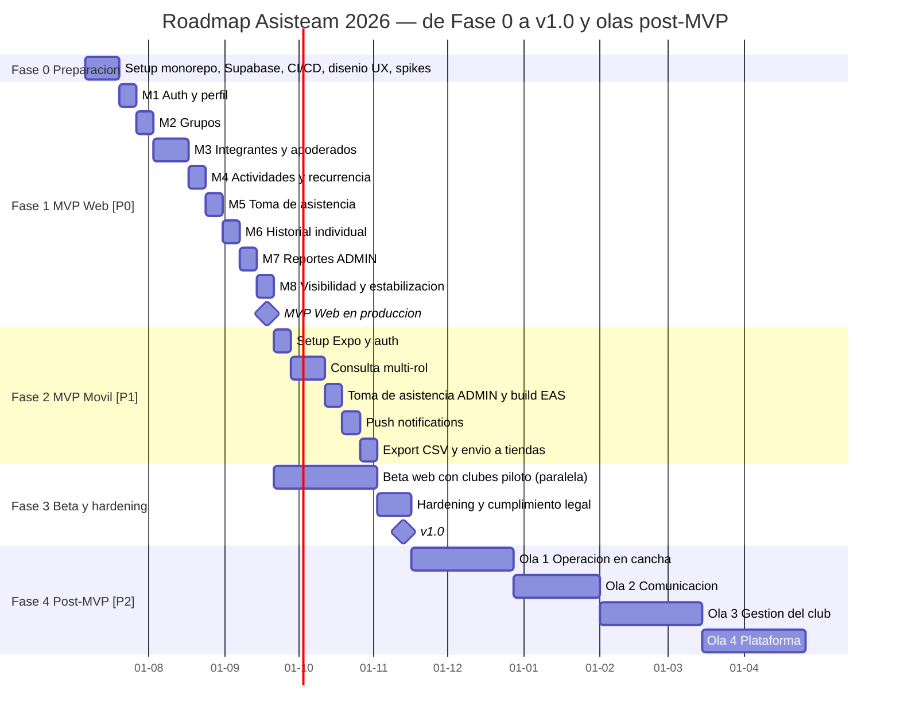

# Roadmap de desarrollo

**Proyecto:** Asisteam | **Fecha:** 2026-07-03 | **Documentos relacionados:** 01-vision-y-alcance.md, 03-modulos-y-flujos.md, 04-modelo-de-datos.md, 06-arquitectura-y-stack.md, 07-api-y-backend.md, 08-reportes-y-estadisticas.md, 10-historias-de-usuario.md, 11-legal-seguridad-privacidad.md

---

## 1. Resumen ejecutivo

El plan lleva Asisteam desde cero hasta la **v1.0 (MVP Web [P0] + MVP Móvil [P1]) en 19 semanas calendario** con un equipo de 2-3 desarrolladores full-stack, sobre el stack decidido en 06-arquitectura-y-stack.md (Supabase + Next.js 16 [P0], Expo/React Native [P1], monorepo pnpm + Turborepo con `packages/core`). La beta con clubes reales corre en paralelo al desarrollo móvil para no alargar el calendario. Todo el alcance post-v1.0 [P2] se organiza en olas temáticas priorizables tras el feedback de la beta.

| Fase | Nombre | Duración | Ventana estimada | Hito de cierre |
|---|---|---|---|---|
| 0 | Preparación | 2 semanas | 2026-07-06 → 2026-07-17 | Infraestructura y diseño listos |
| 1 | MVP Web [P0] | 9 semanas | 2026-07-20 → 2026-09-18 | MVP Web desplegado en producción |
| 2 | MVP Móvil [P1] | 6 semanas | 2026-09-21 → 2026-10-30 | Apps en revisión/beta de tiendas |
| 3 | Beta con clubes + hardening | 8 semanas calendario (solapada con Fase 2; ~4 semanas-persona dedicadas) | 2026-09-21 → 2026-11-13 | **v1.0 — 2026-11-13** |
| 4 | Post-MVP [P2] por olas | 4-6 semanas por ola | Desde 2026-11-16, según backlog | Releases v1.x / v2 |

---

## 2. Fase 0 — Preparación (2 semanas)

**Objetivo:** dejar operativa toda la base técnica y de diseño para que la Fase 1 produzca features de negocio desde el primer día, y desactivar temprano los tres flujos de mayor riesgo del canon.

**Entregables:**
- Monorepo pnpm + Turborepo con paquetes `apps/web` (Next.js 16), `packages/core` (schemas Zod, métrica canónica, tipos de dominio) y `supabase/` (migraciones, seeds, funciones). Estructura según 06-arquitectura-y-stack.md.
- Proyecto Supabase Cloud (región `sa-east-1`) con entornos dev/staging/prod; Vercel Pro conectado con preview deployments por PR; Resend y Sentry configurados.
- CI en GitHub Actions: lint + typecheck + tests unitarios de `packages/core` + `supabase start` (CLI/Docker) con pgTAP y seeds por rol. Hardening del pipeline presupuestado aquí (ver riesgo R11).
- Migración inicial del esquema canónico completo (ver 04-modelo-de-datos.md): `users`, `groups`, `memberships`, `guardianships`, `activity_types` (con los 4 tipos de sistema sembrados), `activities`, `attendance_records`, `invitations`, `consents`, enums implementados como `text` + `CHECK` (sin `CREATE TYPE`, según 04-modelo-de-datos.md §1) y únicos compuestos.
- Funciones helper de RLS `is_member`, `is_group_admin`, `is_guardian_of` (SECURITY DEFINER) con sus primeros tests pgTAP.
- Diseño UX: sistema de diseño sobre shadcn/ui + Tailwind CSS 4 y wireframes aprobados de las ~12 pantallas clave de 05-pantallas.md (login, dashboard multi-grupo, integrantes, actividad, toma de asistencia, reportes).
- Spikes de diseño técnico (1-2 días c/u) de los tres flujos no-CRUD críticos: menor-requiere-apoderado, conversión MANAGED→ACTIVE con consentimiento, expansión de `recurrence_rule` semanal (ver 07-api-y-backend.md).
- Cuentas de desarrollador Apple/Google creadas (necesarias con anticipación para la Fase 2 [P1]).
- Inicio de reclutamiento de 3-5 clubes piloto para la beta de Fase 3.

**Criterios de salida (verificables):**
1. Un PR de ejemplo pasa el pipeline completo (lint, typecheck, tests de `packages/core`, pgTAP) en < 12 minutos y despliega preview en Vercel.
2. `supabase db reset` levanta el esquema canónico con seeds y los 4 `activity_types` de sistema en dev y staging.
3. Los 3 spikes tienen decisión técnica escrita (secuencia de RPC/Edge Function, tablas afectadas, casos borde) revisada por todo el equipo.
4. Wireframes de las pantallas clave aprobados y respaldados por 05-pantallas.md.
5. Cuentas Apple Developer y Google Play activas.

---

## 3. Fase 1 — MVP Web [P0] (9 semanas)

**Objetivo:** entregar la primera versión utilizable por un club real: web responsive donde un ADMIN gestiona su grupo, toma asistencia y ve reportes, y donde ATHLETE/GUARDIAN consultan lo que las reglas de visibilidad les permiten.

**Entregables:** la totalidad del alcance [P0] del canon, desplegado en producción (Vercel + Supabase Pro).

### 3.1 Orden de implementación de módulos y dependencias

El orden sigue la cadena de dependencias del dominio: no se puede tomar asistencia sin actividades, ni crear actividades sin grupo, ni nada sin identidad. Cada módulo cierra con sus políticas RLS testeadas en pgTAP antes de pasar al siguiente.

| Semana | Módulo | Contenido [P0] | Por qué en este punto |
|---|---|---|---|
| S1 | **M1 Auth y perfil** | Registro/login email+contraseña, recuperación de contraseña, perfil básico (`full_name`, `phone`, `birthdate`, `avatar_url` con Supabase Storage). Wiring `auth.users` ↔ `public.users`. Pantalla CFG-03 [P0] de 05-pantallas.md: solicitud de eliminación de cuenta y de copia de datos personales vía soporte (derechos Ley 19.628/21.719). | Todo lo demás necesita `auth.uid()` y la tabla de perfiles desacoplada (base del patrón MANAGED). |
| S2 | **M2 Grupos** | CRUD de `groups`, `invite_code` único, `settings` JSONB (toggles en `false` por defecto), logo, membership ADMIN del creador, selector multi-grupo. | Los memberships, actividades y RLS por grupo dependen de que exista `groups`. |
| S3-S4 | **M3 Integrantes y apoderados** | Incorporación por código/enlace (solo ATHLETE; menor queda PENDING), invitación dirigida por email vía Edge Function + Resend (`invitations`, estado INVITED), cuentas gestionadas MANAGED, CRUD de integrantes, `guardianships`, validación transaccional "menor requiere apoderado" al crear/activar, conversión MANAGED→ACTIVE con consentimiento del apoderado. | Es el módulo más complejo (3 flujos de incorporación + regla de menores); va temprano porque la asistencia referencia `memberships` y porque su riesgo debe quemarse pronto (riesgo R12). 2 semanas. |
| S5 | **M4 Actividades** | CRUD de `activities`, tipos de sistema y personalizados (`activity_types`), recurrencia semanal simple (días de semana + fecha fin) expandida server-side por RPC, agenda del grupo con hora America/Santiago sobre `timestamptz` UTC. | Requiere grupo y ADMIN; la asistencia referencia `activity_id`. |
| S6 | **M5 Toma de asistencia** | Lista de deportistas ACTIVE del grupo con los 4 estados (PRESENT/ABSENT/LATE/EXCUSED) + nota opcional, guardado por lote idempotente (upsert sobre el único `(activity_id, membership_id)`), edición posterior por ADMIN con `recorded_by`/`recorded_at`. | Corazón del producto; requiere M3 (memberships ATHLETE) y M4 (activities). |
| S7 | **M6 Historial individual** | Historial de asistencia propio (ATHLETE), de pupilos (GUARDIAN vía `is_guardian_of`), y de cualquier deportista del grupo (ADMIN); filtros semana/mes/rango/temporada. | Primera lectura agregada sobre `attendance_records`; valida las vistas por rol con columnas explícitas antes de los reportes. |
| S8 | **M7 Reportes de grupo (ADMIN)** | Vistas SQL con la métrica canónica (PRESENT+LATE)/(convocadas−EXCUSED), redondeo a 1 decimal; porcentaje por deportista, por tipo de actividad y por período; misma batería de casos contra la vista SQL y `packages/core` (ver 08-reportes-y-estadisticas.md). | Consume todos los datos anteriores; necesita historial (M6) estabilizado. |
| S9 | **M8 Visibilidad + estabilización** | Toggles `athletes_can_view_group_stats` / `guardians_can_view_group_stats` evaluados dentro de las vistas agregadas (solo nombre + métricas, regla 5), pantalla de reportes para ATHLETE/GUARDIAN, configuración de visibilidad para ADMIN; QA integral, accesibilidad, pulido responsive. | Es una capa sobre los reportes ya construidos; la semana cierra con regresión completa del [P0]. |

### 3.2 Tabla de dependencias entre módulos

| Módulo | Depende de | Naturaleza de la dependencia |
|---|---|---|
| M1 Auth y perfil | Fase 0 (esquema, helpers RLS) | `public.users` y wiring con `auth.users` deben existir |
| M2 Grupos | M1 | `groups.created_by` referencia `users`; el creador necesita sesión |
| M3 Integrantes y apoderados | M1, M2 | `memberships` y `invitations` referencian `users` y `groups`; MANAGED usa el desacople de M1 |
| M4 Actividades | M2 | `activities.group_id` y `activity_types.group_id`; solo ADMIN del grupo crea |
| M5 Toma de asistencia | M3, M4 | `attendance_records` referencia `activity_id` + `membership_id` (rol ATHLETE del mismo grupo) |
| M6 Historial individual | M5, M3 | Lee `attendance_records`; GUARDIAN requiere `guardianships` |
| M7 Reportes ADMIN | M5, M6 | Vistas agregadas sobre asistencia; reutiliza filtros de período de M6 |
| M8 Visibilidad | M7, M2 | Los toggles de `groups.settings` condicionan las vistas de M7 para no-ADMIN |
| Fase 2 (móvil [P1]) | Fase 1 completa | Reutiliza `packages/core`, tipos generados, RLS y RPC/Edge Functions ya probados |
| Push notifications [P1] | M4, M3 | Recordatorios usan `activities.starts_at`; aviso de ausencia usa `guardianships` |
| Export CSV [P1] | M7 | Exporta los mismos datasets de las vistas de reportes |

**Criterios de salida de Fase 1 (verificables):**
1. Checklist [P0] del canon completado al 100% y demostrado en un walkthrough grabado: registro→crear grupo→invitar (código y email)→crear MANAGED menor con apoderado→crear actividad recurrente→tomar asistencia→editar→ver historial→ver reportes→activar toggles y verificar vista ATHLETE/GUARDIAN.
2. pgTAP en verde cubriendo las 6 reglas de visibilidad con seeds por rol, incluyendo tests negativos (no-miembro no lee nada; no-ADMIN nunca recibe `email`, `phone`, `birthdate` ni `note` de terceros).
3. La misma batería de casos canónicos de la métrica pasa contra la vista SQL y contra `packages/core` (incluye casos con EXCUSED, LATE y denominador cero).
4. Es imposible crear o activar un ATHLETE menor de 18 años sin `guardianship` (test de integración sobre la RPC y constraint de respaldo).
5. Web responsive verificada en viewport 375 px; flujo de toma de asistencia usable con una mano en navegador móvil.
6. Desplegado en producción con Sentry activo y backup `pg_dump` automatizado fuera de Supabase.

---

## 4. Fase 2 — MVP Móvil [P1] (6 semanas)

**Objetivo:** entregar la app iOS/Android (Expo SDK 54+, expo-router) con las funciones núcleo — consulta para todos los roles y toma de asistencia para ADMIN — más notificaciones push y exportación CSV, completando el alcance de la v1.0.

**Entregables por semana:**

| Semana | Entregable |
|---|---|
| S1 | App Expo en el monorepo reutilizando `packages/core`, supabase-js, tipos generados y TanStack Query; auth (login, recuperación) y selector multi-grupo [P1]. |
| S2-S3 | Consulta para todos los roles: agenda de actividades, historial individual, pantalla de reportes condicionada por toggles (mismas vistas/RPC del backend, cero lógica duplicada) [P1]. |
| S4 | Toma y edición de asistencia para ADMIN, optimizada para uso en cancha (lista táctil, 4 estados, nota opcional) [P1]. Primer build interno con EAS Build y envío temprano a TestFlight/Play internal testing (adelanta la fricción de tiendas, riesgo R7). |
| S5 | Notificaciones push con Expo Notifications: recordatorio de actividad y aviso de ausencia al apoderado, disparadas desde pg_cron + Edge Functions idempotentes [P1]. |
| S6 | Exportación CSV de reportes (web y móvil, generada desde las vistas de M7) [P1]; QA en dispositivos físicos iOS/Android; EAS Submit a revisión de tiendas. |

**Criterios de salida (verificables):**
1. Builds distribuidos a los clubes piloto vía TestFlight y Play internal testing; envío a revisión pública completado.
2. Push de recordatorio recibida en dispositivo físico ≤ 15 min antes de `starts_at` (hora America/Santiago); aviso de ausencia llega al GUARDIAN al registrarse un ABSENT de su pupilo.
3. Toma de asistencia de 20 deportistas completable en < 60 segundos en un Android de gama media.
4. CSV exportado reproduce exactamente los valores de la vista SQL (mismo redondeo a 1 decimal).
5. Cero lógica de métrica o visibilidad duplicada en la app: solo consumo de vistas/RPC.

---

## 5. Fase 3 — Beta con clubes reales + hardening (solapada; cierre 2 semanas dedicadas)

**Objetivo:** validar el producto con 3-5 clubes reales usando el MVP Web en operación diaria, corregir con datos de uso real y dejar la plataforma lista legal y operativamente para v1.0.

**Estructura temporal:** la beta web comienza el 2026-09-21 (inmediatamente después de Fase 1) y corre en paralelo a la Fase 2 con ~0,5 dev de dedicación para soporte y fixes; las 2 semanas finales (2026-11-02 → 2026-11-13) son de dedicación completa al hardening.

**Entregables:**
- 3-5 clubes piloto operando: onboarding asistido, grupos reales creados, asistencia tomada en entrenamientos reales durante ≥ 4 semanas.
- Instrumentación de activación con las métricas de 01-vision-y-alcance.md §2.5: grupos activos (E1: ≥ 1 actividad con asistencia tomada en los últimos 14 días), adopción del flujo central (E2: asistencia tomada en ≥ 3 actividades en los primeros 14 días), retención semanal de ADMIN, tasa de error en flujos de incorporación.
- Backlog de fixes de beta triado y resuelto (bugs P0/P1 del piloto).
- Hardening: revisión de índices y planes de consulta de reportes con datos reales, rate limiting en Edge Functions, revisión de políticas RLS post-cambios, pruebas de restauración de backup.
- Cumplimiento (con 11-legal-seguridad-privacidad.md): política de privacidad publicada declarando residencia de datos en `sa-east-1`, flujo de consentimiento de apoderados auditado, checklist Ley 19.628 / Ley 21.719 (vigencia diciembre 2026 — v1.0 sale un mes antes, debe nacer conforme).
- Incorporación de los clubes piloto a las apps móviles (TestFlight/Play) apenas la Fase 2 las libera.

**Criterios de salida (verificables) = definición de v1.0:**
1. ≥ 3 clubes con ≥ 4 semanas de uso y ≥ 12 actividades con asistencia tomada cada uno.
2. ≥ 70% de las actividades de los clubes piloto con asistencia registrada el mismo día.
3. P95 de carga de la pantalla de reportes < 2 s con el volumen real de la beta; cero incidentes de fuga de datos entre grupos (verificado por pgTAP + revisión de logs).
4. Checklist legal de 11-legal-seguridad-privacidad.md firmado; restauración de backup ensayada con éxito en staging.
5. Apps móviles aprobadas y publicadas en App Store y Google Play.
6. Tasa de crashes móvil < 1% de sesiones (Sentry) y cero bugs P0 abiertos.

---

## 6. Fase 4 — Post-MVP [P2] por olas temáticas (4-6 semanas por ola)

Sin fechas firmes: el orden se re-prioriza con el feedback de la beta y las métricas de v1.0. Secuencia propuesta según valor operativo observado en pilotos:

| Ola | Tema | Alcance [P2] | Duración estimada |
|---|---|---|---|
| Ola 1 | Operación en cancha | Modo offline con sincronización para la toma de asistencia; justificación de inasistencias con flujo solicitud/aprobación; rol COACH con permisos limitados | 6 semanas |
| Ola 2 | Comunicación y adopción | Anuncios/mensajería interna; login social Google/Apple (nativo en Supabase Auth, sin cambiar proveedor); ranking gamificado | 5 semanas |
| Ola 3 | Gestión del club | Gestión de pagos/cuotas; auditoría completa de cambios; multi-idioma | 6 semanas |
| Ola 4 | Plataforma y escala | Autoregistro de asistencia con QR o geocerca; API pública/integraciones; panel multi-club para federaciones | 6 semanas |

**Criterio de entrada a cada ola:** business case validado con datos de uso (ej.: la Ola 1 se confirma si en beta ≥ 15% de tomas de asistencia reportan problemas de conectividad). **Criterio de salida:** features de la ola en producción con la misma vara de calidad de Fase 3 (RLS testeada, criterios de rendimiento, sin regresión del canon).

---

## 7. Diagrama Gantt del plan completo

---

## 8. Duración total hasta v1.0 y supuestos

**Duración total: 19 semanas calendario** (2026-07-06 → 2026-11-13), rango con contingencia **19-21 semanas** (v1.0 a más tardar el 2026-11-27). Desglose: Fase 0 (2) + Fase 1 (9) + Fase 2 (6) + 2 semanas dedicadas de cierre de Fase 3; la beta de Fase 3 no suma calendario porque corre solapada con la Fase 2.

**Supuestos explícitos:**
1. Equipo de 2-3 devs full-stack TypeScript/React/SQL disponibles desde el 2026-07-06, sin ausencias prolongadas; con 2 devs, sumar ~3 semanas al total.
2. No hay diseñador dedicado: el diseño UX se resuelve en Fase 0 con shadcn/ui y wireframes hechos por el equipo; un rediseño visual profundo no está presupuestado.
3. Los 3 flujos no-CRUD complejos (menor-requiere-apoderado, MANAGED→ACTIVE con consentimiento, recurrencia semanal) no crecen más allá de lo diseñado en los spikes de Fase 0; cualquier extensión se corta al alcance etiquetado (riesgo R12).
4. La estimación de ~9 semanas del MVP Web proviene de la decisión de arquitectura (06-arquitectura-y-stack.md) y asume auth, CRUD, storage y email resueltos por Supabase/Resend.
5. La revisión de tiendas (Apple/Google) toma ≤ 2 semanas; se mitiga enviando builds internos desde la semana 4 de Fase 2 y usando OTA updates para fixes.
6. Los clubes piloto se reclutan durante la Fase 1 (gestión comercial en paralelo, no consume capacidad dev).
7. Costos de infraestructura según 06-arquitectura-y-stack.md: ~USD 45-70/mes en [P0], ~150-170/mes al sumar [P1].
8. Corte de alcance estricto: solo entra a v1.0 lo etiquetado [P0]/[P1]; todo lo demás va al backlog de Fase 4 [P2].

---

## 9. Riesgos técnicos y funcionales

| # | Riesgo | Tipo | Prob. | Impacto | Mitigación concreta |
|---|---|---|---|---|---|
| R1 | **Adopción baja**: los ADMIN de clubes no incorporan el hábito de tomar asistencia digital | Negocio | Media | Alto | Beta con 3-5 clubes reales y onboarding asistido en Fase 3; métrica de adopción del flujo central (E2 de 01-vision-y-alcance.md §2.5: asistencia tomada en ≥ 3 actividades en los primeros 14 días); toma de asistencia < 60 s como criterio de salida; recordatorio push al ADMIN [P1] |
| R2 | **Datos de menores**: el flujo MANAGED + consentimiento del apoderado incumple Ley 19.628/21.719 (vigente dic 2026) o filtra datos sensibles | Legal/técnico | Media | Crítico | Revisión legal temprana del diseño en Fase 0-1 (11-legal-seguridad-privacidad.md); checklist de cumplimiento como criterio de salida de Fase 3; regla de visibilidad 5 aplicada con vistas de columnas explícitas, nunca `SELECT *` sobre `users`; minimización de datos de menores |
| R3 | **Complejidad de la recurrencia**: la expansión de `recurrence_rule` genera actividades duplicadas o con horas corridas por DST | Técnico | Alta | Medio | Alcance cerrado a la regla canónica (días de semana + fecha fin, nada más en [P0]); expansión server-side en una sola RPC idempotente; tests con casos de cambio de hora de America/Santiago; spike dedicado en Fase 0 |
| R4 | **Asistencia sin conectividad**: canchas y gimnasios con señal pobre impiden guardar la toma de asistencia | Funcional | Alta | Medio | En [P0]/[P1]: guardado por lote idempotente + reintento automático de TanStack Query con estado visible; medir % de fallos de red en beta; el modo offline completo con sincronización es [P2] (Ola 1) y se confirma con ese dato |
| R5 | **Calidad de datos**: emails mal escritos, deportistas duplicados, `birthdate` faltante que rompe la regla de menores | Funcional | Alta | Medio | Validación Zod compartida (`packages/core`) en web, móvil y Edge Functions; `birthdate` obligatoria para rol ATHLETE; detección de email duplicado al invitar (único en `users.email`); auditoría de datos con los clubes piloto en Fase 3 |
| R6 | **Scope creep**: pedidos de la beta (pagos, mensajería, QR) se cuelan en v1.0 | Gestión | Alta | Alto | Toda funcionalidad lleva etiqueta [P0]/[P1]/[P2] y no cambia de prioridad sin decisión explícita registrada; lo nuevo entra por defecto al backlog [P2] de Fase 4; revisión de alcance semanal contra el checklist del canon |
| R7 | **Dependencia de tiendas de apps**: rechazo o demora de Apple/Google bloquea la v1.0 | Externo | Media | Medio | Cuentas creadas en Fase 0; build interno con EAS Build y TestFlight/Play internal desde la semana 4 de Fase 2; OTA updates de Expo para fixes sin re-revisión; la beta de Fase 3 arranca sobre web y no depende de las tiendas |
| R8 | **Rendimiento de reportes**: agregaciones por período degradan con grupos grandes o temporadas largas | Técnico | Media | Medio | Vistas SQL con índices sobre `attendance_records(activity_id, membership_id)` y `activities(group_id, starts_at)`; `EXPLAIN ANALYZE` con seeds de volumen (100 grupos, 50 deportistas, 1 año de actividades) en CI; criterio de salida Fase 3: P95 < 2 s; materialización de vistas solo si el dato real lo exige |
| R9 | **Dispersión de la lógica de dominio** entre SQL (RLS, vistas, PL/pgSQL) y TypeScript (Edge Functions, `packages/core`) | Técnico | Alta | Medio | Convención obligatoria desde el día 1 (06-arquitectura-y-stack.md): lectura = RLS + vistas/RPC; todo write no trivial = Edge Function/RPC; misma batería de casos canónicos de la métrica ejecutada contra la vista SQL y contra `packages/core` en cada CI |
| R10 | **Regresión de RLS**: un cambio mal probado filtra datos entre grupos o expone contacto/`birthdate`/notas de terceros | Técnico | Media | Crítico | pgTAP + seeds por rol en CI como gate obligatorio de merge; tests negativos por cada una de las 6 reglas de visibilidad; prohibición de `SELECT *` sobre `users` hacia no-ADMIN; revisión RLS dedicada en el hardening de Fase 3 |
| R11 | **CI frágil**: los tests de integración sobre supabase CLI/Docker se vuelven lentos e intermitentes y el equipo deja de correrlos | Técnico | Media | Medio | Hardening del pipeline presupuestado dentro de la Fase 0; cache de imágenes Docker y de dependencias; presupuesto de duración (< 12 min) monitoreado; tests pgTAP particionados por módulo |
| R12 | **Deslizamiento de las 9 semanas**: los flujos no-CRUD (M3) crecen y erosionan la ventaja del stack elegido | Gestión/técnico | Media | Alto | Spikes de diseño en Fase 0 con decisión escrita; M3 va temprano (S3-S4) para quemar el riesgo con margen de reacción; corte estricto al alcance [P0]; checkpoint de mitad de Fase 1 (fin de S4): si M3 no cerró, se replanifica antes de tocar M5-M8 |
| R13 | **Dependencia de proveedor único** (Supabase): incidente, cambio de pricing o de hoja de ruta | Externo | Baja | Alto | Esquema SQL y `packages/core` portables; backups `pg_dump` automatizados fuera de Supabase desde Fase 1; ruta de salida documentada (backend propio tipo propuesta B, reescribiendo solo la capa API/Auth) |

---

## 10. Gobernanza del roadmap

- **Cadencia:** revisión semanal de avance contra el Gantt (30 min); demo interna al cierre de cada módulo de Fase 1; retro al cierre de cada fase.
- **Control de cambios:** cualquier movimiento de una funcionalidad entre [P0]/[P1]/[P2] requiere acuerdo explícito del equipo y actualización simultánea de 01-vision-y-alcance.md, este roadmap y 10-historias-de-usuario.md.
- **Checkpoints de decisión:** fin de S4 de Fase 1 (M3 cerrado, ver R12); fin de Fase 1 (go/no-go de beta); semana 4 de Fase 2 (estado de revisión de tiendas, ver R7); fin de Fase 3 (declaración de v1.0 solo si los 6 criterios de salida se cumplen).
- **Métricas del roadmap:** velocidad real vs. planificada por módulo, bugs P0/P1 abiertos, duración del pipeline CI, y las métricas de activación de la beta (sección 5).
