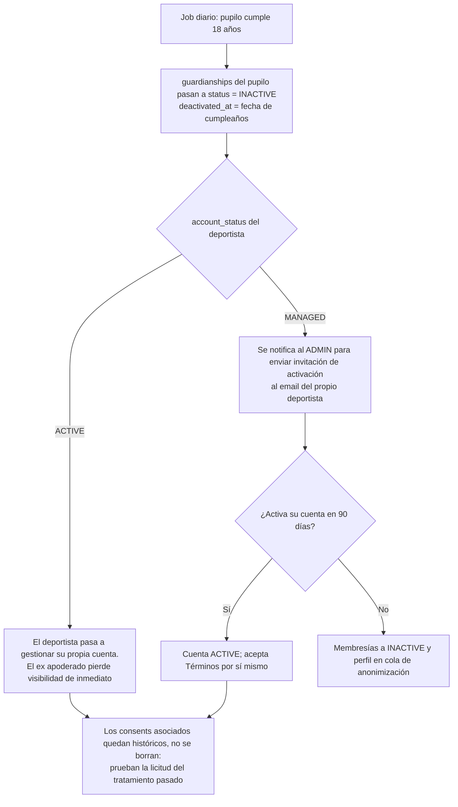

# 11. Consideraciones legales, seguridad y privacidad

**Proyecto:** Asisteam · **Fecha:** 2026-07-03 · **Documentos relacionados:** 02-roles-y-permisos.md, 04-modelo-de-datos.md, 07-api-y-backend.md, 08-reportes-y-estadisticas.md, 10-historias-de-usuario.md

Este documento define cómo Asisteam trata los datos personales de sus usuarios —con foco especial en menores de edad—, el marco legal chileno aplicable, las medidas técnicas de protección de la información y un checklist de cumplimiento previo al lanzamiento del MVP Web [P0].

---

## 1. Principios rectores

1. **Minimización**: se recoge solo el dato necesario para operar el control de asistencia. Nada de RUT, dirección, datos de salud ni datos biométricos en el MVP.
2. **Mínimo privilegio**: cada rol (ADMIN, ATHLETE, GUARDIAN) ve exactamente lo que las reglas de visibilidad canónicas permiten (ver 02-roles-y-permisos.md).
3. **Protección reforzada de menores**: todo deportista menor de 18 años (calculado desde `users.birthdate`) requiere apoderado vinculado (`guardianships`) y consentimiento registrado.
4. **Privacidad por diseño y por defecto**: los toggles `groups.settings.athletes_can_view_group_stats` y `guardians_can_view_group_stats` nacen en `false`; compartir estadísticas es una decisión explícita del ADMIN del grupo.
5. **Trazabilidad proporcional**: [P0] toda asistencia registra `recorded_by` y `recorded_at`; [P2] auditoría completa de cambios en todas las entidades.

---

## 2. Manejo de datos de menores de edad

### 2.1 Qué datos se recogen y por qué (minimización)

| Dato | Campo | Finalidad | ¿Obligatorio para menores? |
|---|---|---|---|
| Nombre completo | `users.full_name` | Identificación en listas de asistencia y reportes | Sí |
| Fecha de nacimiento | `users.birthdate` | Determinar minoría de edad y exigir apoderado; transición a los 18 años | Sí |
| Email | `users.email` | Login y notificaciones; **nullable** si la cuenta es MANAGED | No (típicamente el menor no tiene) |
| Teléfono | `users.phone` | Contacto operativo; opcional | No |
| Foto de perfil | `users.avatar_url` | Reconocimiento visual en la lista de asistencia; opcional | No (para menores requiere consentimiento del apoderado, ver 3.1) |
| Historial de asistencia | `attendance_records` | Finalidad principal del producto: estados PRESENT/ABSENT/LATE/EXCUSED + nota opcional | Sí (derivado del uso) |
| Vínculo con apoderado | `guardianships.relationship` | Saber quién responde por el menor (madre/padre/tutor) | Sí |

**Datos que NO se recogen en el MVP** [P0]: RUT o documento de identidad, dirección domiciliaria, datos médicos o de lesiones, geolocalización (el autoregistro por geocerca es [P2] y tendrá su propia evaluación de impacto antes de implementarse).

### 2.2 Quién puede ver los datos del menor, según rol

| Dato del menor | ADMIN del grupo | GUARDIAN vinculado | Otros ATHLETE/GUARDIAN del grupo | No miembros |
|---|---|---|---|---|
| Nombre completo | Sí | Sí | Solo si el toggle de estadísticas del grupo está activo, y solo junto a métricas agregadas | Nunca |
| Fecha de nacimiento | Sí | Sí | **Nunca** (regla canónica 5) | Nunca |
| Email / teléfono | Sí | Sí | **Nunca** | Nunca |
| Historial y % de asistencia individual | Sí | Sí | **Nunca** (solo el agregado con nombre + porcentaje si el toggle lo permite) | Nunca |
| Notas de asistencia (`attendance_records.note`) | Sí | Sí (las de su pupilo) | **Nunca** | Nunca |
| Datos del apoderado del menor | Sí | Es él mismo | **Nunca** | Nunca |

### 2.3 Cuentas gestionadas (MANAGED) [P0]

- `users.account_status = MANAGED`: perfil creado por un ADMIN **sin credenciales de acceso**; `email` puede ser NULL. Es el mecanismo por defecto para menores sin correo propio.
- Una cuenta MANAGED **no puede iniciar sesión**: no tiene contraseña, no genera tokens, no recibe notificaciones directas (las recibe su apoderado en [P1] push).
- Al crear un deportista menor como MANAGED, el sistema **exige en el mismo flujo** vincular al menos un apoderado (`guardianships`); sin apoderado no se completa el alta (regla canónica de incorporación).
- Conversión MANAGED → ACTIVE: mediante invitación por email y creación de contraseña; si el titular sigue siendo menor, requiere consentimiento vigente del apoderado (ver sección 3).

### 2.4 Prohibición en vistas agregadas (regla canónica 5) [P0]

Aunque `athletes_can_view_group_stats` o `guardians_can_view_group_stats` estén en `true`, las vistas agregadas del grupo (tabla/gráfico de 08-reportes-y-estadisticas.md) exponen a no-ADMIN **únicamente**: avatar y nombre del integrante + porcentaje de asistencia + totales de estados (el `avatar_url` no está en la lista prohibida canónica y ya se expone en la nómina básica del grupo, ver 08-reportes-y-estadisticas.md §3.2). Está prohibido incluir en la respuesta de la API y en la UI: emails, teléfonos, fechas de nacimiento, notas de asistencia individuales de terceros y cualquier dato de apoderados de terceros. Esta restricción se implementa en el serializador del backend, no solo en el frontend (ver 07-api-y-backend.md), y se verifica con tests automatizados de contrato (checklist, ítem C-04).

---

## 3. Consentimiento del apoderado

### 3.1 Cuándo se solicita

| Momento | Flujo | Tipo de consentimiento (`consents.consent_type`) |
|---|---|---|
| Alta del menor (cuenta MANAGED creada por ADMIN, o menor que entra por `invite_code` y queda PENDING) | El apoderado recibe invitación dirigida; al aceptar el vínculo `guardianship`, acepta el tratamiento de datos del menor | `DATA_PROCESSING_MINOR` |
| Activación de cuenta del menor (MANAGED → ACTIVE con email y contraseña propios) | El apoderado confirma la activación antes de que el menor cree su contraseña | `ACCOUNT_ACTIVATION_MINOR` |
| Carga de foto de perfil del menor | Aceptación incluida en `DATA_PROCESSING_MINOR`; si el apoderado la excluye, `avatar_url` permanece NULL | (cláusula dentro de `DATA_PROCESSING_MINOR`) |

Un menor que ingresa por código de grupo queda con `memberships.status = PENDING` y **no aparece en listas de asistencia ni reportes** hasta que exista apoderado vinculado con consentimiento otorgado **y** el ADMIN confirme la membresía.

### 3.2 Cómo se registra [P0]

El consentimiento se persiste en la tabla `consents` (detalle en 04-modelo-de-datos.md):

| Campo | Tipo | Descripción |
|---|---|---|
| `id` | uuid | PK |
| `guardianship_id` | ref `guardianships` | Vínculo apoderado–menor al que aplica |
| `consent_type` | enum `DATA_PROCESSING_MINOR` \| `ACCOUNT_ACTIVATION_MINOR` | Alcance del consentimiento |
| `terms_version` | text | Versión de los Términos y Política de Privacidad aceptados (ej.: `2026-06-01`) |
| `granted_at` | timestamptz (UTC) | Momento exacto de la aceptación |
| `revoked_at` | timestamptz, nullable | Momento de revocación; NULL = vigente |
| `channel` | enum `EMAIL_LINK` \| `IN_APP` | Cómo se otorgó |

Reglas: los Términos y la Política de Privacidad se versionan por fecha; un cambio sustancial de versión exige **re-consentimiento** del apoderado (banner bloqueante para acciones sobre el menor hasta aceptar la nueva versión). Nunca se sobrescribe un registro de consentimiento: revocar crea `revoked_at`, re-otorgar crea una fila nueva.

### 3.3 Revocación y sus efectos [P0]

El apoderado puede revocar el consentimiento desde su perfil (o por solicitud escrita a soporte). Efectos inmediatos:

1. Todas las `memberships` con rol ATHLETE del menor pasan a `status = INACTIVE`: el menor deja de aparecer en tomas de asistencia futuras y en reportes activos.
2. Si la cuenta del menor es ACTIVE, se suspenden sus sesiones; si es MANAGED, queda congelada.
3. Los `attendance_records` históricos se **anonimizan** según la política de la sección 5.4 (se conservan los agregados del grupo sin identificar al menor) salvo que el apoderado pida supresión total, en cuyo caso se eliminan.
4. Se notifica al ADMIN de cada grupo afectado (sin exponerle el motivo).
5. Si el menor tiene otro apoderado con consentimiento vigente, la revocación de uno **no** desactiva al menor; se requiere que no quede ningún consentimiento vigente.

### 3.4 Transición al cumplir 18 años [P0]

Un job diario (ver 07-api-y-backend.md) detecta pupilos que cumplen 18 años según `users.birthdate` (evaluado en America/Santiago):

- La desactivación del vínculo se modela con `guardianships.status = 'INACTIVE'` + `guardianships.deactivated_at` (columnas definidas en 04-modelo-de-datos.md §2.4); el registro no se borra, para conservar trazabilidad.
- El ex apoderado deja de ver perfil, actividades e historial del ex pupilo desde el mismo día (regla canónica 3).
- Los registros de consentimiento históricos se conservan como evidencia de licitud del tratamiento mientras existan datos del titular.

---

## 4. Marco legal

### 4.1 Chile — Ley 19.628 (vigente a la fecha del plan)

Obligaciones aplicables hoy: tratamiento con autorización del titular o habilitación legal, deber de secreto, calidad de los datos, y derechos de acceso, rectificación, cancelación y bloqueo ("derechos ARCO" en su versión chilena). Asisteam cumple desde el MVP [P0] con: consentimiento explícito al registrarse (checkbox de Términos con `terms_version` y timestamp), edición de perfil propio, y proceso de eliminación de cuenta.

### 4.2 Chile — Ley 21.719 (entrada en vigencia diciembre 2026)

Dado que la nueva ley entra en vigencia **durante la vida del producto** (aprox. 5 meses después de este plan), Asisteam se diseña directamente contra la Ley 21.719, que es más exigente:

| Exigencia de la Ley 21.719 | Implementación en Asisteam | Prioridad |
|---|---|---|
| Principios de licitud, finalidad, proporcionalidad, calidad, seguridad, responsabilidad y transparencia | Secciones 1, 2 y 5 de este documento; Política de Privacidad pública | [P0] |
| Base de licitud del tratamiento | Consentimiento del titular (adultos) y del representante legal/apoderado (menores); ejecución del servicio para datos operativos | [P0] |
| Datos de niños, niñas y adolescentes: interés superior y consentimiento del representante | Secciones 2 y 3 completas (guardianships + consents) | [P0] |
| Derechos ampliados: acceso, rectificación, supresión, oposición, **portabilidad** | Sección 4.3 | [P0]/[P1]/[P2] según tabla |
| Deber de información al titular | Política de Privacidad enlazada en registro, invitaciones y footer; lenguaje claro en español | [P0] |
| Notificación de vulneraciones a la Agencia de Protección de Datos Personales y a titulares afectados | Runbook de incidentes, sección 7.6 | [P0] (proceso) |
| Registro de actividades de tratamiento | Documento interno mantenido por el equipo; este archivo es su base | [P0] (proceso) |

### 4.3 Derechos de los titulares y cómo se ejercen en Asisteam

| Derecho | Mecanismo | Prioridad |
|---|---|---|
| Acceso | El titular ve su perfil e historial en la app (reglas canónicas 1 y 2); copia completa de sus datos vía solicitud a soporte con respuesta en ≤ 15 días hábiles | [P0] |
| Rectificación | Edición de perfil propio; para cuentas MANAGED, el ADMIN o el apoderado solicitan la corrección | [P0] |
| Supresión | Solicitud de eliminación de cuenta desde la app o soporte; ejecuta la política de la sección 5.4 | [P0] |
| Oposición / revocación | Revocación de consentimiento del apoderado (sección 3.3); baja voluntaria de un grupo | [P0] |
| Portabilidad | Exportación CSV de reportes | [P1] |
| Portabilidad (autoservicio de todos los datos propios en formato estructurado JSON/CSV) | Botón "Descargar mis datos" | [P2] |

En nombre de menores, los derechos los ejerce el apoderado vinculado con consentimiento vigente.

### 4.4 GDPR como referencia

Si Asisteam se expande fuera de Chile/Latinoamérica, el diseño ya se alinea con GDPR: base de licitud documentada por titular, consentimiento parental verificable para menores (art. 8), minimización (art. 5), derecho al olvido vía anonimización/supresión (art. 17) y portabilidad (art. 20). Decisión de diseño: cumplir el estándar más alto entre Ley 21.719 y GDPR reduce el costo de expansión. Multi-idioma es [P2]; el cumplimiento normativo por país se evaluará junto con esa expansión.

---

## 5. Protección de la información personal

### 5.1 Cifrado

- **En tránsito** [P0]: TLS 1.2+ obligatorio en todos los endpoints (web, API, app móvil [P1]); HSTS habilitado; redirección forzada HTTP→HTTPS; sin contenido mixto.
- **En reposo** [P0]: cifrado de disco/volumen del proveedor cloud para la base de datos y backups (ej.: AES-256 gestionado por el proveedor, ver 06-arquitectura-y-stack.md). No se requiere cifrado a nivel de columna en el MVP porque no se almacenan datos sensibles según Ley 21.719 (salud, biometría); si [P2] incorpora geocerca, se reevalúa.

### 5.2 Contraseñas [P0]

- Hashing con **argon2id** (parámetros OWASP: memoria ≥ 19 MiB, iteraciones ≥ 2) o bcrypt cost ≥ 12 como alternativa; nunca hashing propio ni reversible.
- Nunca se registra la contraseña en logs ni se envía por email; la recuperación usa token de un solo uso con expiración de 60 minutos.
- Política: mínimo 10 caracteres, sin exigencia de composición arbitraria, verificación contra listas de contraseñas filtradas, sin caducidad periódica forzada (alineado con NIST 800-63B).

### 5.3 Minimización en payloads de API [P0]

- Serializadores por rol: el mismo recurso devuelve campos distintos según el rol del solicitante (ver 07-api-y-backend.md). Ejemplo: `GET /groups/:id/reports` para un ATHLETE devuelve `[{ full_name, attendance_pct, totals }]` y **jamás** `email`, `phone`, `birthdate` ni `note`.
- Nunca se responde con el objeto `users` completo a no-ADMIN; los listados de miembros para ATHLETE/GUARDIAN se limitan a `full_name` y `avatar_url`.
- Los tokens de invitación (`invitations.token`) y códigos de grupo (`groups.invite_code`) no aparecen en respuestas de listado, solo en el flujo de creación/regeneración para el ADMIN.
- IDs internos son UUID no secuenciales: evitan enumeración de recursos.

### 5.4 Retención y eliminación [P0]

Regla central: **la integridad estadística del grupo se preserva mediante anonimización; los datos identificatorios se eliminan.**

| Evento | Efecto sobre los datos |
|---|---|
| ADMIN elimina/desactiva un integrante del grupo | `memberships.status = INACTIVE`. Los `attendance_records` **se conservan intactos** (el integrante era miembro cuando ocurrieron); dejan de sumar en periodos posteriores a la baja. No se borra el usuario. |
| Titular (o apoderado del menor) solicita supresión de cuenta | Anonimización de la fila `users`: `full_name = 'Ex integrante'`, `email/phone/birthdate/avatar_url = NULL`, `account_status` congelado; `memberships` a INACTIVE; `guardianships` cerradas (`status = 'INACTIVE'`, `deactivated_at`). Los `attendance_records` se conservan anonimizados (siguen apuntando a la membership, pero sin persona identificable) para no distorsionar los porcentajes históricos del grupo. Si el titular exige supresión total, se eliminan también los `attendance_records` y se recalculan los agregados. Plazo de ejecución: ≤ 30 días desde la solicitud. |
| ADMIN elimina un grupo | Borrado lógico con periodo de gracia de 30 días (recuperable); luego borrado físico de `activities`, `attendance_records`, `memberships`, `invitations` y `activity_types` personalizados del grupo. Las filas `users` no se tocan (pueden pertenecer a otros grupos). |
| Invitaciones | `status = EXPIRED` al vencer `expires_at`; purga física de invitaciones EXPIRED/ACEPTADAS a los 90 días. |
| Cuentas MANAGED nunca activadas y sin membresía ACTIVE | Anonimización automática a los 12 meses de inactividad, previa notificación al apoderado y al ADMIN creador. |
| Cuentas INVITED nunca aceptadas | Purga a los 90 días junto con su invitación. |
| Logs de aplicación y acceso | Retención 90 días; sin datos personales más allá de user_id e IP. |
| Backups | Retención 30 días; un dato suprimido desaparece de todos los backups en ≤ 35 días (no se restauran datos suprimidos: el runbook de restauración incluye re-aplicar la cola de supresiones). |

### 5.5 Exportación de datos propios

- [P1] Exportación CSV de reportes (para ADMIN según su grupo; para ATHLETE/GUARDIAN, de sus propios datos/los de su pupilo).
- [P0] Como proceso operativo: cualquier titular puede pedir a soporte una copia de sus datos (JSON/CSV) con respuesta en ≤ 15 días hábiles.
- [P2] Autoservicio "Descargar mis datos" desde el perfil.

---

## 6. Control de acceso por rol

- **Mínimo privilegio**: los permisos por rol y la matriz completa están en 02-roles-y-permisos.md. Regla operativa: si una acción no está explícitamente permitida para el rol, está denegada (deny by default).
- **Scoping por `group_id`** [P0]: toda query del backend filtra por las memberships ACTIVE del usuario autenticado. Ningún endpoint acepta un `group_id` sin verificar que exista `memberships(user_id, group_id, status = ACTIVE)` con el rol requerido. La implementación (middleware de autorización) se detalla en 07-api-y-backend.md.
- **Autorización en el servidor, nunca solo en el cliente**: ocultar un botón en la UI no es control de acceso; cada endpoint revalida rol y pertenencia.
- Solo ADMIN toma y edita asistencia en el MVP [P0]; el rol COACH con permisos limitados es [P2] y heredará este mismo modelo de scoping.
- GUARDIAN accede a datos de un menor **solo** si existe `guardianships` vigente (`status = 'ACTIVE'`, `deactivated_at` NULL) hacia ese `athlete_user_id` (reglas canónicas 2 y 3).

---

## 7. Recomendaciones generales de seguridad

### 7.1 Contraseñas y autenticación [P0]
Ver 5.2. Login con email + contraseña en el MVP; login social Google/Apple es [P2]. Bloqueo progresivo tras intentos fallidos (ver 7.3). MFA no está en el alcance del MVP; se recomienda evaluarlo para cuentas ADMIN en [P2].

### 7.2 Sesiones y tokens [P0]
- Tokens de acceso de vida corta (recomendado: 15 minutos) + refresh token rotatorio con revocación (recomendado: 30 días); los valores definitivos y el mecanismo se fijan en 07-api-y-backend.md.
- Invalidación de todas las sesiones al cambiar contraseña o al detectar reutilización de un refresh token ya rotado.
- Cookies con `Secure`, `HttpOnly` y `SameSite=Lax` si la web usa cookies; nunca tokens en `localStorage` si hay alternativa httpOnly.

### 7.3 Rate limiting y abuso [P0]
- Login: máx. 5 intentos fallidos por email cada 15 minutos (respuesta genérica, sin revelar si el email existe).
- Recuperación de contraseña y validación de `invite_code`: límite por IP (el código de grupo es adivinable por fuerza bruta si no se limita; usar códigos de ≥ 8 caracteres alfanuméricos y permitir regeneración por el ADMIN).
- Límite global por usuario/IP en la API (detalle en 07-api-y-backend.md).

### 7.4 Backups y recuperación [P0]
Backups automáticos diarios de la base de datos, cifrados, retención 30 días, restauración probada al menos trimestralmente (RPO ≤ 24 h, RTO ≤ 8 h para el MVP). El runbook de restauración re-aplica las supresiones pendientes (sección 5.4).

### 7.5 Registro de auditoría
- [P0] `attendance_records.recorded_by` y `recorded_at` identifican quién registró/modificó cada asistencia; la edición posterior sobreescribe el registro actualizando ambos campos (última edición visible).
- [P2] Auditoría completa de cambios (tabla `audit_log` con before/after por entidad sensible: memberships, guardianships, consents, groups.settings).

### 7.6 Gestión de incidentes y notificación de brechas [P0] (proceso)
1. Runbook escrito: detección → contención → evaluación de datos afectados → erradicación → notificación → post-mortem.
2. Si la brecha afecta datos personales con riesgo para los titulares: notificación a la **Agencia de Protección de Datos Personales** (Ley 21.719) y a los titulares afectados —al apoderado cuando el afectado sea menor— en lenguaje claro; objetivo interno: ≤ 72 horas desde la confirmación.
3. Registro interno de todo incidente, incluso los que no requieren notificación.

### 7.7 Actualización de dependencias [P0]
Escaneo automático (Dependabot/Renovate o equivalente) con revisión semanal; parches de vulnerabilidades críticas (CVSS ≥ 9) aplicados en ≤ 48 horas; imágenes/base del runtime actualizadas mensualmente. Detalle de pipeline en 06-arquitectura-y-stack.md.

---

## 8. Checklist de cumplimiento pre-lanzamiento [P0]

Todos los ítems deben estar en "OK" antes del lanzamiento del MVP Web. Responsables sugeridos para un equipo de 2-3 desarrolladores full-stack: TL = Tech Lead, DEV = desarrollador asignado.

| ID | Ítem | Verificación (criterio objetivo) | Resp. | Estado |
|---|---|---|---|---|
| C-01 | Política de Privacidad y Términos publicados y versionados | Documentos accesibles sin login; `terms_version` visible; español claro | TL | Pendiente |
| C-02 | Consentimiento en registro de adultos | Checkbox obligatorio; se persiste versión + timestamp | DEV | Pendiente |
| C-03 | Consentimiento del apoderado para menores | Imposible activar/confirmar a un ATHLETE menor sin fila vigente en `consents`; test E2E del flujo | DEV | Pendiente |
| C-04 | Regla canónica 5 en API | Tests de contrato: respuestas de reportes agregados para ATHLETE/GUARDIAN no contienen `email`, `phone`, `birthdate`, `note` ni datos de apoderados | DEV | Pendiente |
| C-05 | Scoping por `group_id` en todos los endpoints | Test automatizado: usuario de un grupo recibe 403/404 al pedir recursos de otro grupo | TL | Pendiente |
| C-06 | Cuentas MANAGED sin acceso | Un usuario MANAGED no puede autenticarse por ninguna vía; test negativo de login | DEV | Pendiente |
| C-07 | Menor por `invite_code` queda PENDING | No aparece en toma de asistencia ni reportes hasta apoderado + confirmación de ADMIN | DEV | Pendiente |
| C-08 | Job de transición a los 18 años | Ejecuta a diario; `guardianships.status = 'INACTIVE'` y `deactivated_at` seteados; ex apoderado pierde acceso (test) | DEV | Pendiente |
| C-09 | TLS y HSTS | SSL Labs grado A o superior; sin contenido mixto | TL | Pendiente |
| C-10 | Hashing de contraseñas argon2id/bcrypt | Revisión de código + verificación de que ningún log contiene contraseñas | TL | Pendiente |
| C-11 | Rate limiting en login, recuperación e `invite_code` | Prueba de fuerza bruta controlada devuelve 429 | DEV | Pendiente |
| C-12 | Flujo de supresión de cuenta y anonimización | Solicitud de supresión ejecutada en staging: `users` anonimizado, agregados del grupo consistentes | DEV | Pendiente |
| C-13 | Borrado de grupo con gracia de 30 días | Grupo eliminado desaparece para todos; restaurable dentro del plazo; purga física verificada | DEV | Pendiente |
| C-14 | Backups cifrados + restauración probada | Restauración completa en staging documentada, con re-aplicación de supresiones | TL | Pendiente |
| C-15 | Runbook de incidentes y contacto de notificación | Documento aprobado; responsables y canal hacia la Agencia definidos | TL | Pendiente |
| C-16 | Registro de actividades de tratamiento (Ley 21.719) | Documento interno actualizado con finalidades, categorías de datos y plazos de retención | TL | Pendiente |
| C-17 | `recorded_by`/`recorded_at` en asistencia | Toda escritura de `attendance_records` los completa; no son nullables en la práctica | DEV | Pendiente |
| C-18 | Toggles de visibilidad en `false` por defecto | Grupo recién creado no expone estadísticas a ATHLETE/GUARDIAN; test | DEV | Pendiente |
| C-19 | Escaneo de dependencias activo en CI | Dependabot/Renovate configurado; sin vulnerabilidades críticas abiertas | TL | Pendiente |
| C-20 | Expiración de invitaciones | `expires_at` respetado; token expirado devuelve error claro y `status = EXPIRED` | DEV | Pendiente |

Ítems que se re-verifican en el lanzamiento móvil [P1]: C-09 (pinning/TLS en apps), C-02/C-03 (mismos flujos de consentimiento en móvil), más el consentimiento de notificaciones push del sistema operativo (recordatorio de actividad y aviso de ausencia al apoderado [P1]).

---

## 9. Resumen de decisiones de privacidad por defecto

| Configuración | Valor por defecto | Quién puede cambiarla |
|---|---|---|
| `athletes_can_view_group_stats` | `false` | ADMIN del grupo |
| `guardians_can_view_group_stats` | `false` | ADMIN del grupo |
| Foto de perfil de menor | No se carga sin consentimiento del apoderado | Apoderado (vía consentimiento) / ADMIN |
| Datos expuestos en agregados a no-ADMIN | Solo nombre + métricas | No configurable (regla canónica 5, inamovible) |
| Retención tras supresión | Anonimización; supresión total a petición expresa | Titular / apoderado |
