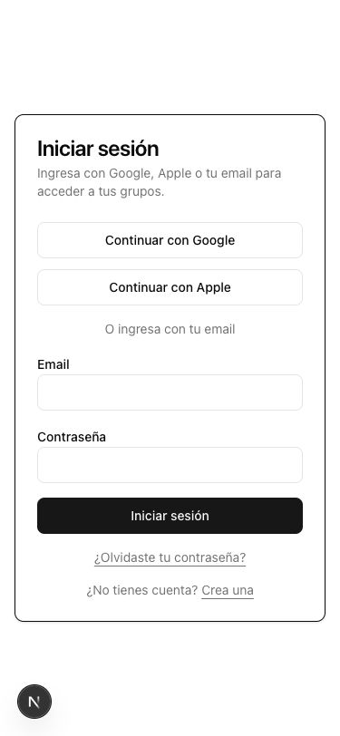
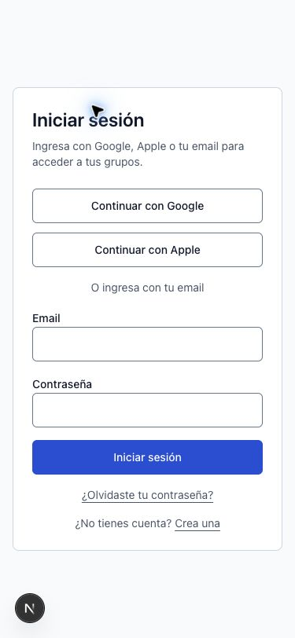
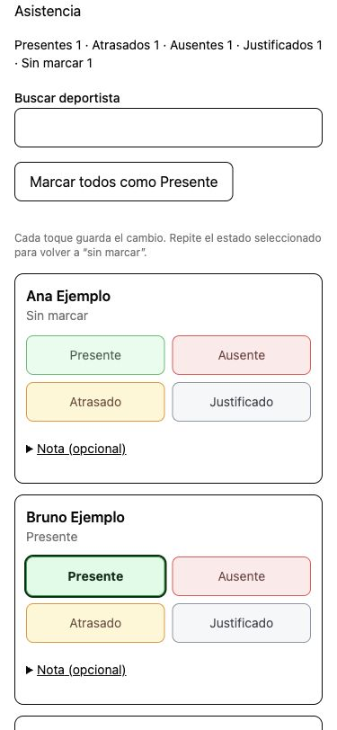
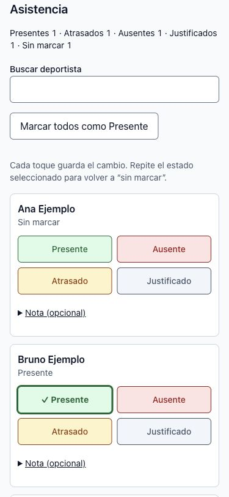
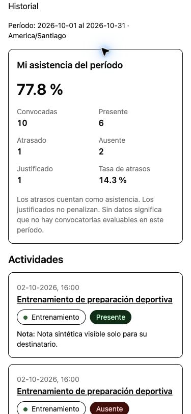
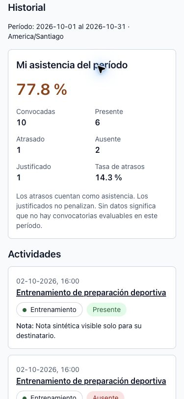

# Sistema visual web

Corte de contratos: **05-10-2026**, base `48d404ab96cecd1d6ddb109616e91ed0fcabce8b`; reconciliación [#121](https://github.com/AlexxSome/asisteam/issues/121). El [inventario de pantallas](05-pantallas.md) distingue las rutas entregadas y las propuestas.

Base P0 de [#102](https://github.com/AlexxSome/asisteam/issues/102), según la dirección de la [épica #100](https://github.com/AlexxSome/asisteam/issues/100). Fuente ejecutable: `apps/web/src/app/globals.css`. Tema claro único: `color-scheme: only light`; la preferencia oscura del sistema no cambia la paleta. No añadir clases `dark:` ni una clase `.dark` a la aplicación.

## Color y superficies

| Token / utilidad Tailwind | Valor | Uso |
|---|---|---|
| `background` | `#F8FAFC` | Fondo de página |
| `surface` / alias `card` | `#FFFFFF` | Tarjetas, filas de asistencia, controles y tablas |
| `foreground` / `card-foreground` | `#0F172A` | Texto principal |
| `primary` / `primary-foreground` | `#1D4ED8` / blanco | Acción dominante |
| `primary-hover` | `#1E40AF` | Hover opaco de acción dominante |
| `secondary` / `secondary-foreground` | `#F1F5F9` / `#0F172A` | Hover de acciones de contorno |
| `neutral` / `muted-foreground` | `#475569` | Texto secundario y Justificado |
| `neutral-subtle` / `muted` | `#F1F5F9` | Cabeceras de tabla y fondo neutral |
| `border` | `#CBD5E1` | Divisores estructurales y superficies |
| `input` | `#64748B` | Borde perceptible de controles |
| `focus` / alias `ring` | `#2563EB` | Contorno de foco: 2 px, separación 2 px |
| `success` / `success-subtle` | `#166534` / `#DCFCE7` | Presente, éxito |
| `warning` / `warning-subtle` | `#92400E` / `#FEF3C7` | Atrasado, advertencia |
| `error` / `error-subtle` | `#991B1B` / `#FEE2E2` | Ausente, error |
| `destructive` | alias `error` | Compatibilidad de errores existentes |
| `info` / `info-subtle` | `#1E40AF` / `#DBEAFE` | Información contextual |

El borde estructural no identifica por sí solo un control: usar `border-input` para controles y `border-border` para divisores. El estilo base asigna un borde explícito también a superficies existentes que usan `border` sin color. No añadir gradientes ni sombras a filas o cards; `shadow-overlay` queda reservado para overlays (0 4px 16px, negro azulado al 12 %).

Los colores semánticos oscuros son texto/borde sobre su fondo `*-subtle`, blanco o fondo de página. No usar texto blanco sobre un fondo sutil ni reducir la opacidad de estados habilitados. Disabled puede tener opacidad reducida; debe acompañarse del estado textual de la operación.

## Tipografía, ritmo y tamaño

System sans de Tailwind; sin descarga de fuentes. `body` usa números tabulares para fechas, conteos y porcentajes; las tablas mantienen `tabular-nums` explícito. El nivel del encabezado HTML indica jerarquía y no se elige por tamaño visual.

| Rol | Utilidad | Tamaño/interlínea (px) | Uso |
|---|---|---|---|
| Display | `text-display` | 32/40, semibold | Porcentaje destacado |
| H1 | `text-h1` | 24/32 móvil; 28/36 desde 768 | Título de página |
| H2 | `text-h2` | 20/28, semibold | Sección |
| H3 | `text-h3` | 16/24, semibold | Sub-sección o nombre de actividad |
| Body | `text-body` | 16/24 | Texto principal y entradas de datos |
| Small | `text-small` (`text-sm` equivalente) | 14/20 | Ayudas, estado, tablas |
| Caption | `text-caption` (`text-xs` equivalente) | 12/16 | Metadatos no esenciales |
| Label | `text-label` | 14/20, medium | Etiquetas y botones |

`cn()` registra estos tamaños en `tailwind-merge`: combinar `text-label text-primary-foreground` debe conservar ambos. `CardTitle` acepta `as="h1" | "h2" | "h3"` y aplica el rol correspondiente; por defecto es H2. Acceso, registro, recuperación e invitaciones usan H1. Asistencia, historial y reportes aplican los roles en sus encabezados y resúmenes. Otras pantallas conservan su composición para las intervenciones específicas de la épica.

- Espaciado: escala nativa de Tailwind de 4 px; preferir 4/8/12/16/24/32/48/64 (`1/2/3/4/6/8/12/16`). Padding de página objetivo 16 móvil, 24 tablet, 32 escritorio, según el layout de la tarea.
- Radio: `rounded-md` 6 px para controles; `rounded-lg` 8 px para superficies; `rounded-sm` 4 px para elementos pequeños. Chips conservan `rounded-full`.
- Altura: `min-h-control` = 44 px, equivalente a `min-h-11`. Preferir altura mínima para admitir texto en varias líneas y zoom; inputs usan texto de 16 px. Los controles compartidos de #103 ya existen; su contrato y los controles nativos aún usados por pantallas se distinguen abajo.
- Breakpoints nativos: `sm` 640, `md` 768, `lg` 1024, `xl` 1280, `2xl` 1536 px. Sin breakpoints paralelos. Mantener tablas en una región de scroll identificada y enfocable.
- Movimiento: transición de color 150 ms en botones compartidos; sin transición con `prefers-reduced-motion: reduce`.

## Asistencia y porcentajes

`apps/web/src/lib/attendance-presentation.ts` es la fuente de clases web compartida por controles de asistencia, historial y reportes. Los estados conservan las etiquetas de `packages/core` y verde/ámbar/rojo/gris. La selección añade una marca **✓**, borde reforzado y `aria-pressed`; la marca se oculta al lector de pantalla para conservar el nombre textual del botón. La reversión de un guardado fallido también retira la marca.

`reportAttendanceTone()` permanece en core y devuelve semántica: `neutral` si null, `success` desde 85 %, `warning` desde 70 % y `error` bajo 70 %. `reportAttendanceClass()` solo traduce esa clasificación a tokens web. La fórmula, redondeo, datos, permisos y contratos de servidor no cambian. Null sigue siendo «Sin datos».

## Contratos de componentes y estados — corte 05-10-2026

Esta tabla describe la implementación compartida existente, no declara migradas todas las pantallas. Los controles nativos que permanecen en formularios también deben conservar etiqueta, foco, validación y semántica de guardado. No añadir una abstracción nueva solo para hacer coincidir esta guía.

| Componente / fuente | Contrato existente y responsabilidad del consumidor |
|---|---|
| [Button / ActionLink](../apps/web/src/components/ui/button.tsx) | `primary`, `secondary`, `tertiary`, `destructive`; aliases `default`/`outline`. Button con `loading` bloquea doble envío y establece `aria-busy`; el consumidor aporta el texto de la operación. ActionLink conserva navegación de Next y añade progreso; no simula un botón de mutación. |
| [Input / Textarea](../apps/web/src/components/ui/input.tsx) y [Field](../apps/web/src/components/ui/field.tsx) | Field conecta un control a label, ayuda/error mediante IDs y conserva `aria-describedby` anterior; error añade `aria-invalid`. Input/Textarea comparten borde, foco y disabled; no validan negocio por sí solos. |
| [Alert](../apps/web/src/components/ui/alert.tsx) | Tonos error/success/warning/info con texto; por defecto error anuncia `alert`, otros `status`. El consumidor puede ajustar rol y no debe duplicar anuncios de la misma operación. |
| [Badge](../apps/web/src/components/ui/badge.tsx) | Etiqueta neutral; no es un botón ni un indicador de selección por sí mismo. Asistencia usa etiquetas core y presentación semántica específica. |
| [Card / CardTitle](../apps/web/src/components/ui/card.tsx) y [PageHeader](../apps/web/src/components/ui/page-header.tsx) | CardTitle admite h1/h2/h3; PageHeader genera H1. La composición decide un único H1 y orden de encabezados, sin elegir semántica por tamaño. |
| [InlineConfirmation](../apps/web/src/components/ui/inline-confirmation.tsx) | Confirmación **no modal**, `role=group`: foco inicial en Cancelar, Escape cancela si no está ocupada, retorno al disparador o fallback; Tab puede salir. Confirmar/Cancelar se bloquean durante operación. No confundir con el drawer modal. |
| [Pagination](../apps/web/src/components/ui/pagination.tsx) | `nav` con nombre; modo callbacks o enlaces, página anunciada con `aria-live=polite`. El consumidor mantiene filtros en URLs y decide límites. |
| [AppShell](../apps/web/src/components/app-shell.tsx) | Salto a contenido, main enfocable, navegación por tarea y `aria-current`; sidebar desde 1024 px y `dialog.showModal()` en móvil. Drawer: foco inicial, límites de Tab, Escape/cierre y retorno al disparador; al pasar a escritorio devuelve foco al main. Los permisos siguen en servidor/RLS. |
| [AccountMenu](../apps/web/src/components/account-menu.tsx) | Disclosure «Mi cuenta» con Escape y retorno a summary; cierre de sesión del dispositivo, estado de envío, error y reintento. No promete cerrar otras sesiones. |
| [ReportTableRegion](../apps/web/src/app/groups/%5BgroupId%5D/reports/report-table.tsx) | Región nombrada y enfocable para scroll horizontal local, instrucciones visibles, primera columna fija, caption y encabezados de tabla. El padre conserva el DTO autorizado; reutilizar presentación no abre datos ADMIN a otros roles. |

### Matriz de estados compartidos

| Estado | Implementación actual | Límite/recuperación |
|---|---|---|
| Carga de contenido | [LoadingState](../apps/web/src/components/ui/loading-state.tsx): texto `status`, sección `aria-busy` y esqueletos ocultos a lectores. | No introduce contenido ficticio como datos reales; no prueba que toda ruta tenga la misma boundary. |
| Navegación pendiente | [NavigationProgress](../apps/web/src/components/ui/navigation-progress.tsx) usa `useLinkStatus` dentro de Link. | Anuncio «Cargando página…» mientras el router está pendiente; contempla navegación cancelada. |
| Vacío | [EmptyState](../apps/web/src/components/ui/empty-state.tsx): título opcional H2, descripción y acción provistos por pantalla. | El consumidor diferencia grupo vacío, filtro sin coincidencias y página fuera de rango; CTA según permiso. |
| Error recuperable / sin red | [ErrorState](../apps/web/src/components/ui/error-state.tsx): título según conexión, alert, `reset()` y regreso a grupos. | Reintento explícito; no cola ni reenvío offline automático. Un fallo de carga no debe aparecer como colección vacía. |
| Recurso no disponible | [UnavailableState](../apps/web/src/components/ui/unavailable-state.tsx): mensaje seguro compartido y regreso a grupos. | No revela existencia de un grupo/recurso ajeno; distinguir errores de transporte en el consumidor. |
| Mutación procesando / éxito / error | Button + mensaje de la pantalla; asistencia tiene feedback y rollback por fila. | Conservar borrador si falla cuando el formulario lo soporte; no anunciar éxito antes de confirmar servidor. No existe un toast global obligatorio ni una única semántica de autosave. |
| Selección / disabled | Asistencia usa texto, marca y `aria-pressed`; Button/Input exponen disabled real. | La selección no depende solo de color. Disabled debe acompañarse de la explicación pertinente, no sustituirla. |

### Semánticas de guardado que no deben homogeneizarse

- Asistencia guarda estados por fila; lote exige confirmación. COACH modifica estados, conserva notas privadas y no puede desmarcar. Los permisos completos están en [doc 02](02-roles-y-permisos.md).
- Visibilidad guarda cada toggle inmediatamente; datos del grupo, tipos, invitaciones, perfil y ajustes de QR tienen acciones explícitas. Abrir los ajustes de QR no guarda nada.
- Filtros de reportes/historial conservan borrador hasta **Aplicar**; las tablas muestran el resultado del filtro aplicado. Un valor null permanece «Sin datos».
- Billing distingue plan elegido, checkout/autorización y primer pago aprobado; volver de la pasarela no confirma cupos. Ver [contrato de suscripciones](12-suscripciones-saas.md).
- Anuncios separa lectura, redacción/edición y preferencia de avisos; su push requiere cliente/dispositivo configurado. Ver [doc 13](13-anuncios.md).
- QR distingue lectura, registro, confirmación, registro previo, caducidad y error recuperable. Un token vencido exige reescaneo; el contador de segundos no es región viva. Ver [doc 14](14-asistencia-qr.md).

### Actualización y evidencia por issue

Al terminar un issue que cambie una ruta, componente o estado, actualizar en el mismo PR el [inventario](05-pantallas.md) y esta guía solo en el contrato afectado. Registrar base/fecha, cambio observable, pruebas ejecutadas, evidencia antes/después y pendientes; conservar los resultados históricos identificados por issue. No declarar cobertura total porque un componente compartido tenga tests.

El [método QA de #120](qa/issue-120/README.md) contiene fixtures, teclado, roles y viewports 320/375/768/1024/1440 px, así como la distinción entre zoom CSS y zoom nativo 200 %. La pasada humana con lector de pantalla y los pendientes de la matriz siguen pendientes hasta tener evidencia específica. Los contratos aquí descritos se verificaron contra fuentes en #121; esta edición documental no constituye una nueva medición visual.

## Evidencia y validación — 03-10-2026

Evidencia histórica de **#102**, anterior a los contratos de #103–#120 documentados arriba; no es una certificación del corte actual. Base: `ed483f376eacf82c0fbd3b363e51ef95489bf120`. Capturas de login real local y fixture aislado que monta los componentes reales `LoginForm`, `Button`, `Input`, `AttendanceSheet`, `AttendanceHistoryContent`, `ReportFilters`, `ReportTable` y `StatsTable`. El fixture contiene cinco personas sintéticas, los cuatro estados, sin marcar, porcentajes en ambos umbrales y null. Sus acciones son simuladas: no envía correos ni usa cuentas, pagos o datos reales.

| Contexto a 375 px | Antes | Después |
|---|---|---|
| Acceso local real |  |  |
| Asistencia sintética |  |  |
| Historial con preferencia oscura |  |  |

[Estado de validación del login](evidence/issue-102/login-error-375.jpg): errores textuales y borde rojo del input con `aria-invalid=true`.

Medición WCAG de luminancia sRGB, sobre colores calculados en DOM y fondos compuestos hasta la superficie opaca, excluyendo controles disabled. [Resultados de contraste](evidence/issue-102/contrast.json): mínimo de texto **6.37:1** (Atrasado); Presente 6.49:1, Ausente 6.80:1, Justificado 6.92:1. Botón primario 6.70:1. Borde de input sobre blanco **4.76:1**; foco **5.17:1** sobre blanco y **4.94:1** sobre background. No se usa opacidad en estados habilitados. Estas mediciones cubren las parejas renderizadas del fixture, no son una certificación integral WCAG.

[Responsive](evidence/issue-102/responsive.json): 320/375/768/1024/1440 px, sin overflow global; tablas de 865 px contenidas en regiones de 286/341/718 px en los tres anchos menores. Inputs y estados miden 44 px. [Zoom nativo Chrome 200 %](evidence/issue-102/zoom-200.json): ventana 1512 px → viewport CSS 756 px, sin overflow global ni recorte de controles.

Preferencia oscura probada en un iframe con `color-scheme: dark`: se verificó `matchMedia('(prefers-color-scheme: dark)').matches === true` dentro del documento y se conservaron fondo claro, colores semánticos y `color-scheme: only light`. Teclado: Tab muestra contorno azul sólido de 2 px con separación 2 px; Enter selecciona y Espacio desmarca; los tests verifican marca visible, `aria-pressed`, reversión ante error y conservación de guardados/lotes. Se ejercitaron error de validación, sin datos, sin marcar, seleccionado y guardando/disabled.

Comandos del repositorio (mediante Corepack, pnpm 10.33.2):

```sh
corepack pnpm --filter @asisteam/core test
corepack pnpm --filter @asisteam/web test
corepack pnpm --filter @asisteam/core typecheck
corepack pnpm --filter @asisteam/web typecheck
corepack pnpm --filter @asisteam/web build
git diff --check
```

No existe script `lint` en el root ni en los paquetes afectados. Las integraciones Supabase se omiten por defecto (76 casos); no hubo cambios de DB/RLS/RPC ni regeneración de tipos de DB. El build necesitó permiso para el puerto interno de Turbopack; el wrapper Turbo raíz encuentra pnpm global 11, por lo que se ejecutan los scripts por paquete con Corepack. El warning de Next sobre `middleware` → `proxy` es preexistente. QA completa de todas las rutas/roles y lector de pantalla corresponde a #120; la composición de navegación, formularios y diálogo de asistencia permanece en sus issues.
