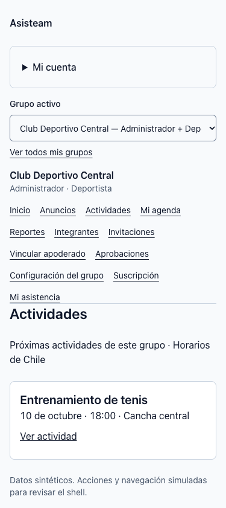
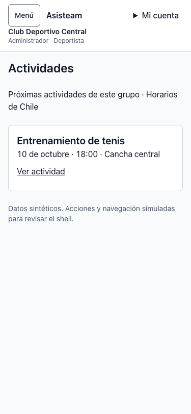
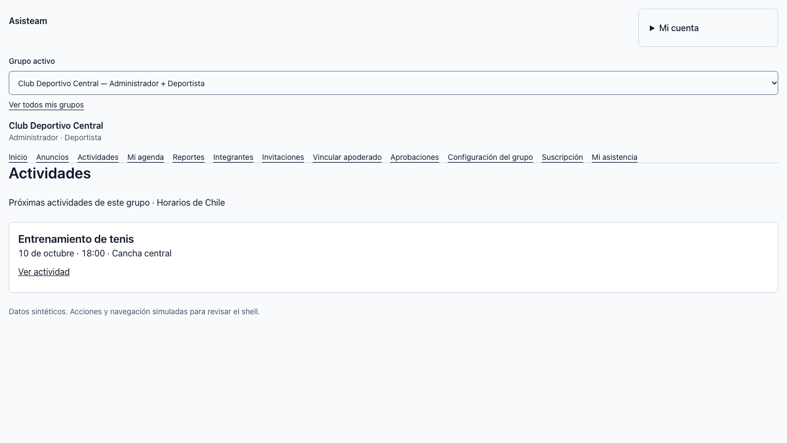
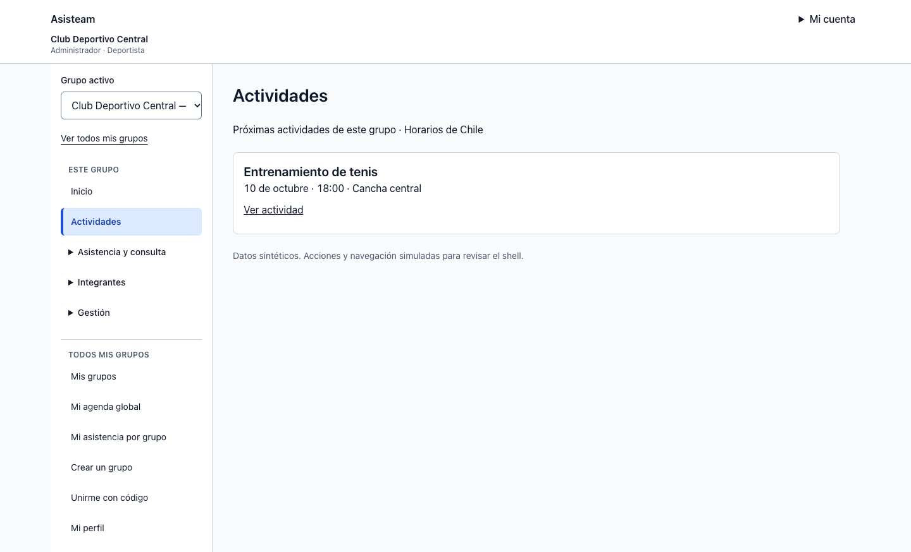

# Navegación por tarea — issue #104

Base de comparación: `9b2f50fcf7dc537c6c21b601b4a566f647b4d658` (`develop`, con #102 y #103 integrados).

## Cambio

`AppShell` unifica las páginas de grupo y las páginas personales: grupos/agenda, perfil/correcciones de edad, bienvenida, pupilos, crear/unirse a grupo e historial global. Navegación lateral desde 1024 px; menú modal en anchos menores. El encabezado mantiene cuenta, nombre completo y roles del grupo. El selector queda en la navegación. Invitaciones, apoderados y aprobaciones se agrupan en Integrantes; Gestión conserva autorización ADMIN. GUARDIAN puro tiene acceso prioritario a elegir pupilo y no recibe selector de grupo.

Los enlaces de sección indican `aria-current="page"`, el shell aporta un único `main` y salto al contenido; cada página conserva su H1. No hay cabeceras fijas. El drawer usa `dialog.showModal()`, foco inicial en Cerrar, ciclo Tab/Shift+Tab, Escape y retorno a Menú; al ampliar al escritorio se cierra y el foco pasa al contenido.

Al cambiar grupo se conservan las listas/reportes disponibles para los roles de destino. Los detalles vuelven a la lista equivalente, sin trasladar IDs de actividad/pupilo, filtros, paginación ni hashes. Las actividades abiertas desde una agenda vuelven a la agenda global o al mismo pupilo/período/página; las rutas directas siguen volviendo a Actividades del grupo. Los destinos de retorno son internos y explícitos.

## Evidencia antes/después

Capturas en Chrome de un fixture que monta los componentes reales. El antes usa `GroupLayout`, `GroupSelector` y `AccountMenu` de la base; el después usa `AppShell` y sus componentes. Dos equipos sintéticos, ADMIN+ATHLETE, variantes ATHLETE/COACH/GUARDIAN y un nombre largo. El contenido de actividad es sintético e idéntico para aislar la navegación. Router, consultas y acciones se simulan; no hay sesión, solicitudes de negocio ni datos reales.

| Viewport | Antes | Después |
|---|---|---|
| 375 × 812 |  |  |
| 1440 × 812 |  |  |

[Mediciones responsive y teclado](checks.json):

| Ancho CSS | Cabecera antes | Cabecera después | Overflow global después |
|---|---:|---:|---|
| 320 | 487 px | 101 px | No |
| 375 | 487 px | 101 px | No |
| 768 | 319 px | 101 px | No |
| 1024 | 319 px | 101 px | No |
| 1440 | 283 px | 101 px | No |

El valor previo difiere de la auditoría inicial del issue porque esta comparación parte de `develop` después de #103. La cabecera base queda bajo 112 px. El [nombre largo](long-name-375.png) se lee completo en dos líneas, aumenta la cabecera a 121 px y no produce overflow.

- [Drawer y foco visible a 375 px](drawer-375.png): apertura con Enter, foco en Cerrar; 24 avances con Tab y un retroceso permanecen dentro; Escape cierra y devuelve el foco a Menú. El salto al contenido enfoca `main-content`. Escape en Mi cuenta vuelve a su disparador.
- [GUARDIAN puro](guardian-375.png): prioriza Elegir pupilo, sin selector de grupo ni gestión. COACH y ATHLETE tampoco reciben Integrantes/Gestión.
- [Espacio personal](personal-375.png): mismo shell sin atribuir las tareas globales a un grupo; el contenido del fixture sigue siendo sintético.
- [Zoom nativo 200 %](zoom-200.png), [mediciones](zoom-200.json): Chrome con perfil temporal aislado; ventana de 1440 px → viewport CSS de 720 px, DPR 2, `visualViewport.scale = 1`. No se usó CSS zoom ni escalado de captura. Sin overflow; Menú mide 44 px CSS y el drawer mantiene Tab/Escape/retorno de foco.

## Verificación y límites

```sh
corepack pnpm --filter @asisteam/web test
corepack pnpm --filter @asisteam/web typecheck
corepack pnpm --filter @asisteam/web build
git diff --check
```

PASS: 553 pruebas web; typecheck y build de producción. Las 76 pruebas de integración Supabase se omiten por la configuración habitual. No se modifican DB/RLS/RPC ni tipos de DB. El repositorio no define script lint; las skills heredadas `frontend-check`/`frontend-ci`/`ship` no están instaladas y se usaron los gates y la entrega explícitos de este proyecto.

Las pruebas nuevas cubren permisos de navegación, sección activa, IDs de controles, landmarks, salto, cierre al cambiar ruta, conservación/limpieza de contexto y rechazo de destinos externos. Las pruebas existentes de cuentas, grupos, actividades, asistencia y pupilos pasan. La revisión se limitó al diff del issue.

La evidencia visual corresponde al fixture y no a un recorrido E2E autenticado contra Supabase. No certifica todas las pantallas ni un lector de pantalla específico. El build requiere permitir el puerto interno de Turbopack; el warning de migración `middleware` a `proxy` es preexistente.
