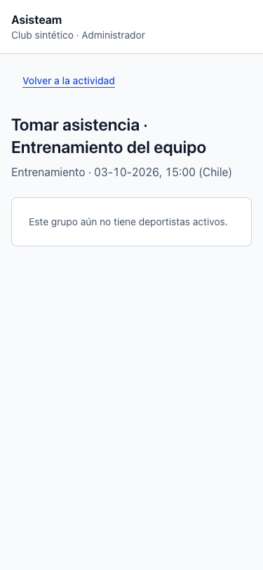
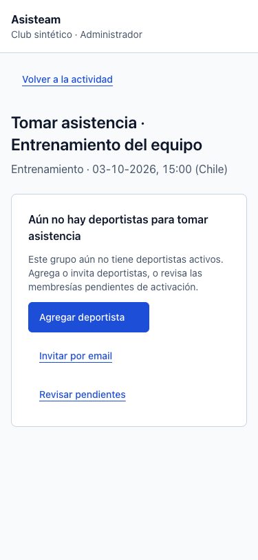
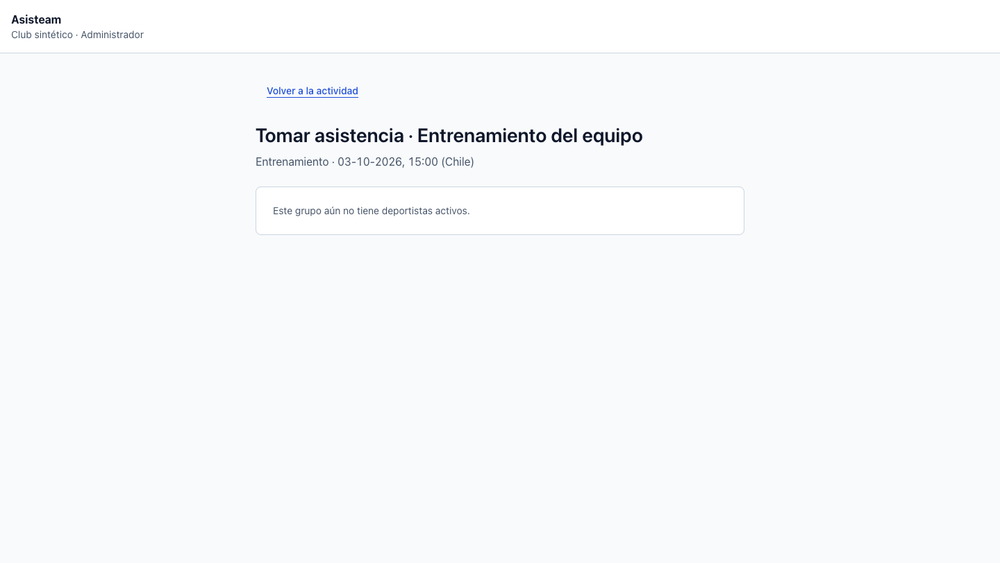
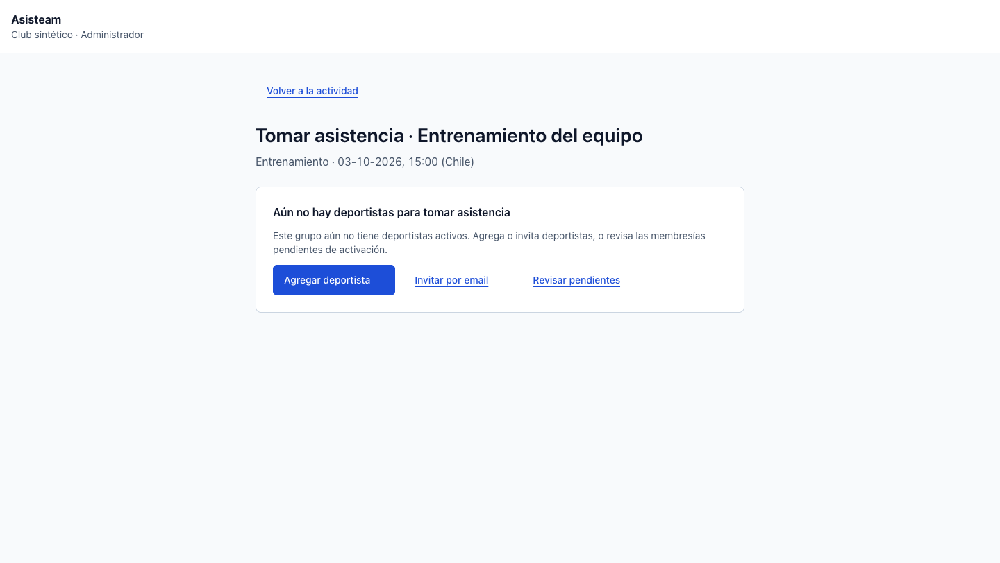
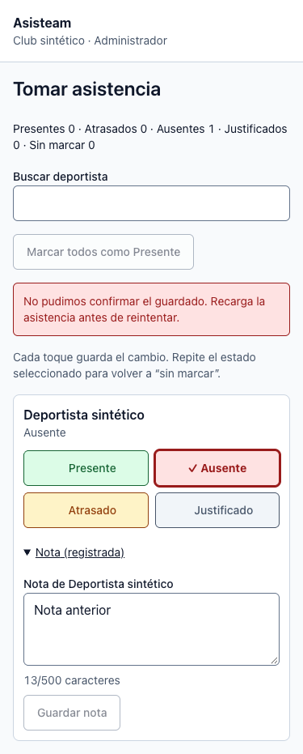
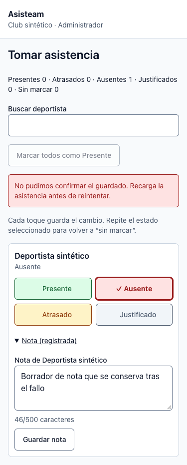

# Carga, vacíos y recuperación — #105

Base: `fdd79bec066592b390aa217caa90a5e97a964dd1` (`develop`, con #103 y #104 integrados).

## Comportamiento

- Los errores de render/carga tienen explicación pública en español, detección de falta de conexión, reintento y retorno a Mis grupos. Los límites global y del grupo no muestran el error recibido ni toman el foco automáticamente.
- Next y las respuestas del middleware comparten el texto de recurso no disponible. Las decisiones de autorización, HTTP 403/404, cookies y `private, no-store` permanecen en el middleware; no se incluyen IDs, URL solicitada, PII ni detalles internos en las respuestas.
- Los enlaces compartidos y del menú anuncian la navegación pendiente mediante `useLinkStatus`. El indicador reserva su espacio y aparece con 150 ms de demora visual para evitar destellos en transiciones rápidas.
- Actividades mantiene su encabezado y navegación durante la consulta y muestra esqueletos estáticos, sin datos ficticios. El anuncio `status` queda fuera de la región `aria-busy`, y los bloques decorativos tienen `aria-hidden`.
- Integrantes, invitaciones, actividades, agenda global, pupilos y asistencia distinguen falta de registros, búsqueda/filtros sin resultados y páginas vacías. Ofrecen agregar/invitar/crear solo a ADMIN, limpiar búsqueda/filtros, cambiar de período o volver a la primera página conservando filtros. Un operador COACH sin nómina recibe retorno y orientación para consultar a ADMIN.
- Un fallo de invitación conserva email y rol sin forzar un refresco que pueda desmontar el formulario. Un fallo demorado al guardar una nota conserva el borrador mientras revierte el estado optimista. Los mensajes no mueven el foco de forma rutinaria; Limpiar búsqueda sí devuelve el foco al campo por acción explícita.

El esqueleto usa un `Suspense` cercano a la consulta dentro de `ActivitiesPage`, **después** de validar acceso y parámetros. No se agrega un `loading.tsx` externo que adelante el streaming de rutas protegidas. Next documenta la colocación de [límites próximos a las consultas](https://nextjs.org/docs/app/getting-started/fetching-data) y el [progreso de enlaces con useLinkStatus](https://nextjs.org/docs/app/api-reference/functions/use-link-status).

## Evidencia antes/después

Chrome, datos sintéticos y componentes reales. La comparación carga los componentes previos desde el commit base. Un fixture temporal fuera del repositorio simula consultas, acciones fallidas y navegación; usa el CSS del build de producción. El encabezado del fixture es de contexto y no sustituye una prueba del shell. No hay sesión de Supabase ni datos reales.

| Escenario | Antes | Después |
|---|---|---|
| Asistencia sin nómina, 375 px |  |  |
| Asistencia sin nómina, 1440 px |  |  |
| Fallo de red demorado al guardar nota, 375 px |  |  |

Otros estados verificados:

- [Carga de actividades](after-loading-375.png), [error recuperable](after-error-375.png), [sin conexión](offline-375.png), [recurso no disponible](after-404-375.png).
- [Filtros sin resultados](after-members-375.png) y [página fuera de rango](page-out-of-range-375.png).
- [Invitación fallida con datos conservados](failed-invitation-375.png).
- [Error al 200 %](zoom-200-error.png) y [vacío de asistencia al 200 %](zoom-200-attendance.png).

[Mediciones responsive y teclado](checks.json): 37 comprobaciones, sin overflow global en 320, 375, 768, 1024 y 1440 px para los seis estados compartidos. Tab + Enter activa el reintento; el evento offline cambia la explicación y online la recupera. Los fallos conservan los datos seguros y no enfocan la alerta. La invitación mantiene el foco en Enviar; en la nota con fallo demorado Chrome retira el foco al deshabilitar el botón durante el guardado, comportamiento también observado en la base. La búsqueda se limpia y recupera el foco en la prueba de comportamiento.

[Zoom nativo 200 %](zoom-200.json): perfil temporal aislado de Chrome, configurado desde Apariencia. Ventana de 1440 px → viewport CSS de 720 px, DPR 2, `visualViewport.scale = 1`. Los seis estados no producen overflow y el reintento funciona con Tab + Enter. Las capturas usan CDP sin recorte para conservar todo el viewport físico.

## Verificación

```sh
corepack pnpm --filter @asisteam/web test
corepack pnpm --filter @asisteam/web typecheck
corepack pnpm --filter @asisteam/web build
git diff --check
```

PASS: 573 pruebas web, typecheck y build de producción. Tras la revisión final se repitieron únicamente las 27 pruebas de carga/recuperación, las 14 de asistencia afectadas y el build. La suite incluye streaming de una consulta retenida hasta resolverla, rechazo antes del streaming, aislamiento de datos privados en errores, permisos de CTA y borradores tras fallos demorados.

Las 76 pruebas de integración Supabase se omiten por la configuración habitual. No se modifican DB/RLS/RPC ni tipos generados. El repositorio no define lint y las skills heredadas `frontend-check`, `frontend-ci` y `ship` no están instaladas; se usan los gates de Asisteam y la entrega explícita de la skill principal. Turbopack necesita abrir un puerto interno fuera del sandbox; el aviso de migración de `middleware` a `proxy` es previo al cambio.

La evidencia es de componentes/fixture y pruebas de comportamiento; no representa un recorrido E2E autenticado ni una certificación con lector de pantalla. La auto-revisión se limitó al diff de #105 y sus efectos.
