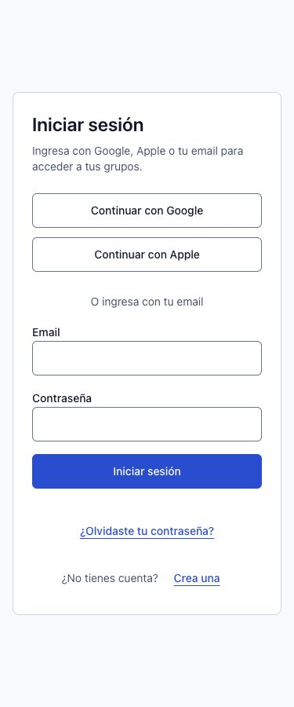
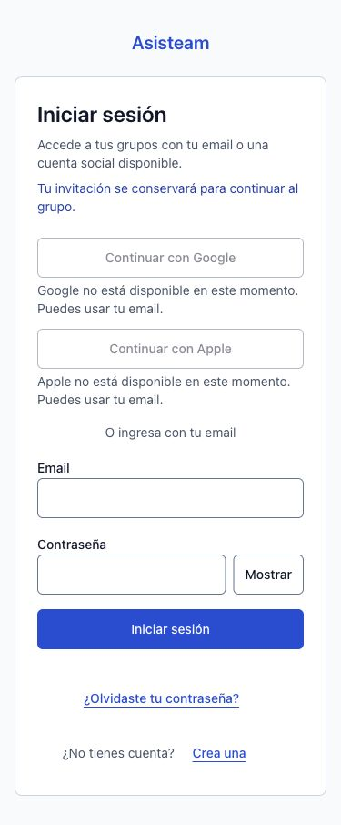
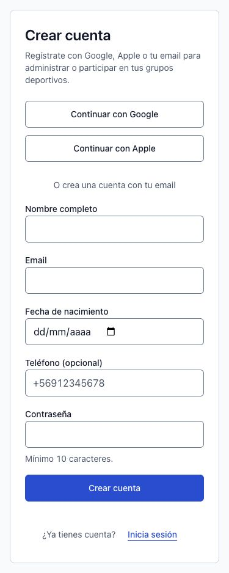
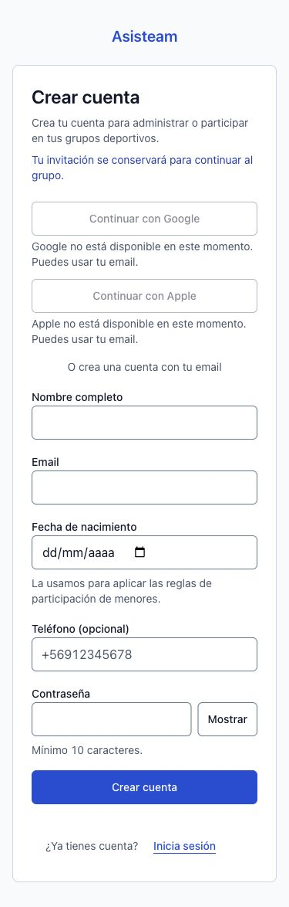

# Acceso y continuidad de invitaciones — #106

Base: `e95e6d3eb384351b34230b30d6d8d5a3cbf34718` (`develop`, con #102–#105 integrados).

## Comportamiento

- Login, registro, recuperación y restablecimiento comparten `AuthLayout`: marca Asisteam, un h1, ancho de lectura y enlaces secundarios. El código de invitación válido mantiene el contexto al alternar pantallas y después del registro, del login y del retorno OAuth. También se conserva al cancelar OAuth para poder reintentar.
- `auth-context.ts` solo construye rutas fijas con `joinCodeSchema` de core. No copia `next`, URLs externas, parámetros desconocidos ni tokens a enlaces secundarios. Los códigos inválidos y duplicados se descartan. OAuth sigue transportando el QR en cookie HttpOnly y devolviéndolo en fragmento mediante el contrato existente.
- Login y registro anuncian fallos de transporte y permiten reenviar conservando los campos. Se conserva el bloqueo de doble envío y se coordina con OAuth. Las excepciones internas de navegación se vuelven a lanzar con la API de Next para no convertir una redirección en error de conexión.
- `PasswordInput` mantiene ref, validación, pegado y autocompletado; su botón tiene etiqueta accesible estable, `aria-pressed`, `aria-controls`, estado visible Mostrar/Ocultar y activación por teclado. Se usa en login, registro y ambos campos de restablecimiento.
- OAuth anuncia el proveedor concreto durante la espera. El servidor consulta el endpoint público [GET /settings de Supabase Auth](https://supabase.github.io/auth/#get-settings), con límite de 3 segundos, y entrega únicamente los booleanos Google/Apple. Los proveedores deshabilitados tienen explicación visible y asociada al botón. Una consulta fallida se presenta como disponibilidad desconocida y permite reintentar; no expone el objeto de configuración ni secretos.
- La recuperación mantiene su mensaje anti-enumeración para cuentas existentes/inexistentes, límites y errores del proveedor. El código se guarda durante una hora en cookie HttpOnly/SameSite=Lax/Secure en producción, restringida a `/reset-password`. Solo contiene contexto de navegación; no autentica ni incorpora al grupo. No se cambian plantilla de email, Supabase SSR, contraseñas ni seguridad/duración de tokens.

El retorno desde el correo conserva la invitación **en el mismo navegador**. En otro dispositivo la recuperación sigue funcionando y se debe reabrir la invitación del grupo; el mensaje de recuperación lo explica. Una nueva solicitud sin código elimina el contexto anterior. La cookie expira por sí sola y cualquier código vuelve a validarse antes de usarlo.

## Evidencia antes/después

Datos sintéticos. Las capturas «antes» renderizan las páginas/componentes exactos de la base en un fixture temporal con el CSS de producción compartido. Las capturas «después» y las mediciones corresponden al build real de Next.js en `127.0.0.1:3106`. El servidor de desarrollo preexistente tenía CSS obsoleto; sus capturas iniciales se sustituyeron y no forman parte de esta evidencia.

| Pantalla a 375 px | Antes | Después |
|---|---|---|
| Iniciar sesión |  |  |
| Crear cuenta |  |  |

Otros estados:

- [Recuperación](forgot-password-after-375.jpg), [restablecimiento](reset-password-after-375.jpg) y [registro a 320 px](register-after-320.jpg).
- Errores de [login](login-validation-375.jpg), [registro](register-validation-375.jpg), [recuperación](forgot-password-validation-375.jpg) y [restablecimiento](reset-password-validation-375.jpg), con foco en el primer campo inválido.
- [Control de contraseña activado con teclado](password-toggle-375.jpg).

[Responsive](responsive.json): las cuatro pantallas en 320/375/768/1024/1440 px, sin overflow global, con un h1 y controles de al menos 44 px de alto. [Teclado](keyboard.json): Enter valida sin enviar campos vacíos, el foco llega al primer error, `aria-describedby` incluye ayuda antes del error y Tab/Enter activa el control de contraseña con contorno visible de 2 px.

[Zoom nativo Chrome 200 %](zoom-200.json): viewport inicial de 1512 CSS px/DPR 2 → 756 CSS px/DPR 4, `visualViewport.scale = 1`. Las cuatro pantallas no desbordan horizontalmente. La captura automatizada de Chrome recorta incorrectamente al usar zoom; se conservan las mediciones DOM y las capturas completas al 100 %. Zoom restaurado al 100 % al finalizar. Las pruebas responsive restantes se hicieron en el navegador integrado.

## Verificación

```sh
corepack pnpm --filter @asisteam/web test
corepack pnpm --filter @asisteam/web typecheck
corepack pnpm --filter @asisteam/web build
git diff --check
```

PASS: **611 pruebas web**, typecheck y build de producción. Las 99 pruebas enfocadas incluyen 38 casos nuevos de continuidad, parámetros inválidos/duplicados, reintento de red con conservación de valores, pegado, teclado, capacidades y progreso OAuth. La autorrevisión se limitó al diff del issue y sus efectos.

Las **76 integraciones Supabase están omitidas** por sus flags habituales. No se modificaron DB/RLS/RPC ni tipos generados, por lo que no corresponden pgTAP ni regeneración de tipos. No hay script `lint` en root o web; las skills heredadas `frontend-check`, `frontend-ci` y `ship` no están instaladas. Se ejecutaron los gates reales de Asisteam y la entrega de la skill principal. Turbopack necesitó permiso para abrir su puerto interno fuera del sandbox; el aviso de `middleware` → `proxy` es preexistente.

El recorrido completo de alta y los retornos OAuth se prueban por comportamiento con Auth simulado y datos sintéticos; no se crearon cuentas reales ni se usaron credenciales de proveedores. No se certifica aquí un E2E con Google/Apple reales ni una evaluación integral con lector de pantalla.
