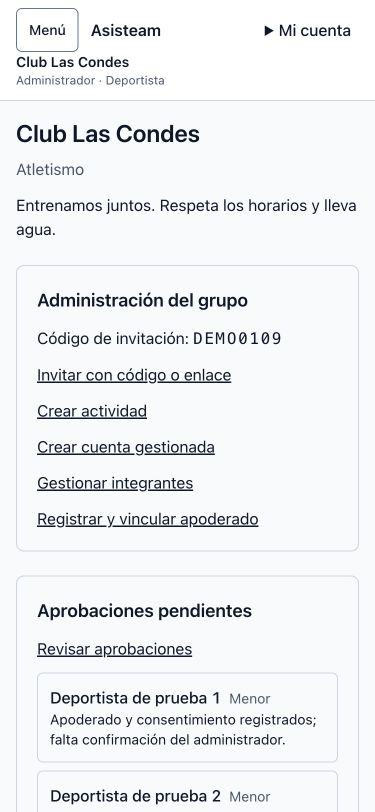
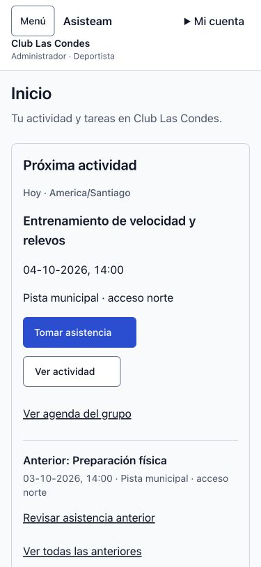
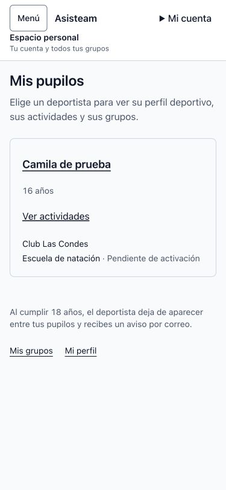
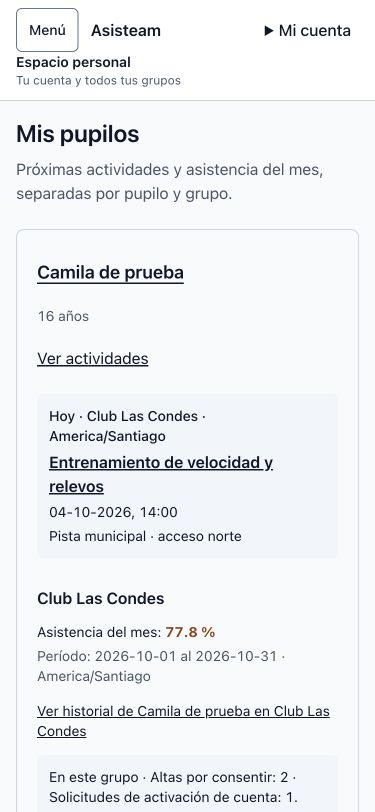

# Inicio por rol — issue #109

Base de comparación: `ccbe47bd53ff50e54b5f140e4c265124a11ba1c6` (`develop`, incluye #104, #105 y #108).

## Comportamiento

El inicio del grupo presenta primero la actividad en curso o más próxima, con fecha/hora de Chile, lugar y acceso directo a asistencia para ADMIN/COACH. La última actividad terminada queda identificada como anterior; los vacíos ofrecen crear solo a ADMIN. Las aprobaciones usan el total de la RPC y una sola fila proyectada, sin descargar ni mostrar cientos de perfiles. Administración queda en un desplegable operable por teclado. Se conserva la guía inicial de #108.

ATHLETE y multirol ven su asistencia mensual en el grupo, con período explícito y `null` como “Sin datos”. GUARDIAN obtiene acceso a altas por consentir y solicitudes de activación (estas últimas pueden estar autorizadas y permitir reenvío, por eso no se etiquetan todas como consentimientos pendientes).

En `/wards`, la próxima actividad se elige entre **todos** los grupos activos del pupilo. Los resúmenes mensuales permanecen separados por grupo: diez pupilos por página, hasta tres resúmenes de grupo por pupilo y enlace explícito al resto. Los grupos PENDING muestran su contexto de activación y consentimientos, sin consultar agenda ni métricas. Las vistas/RPC mantienen autorización, V1–V6 y cálculos; no se crean registros de asistencia ni se modifica DB/RLS/RPC.

## Evidencia antes/después

Fixture local con las páginas y AppShell reales, datos sintéticos y lecturas/acciones simuladas. La versión anterior procede de la base indicada; la versión posterior monta los componentes modificados. CSS del build de producción. Capturas finales en Chrome, sin sesión de Supabase ni datos personales reales.

| Pantalla | Antes (375 px) | Después (375 px) |
|---|---|---|
| Inicio del grupo |  |  |
| Mis pupilos |  |  |

Escritorio a 1440 px: [grupo antes](group-before-1440.jpg), [grupo después](group-after-1440.jpg), [pupilos antes](wards-before-1440.jpg), [pupilos después](wards-after-1440.jpg).

[Mediciones](checks.json): ambas pantallas sin overflow horizontal en 320/375/768/1024/1440 px; un `h1` y un `main`. En 375 px, Tomar asistencia comienza a 454 px y mide 44 px de alto. [ATHLETE vacío, Sin datos y nombre largo a 320 px](athlete-empty-320.jpg).

[Teclado en administración](keyboard-admin-375.jpg): Enter abre el desplegable y Tab lleva a Invitar con código o enlace. [Foco en Tomar asistencia](keyboard-attendance-375.jpg): enlace de salto al contenido y Tab enfocan la acción primaria sin recorrer administración.

## Gate local y límites

- PASS: 697 pruebas web; 94 pruebas focalizadas tras los últimos ajustes de presentación.
- PASS: `corepack pnpm --filter @asisteam/web typecheck` y `corepack pnpm --filter @asisteam/web build`.
- PASS: `git diff --check` y auto-revisión limitada al diff de #109.
- No hay script `lint` en los manifests raíz/web. Las skills heredadas `frontend-check`, `frontend-ci` y `ship` no están instaladas; se aplicaron los gates y la entrega explícitos del proyecto, como en #104.
- `corepack pnpm typecheck` en la raíz falla por una incompatibilidad del entorno: Turbo invoca pnpm global 11.1.1, mientras el proyecto fija 10.33.2. El typecheck del componente ejecutado directamente con Corepack pasa. No se cambiaron versiones ni archivos de configuración.
- El build pasa con permiso para el puerto interno de Turbopack. El aviso `middleware` → `proxy` es preexistente.
- Las 80 pruebas de integración opt-in no se ejecutan en el gate web normal. No hubo cambios de DB, migraciones, RLS ni RPC; la evidencia visual es de fixture y no certifica un recorrido autenticado de extremo a extremo.
- **Pendiente: zoom nativo 200 %.** El navegador integrado no modificó el zoom con el atajo; el control nativo de Chrome quedó impedido por el Mac bloqueado. Se comprobó por separado el reflow a 720 px CSS (ancho resultante de una ventana de 1440 px al 200 %), [grupo](group-reflow-720.jpg) y [pupilos](wards-reflow-720.jpg), sin overflow. Esta comprobación no se presenta como una prueba de zoom nativo.
