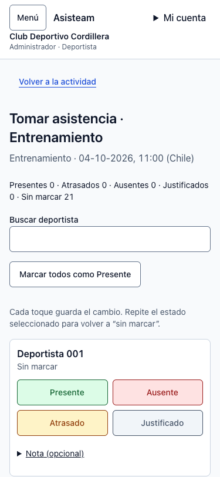
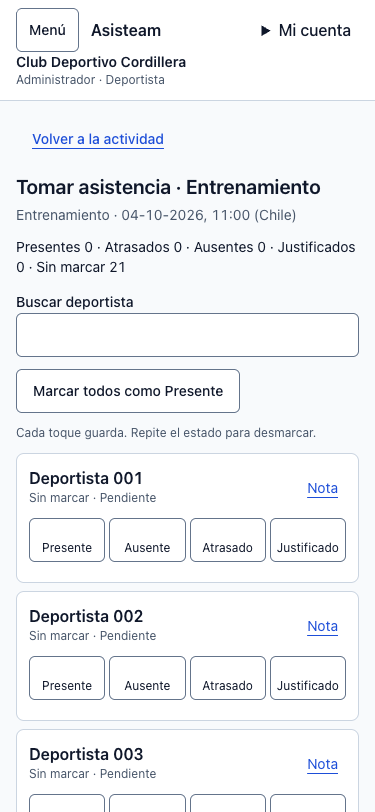
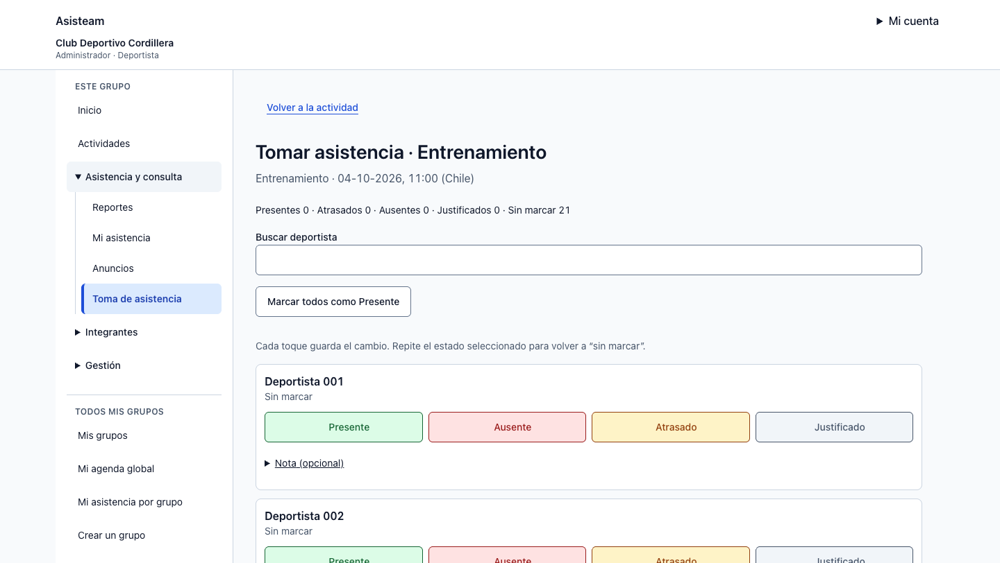
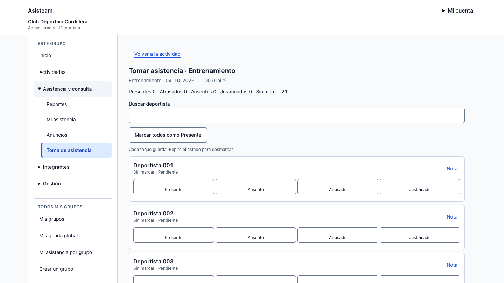

# Toma de asistencia móvil — #110

Base de comparación: `493db9facf3d20f3bfbe4c9ef148da0e4220f571` (`develop`, con #102, #103 y #104 integrados). Datos exclusivamente sintéticos; validación del 04-10-2026.

## Cambio

- Cabecera de actividad más compacta, con un único h1 y fecha/hora de Chile. Se reutilizan AppShell y los controles existentes.
- Cuatro estados en una fila desde 360 px; a 320 px se distribuyen en dos columnas para mantener las etiquetas completas. Solo la selección usa color semántico, borde reforzado y ✓; cada botón conserva `aria-pressed` y al menos 44×44 px.
- Nota junto al nombre, con revelado explícito (`aria-expanded`/`aria-controls`), borrador durante errores y límite de 500 caracteres. COACH conserva las restricciones existentes de notas y desmarcado.
- Guardando, guardado y fallo aparecen en la fila correspondiente. Un guardado concurrente en otra fila no elimina su error. El fallo revierte la selección y explica cuando no se pudo confirmar el guardado.
- Búsqueda con acción Limpiar, conteo de resultados y vacío. Paginación conserva los confirmados y lleva foco/contexto al comienzo de la nueva página. No se agregan almacenamiento local ni colas offline.
- La confirmación de “Marcar todos como Presente” explicita toda la nómina, incluidos filtros y otras páginas; conserva las marcas existentes y los lotes exitosos cuando falla otro. Las RPC, el upsert y sus contratos no cambian.

## Evidencia antes/después

Fixture temporal que monta los componentes reales `AttendancePage`, `AttendanceSheet`, `AppShell` y controles compartidos, con el CSS procesado por Tailwind del repositorio. El antes usa copias exactas de los dos componentes de asistencia de la base; el shell y las dependencias son idénticos. Router, carga y respuestas de las acciones están simulados. No es un E2E autenticado contra Supabase.

Nómina normal: 21 deportistas, ADMIN+ATHLETE. Otras variantes: nombre/actividad largos, COACH, 51 deportistas para paginación, respuesta demorada y fallo de red. Los casos de 1000 deportistas y lotes parciales se verifican en Vitest.

| Viewport | Antes | Después |
|---|---|---|
| 375×812 |  |  |
| 1440×812 |  |  |

[Mediciones de Chrome](checks.json):

| Ancho CSS | Primer deportista antes → después (y) | Altura de fila antes → después | Control después (ancho × alto) | Overflow después |
|---|---|---|---|---|
| 320 | 621 → 497 px | 234 → 178 px | 129×44 px | No |
| 375 | 577 → 453 px | 234 → 130 px | 76,25×44 px | No |
| 768 | 517 → 441 px | 182 → 130 px | 170,5×44 px | No |
| 1024 | 525 → 449 px | 182 → 130 px | 166,5×44 px | No |
| 1440 | 525 → 449 px | 182 → 130 px | 230,5×44 px | No |

A 375 px, los cuatro controles terminan en y=562 px; el primer deportista y sus acciones quedan completos dentro de 812 px. Las cifras previas difieren de la auditoría original porque #104 ya compactó el shell en la base comparada.

Otros estados comprobados:

- [320 px](after-320.png) y [nombre largo](long-name-375.png), sin truncar ni desbordar.
- [Teclado](keyboard-375.png): Tab alcanza los cuatro estados y el botón Nota; Enter/Espacio seleccionan/desmarcan. Foco visible con contorno de 2 px. La confirmación se cancela con Escape y devuelve el foco a su disparador.
- [Guardando](saving-375.png), [guardado](saved-375.png) y [error con reversión](error-375.png), con texto además de color y feedback en la fila.
- [Nota desplegada](note-375.png), [sin resultados](no-results-375.png), [segunda página con foco en la nómina](page-2-375.png), [alcance masivo con filtro](bulk-filter-375.png) y [COACH](coach-375.png).
- [Zoom nativo Chrome 200 %](zoom-200.json): dos perfiles temporales aislados; viewport inicial de 1440 CSS px/DPR 1 → 720 CSS px/DPR 2 y `visualViewport.scale = 1`. Sin overflow, con controles de 162,5×44 CSS px. Se configuró el zoom nativo del perfil, sin CSS zoom ni escalado de imagen. La captura de Chrome bajo ese zoom recorta incorrectamente; se entregan las mediciones DOM y las capturas normales en su lugar.

## Verificación técnica

```sh
corepack pnpm --filter @asisteam/web test
corepack pnpm --filter @asisteam/web typecheck
corepack pnpm --filter @asisteam/web build
git diff --check
```

PASS: **701 pruebas web**, typecheck y build de producción. Las **80 integraciones Supabase** están omitidas por sus flags habituales. No se modifican DB/RLS/RPC ni tipos generados. El repositorio no define script lint; las skills heredadas de Spendium no corresponden a sus carpetas ni stack. Se usan los gates reales de Asisteam y la entrega de la skill invocada.

Las pruebas añadidas comprueban errores independientes en solicitudes concurrentes, estados/notas confirmados al paginar y buscar, revelado accesible de la nota, límite de 500 caracteres y cabecera/advertencia futura. Las existentes cubren doble envío, reconciliación del servidor, lotes de 500, éxitos parciales, desmarcado ADMIN y restricciones COACH. La auto-revisión se limitó al diff del issue. El aviso `middleware` → `proxy` del build es preexistente.

## Validación humana pendiente

**No se realizó una medición con participantes representativos. Participantes: 0; tiempo real observado: no disponible. El objetivo de 20 deportistas en menos de 60 segundos sigue pendiente.** Las mediciones de layout y las pruebas automáticas no acreditan ese objetivo ni sustituyen una prueba en cancha.

Para completarla, un ADMIN/entrenador representativo debe registrar una nómina sintética de 20 deportistas en su teléfono habitual, incluyendo estados mixtos y una corrección. Cronometrar desde la nómina abierta hasta la última confirmación y registrar dispositivo, condiciones, tiempo real, errores y observaciones por participante. No cerrar el criterio por las capturas ni por la duración de Vitest.
