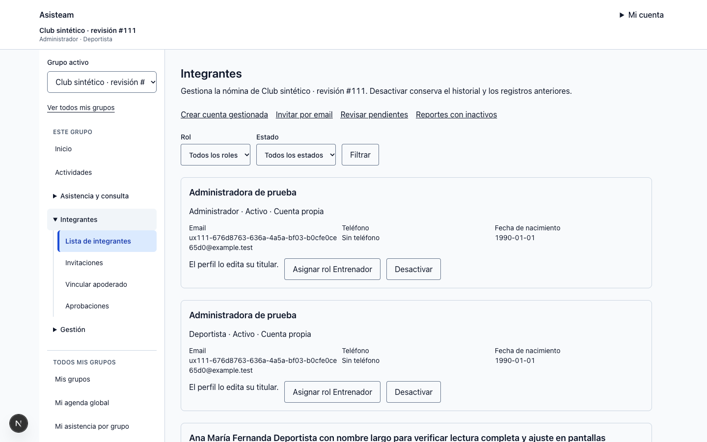
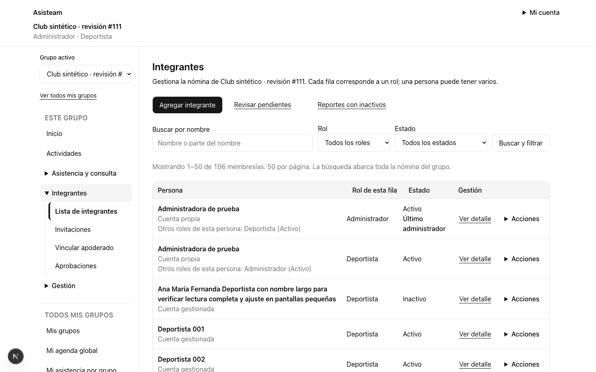
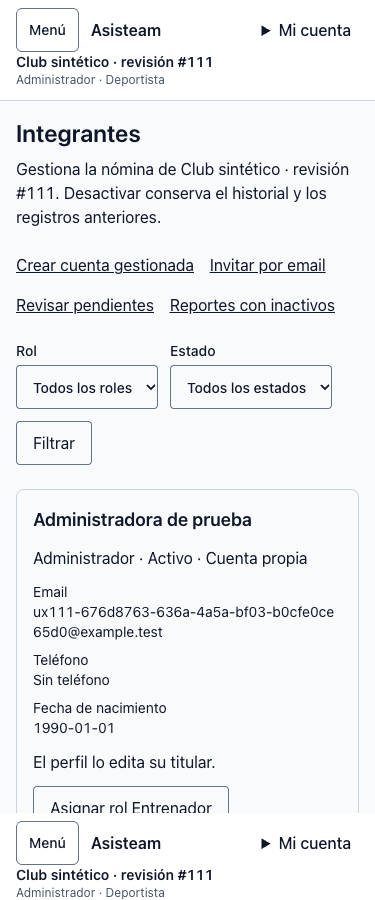
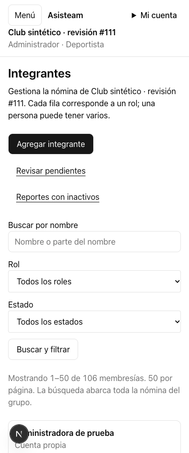

# Nómina y búsqueda de integrantes — #111

Comparación contra `b740264b7f1ed30113dcf55f9d3900b742d17c29` (`develop`). Validación del 04-10-2026 con cuentas, contactos y grupos exclusivamente sintéticos en Supabase local.

## Cambio

- Cada membership conserva su fila, identidad y acciones por rol. Nombre, rol y estado quedan visibles; contactos y edición se revelan al abrir el detalle. Los otros roles de la misma persona se indican dentro del grupo, incluso si un filtro oculta sus filas.
- Acciones secundarias en un desplegable operable con teclado; desactivar abre la confirmación compartida, identifica el rol y explica la conservación del historial. La señal de último ADMIN bloquea esa acción y explica el requisito de otro ADMIN activo. La RPC de escritura conserva su protección transaccional existente.
- Buscar por nombre filtra el conjunto autorizado antes de contar y paginar. Nombre, rol, estado y página quedan en la URL. Cambiar filtros reinicia la página; una página fuera de rango conserva el total mediante una segunda lectura limitada a 50 filas y permite volver al inicio con los filtros intactos.
- “Agregar integrante” reúne cuenta gestionada e invitación por email, explicando cada ruta. Los estados vacíos ofrecen restauración o creación.
- Un perfil modificado requiere confirmar su descarte al cancelar, cerrar detalle, navegar, filtrar o recargar. Cancelar sin cambios no pregunta; fallos de guardado y refrescos externos conservan el borrador. No se persisten perfiles en almacenamiento local.
- La migración añade `p_search`, `user_id`, `person_roles` e `is_last_admin` a `list_group_members`. Mantiene ADMIN-only, comprobación de membresía y grupo, columnas privadas existentes, `search_path` fijo y límite de 50. No cambia permisos, transiciones ni promociones.

## Antes y después

Chrome autenticado contra la aplicación Next.js y Supabase locales. El antes ejecuta la página de `develop`; el después ejecuta la rama del issue. Ambos usan el mismo grupo sintético de 106 memberships y muestran sus primeras 50 filas. Incluye una persona ADMIN+ATHLETE, nombre largo, cuentas gestionadas y estados distintos.

| Viewport | Antes | Después |
|---|---|---|
| 1440×900 |  |  |
| 375×900 |  |  |

Altura de la página a 1440 px: **11.985 → 4.301 px**, una reducción de **64,1 %** con las mismas 50 filas. Esta es una medición de layout; no mide el tiempo de una persona para completar una tarea.

[Mediciones y comprobaciones](report.json), [medición base](before-report.json):

| Ancho CSS | Ancho del documento | Desbordamiento horizontal |
|---|---|---|
| 320 | 320 | No |
| 375 | 375 | No |
| 768 | 768 | No |
| 1024 | 1024 | No |
| 1440 | 1440 | No |

Capturas adicionales: [320 px](after-320.png), [768 px](after-768.png), [1024 px](after-1024.png), [nombre largo móvil](after-375-long-name.png) y [editor con borrador](after-dirty-editor.png).

Se comprobó [reflow equivalente al zoom 200 %](after-zoom-200.png) con 720 CSS px y también [zoom nativo 200 % de Chrome](native-zoom-200.json), usando dos perfiles temporales aislados y sin CSS zoom ni cambio de viewport: 1440 CSS px/DPR 1 → 720 CSS px/DPR 2, `visualViewport.scale = 1`. Ambos conservan las 50 filas sin desbordamiento horizontal. Con zoom nativo, Enter abre Acciones y Escape devuelve el foco a su disparador.

Chrome verificó búsqueda de un integrante posterior a las primeras 50 filas, conservación de filtros/total en página fuera de rango, apertura de acciones con teclado, Escape con retorno del foco, bloqueo del último ADMIN y cancelación de enlaces/filtros/edición sin perder el borrador. Las pruebas de componente cubren además navegación atrás, error de guardado y refresco externo.

## Verificación técnica

- Web: **713 pruebas PASS**; las integraciones opt-in no forman parte de esa cifra (80 omitidas en esa ejecución, antes de añadir la nueva prueba HTTP).
- Core: **148 pruebas PASS**.
- pgTAP: **1.450 pruebas PASS**, 32 archivos; incluye búsqueda después de 50 filas, total, filtros, comodines literales, homónimos, multirol, último ADMIN y denegaciones para anon/ATHLETE/GUARDIAN/COACH/otro grupo.
- Tipos regenerados desde Supabase local: la diferencia corresponde exclusivamente al nuevo argumento y proyección de `list_group_members`.
- Typecheck, build de producción de Next.js y `git diff --check`: **PASS**. El aviso de deprecación de `middleware` es preexistente. El repositorio no define script lint.
- Integración HTTP del módulo: **3 pruebas PASS** (concurrencia del último ADMIN, aislamiento/edición y nuevo contrato de búsqueda), **1 fallo preexistente** descrito abajo. No se presenta la suite HTTP completa como aprobada.

Comandos usados desde `apps/web`, con las dependencias ya instaladas:

```sh
node node_modules/vitest/vitest.mjs run
node node_modules/next/dist/bin/next build
RUN_MEMBER_MANAGEMENT_INTEGRATION=1 node node_modules/vitest/vitest.mjs run 'src/app/groups/[groupId]/members/member-management.integration.test.ts'
```

Desde la raíz:

```sh
node node_modules/typescript/bin/tsc --noEmit -p apps/web/tsconfig.json
node_modules/.bin/supabase test db
git diff --check
```

El ejecutable global de pnpm intentó descargar otra versión y falló. Para la integración se usó un adaptador temporal de `pnpm exec supabase` que ejecuta exclusivamente el CLI instalado del repositorio; no modifica las pruebas ni sus aserciones. Build y Docker requirieron ejecución fuera del sandbox local.

### Fallo preexistente de integración

`dos reactivaciones disputan el último cupo sin exceder 500` falla al insertar sus 497 deportistas de preparación con `subscription_athlete_limit`, antes de las reactivaciones que pretende comprobar. Se reprodujo el mismo error ejecutando el test original en la copia de `develop`; tanto ese caso como `enforce_subscription_capacity()` de `20261003010000_group_subscriptions.sql` eran idénticos a la base. La reproducción usa la misma instancia local, cuya política de suscripción no cambia en este issue. El #111 solo modifica la RPC de lectura de la nómina. La adaptación de ese fixture a los planes actuales queda fuera del alcance.
