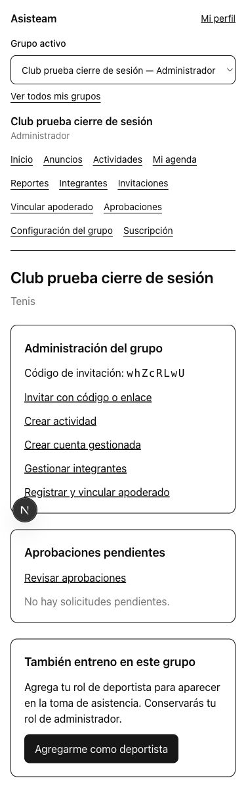
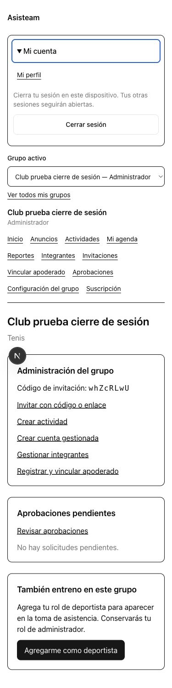
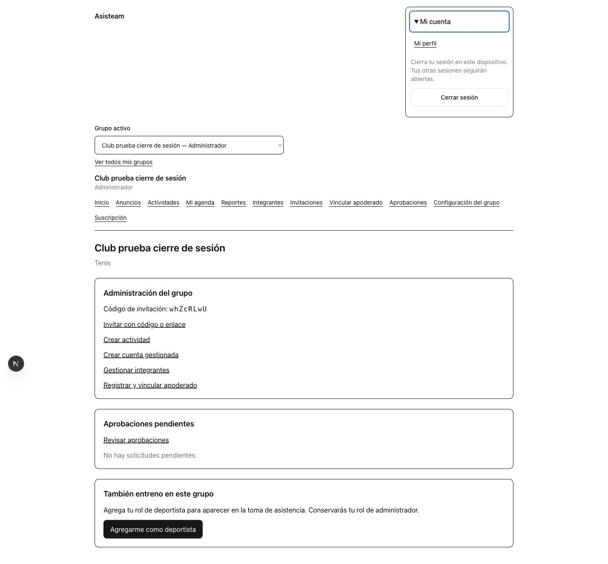
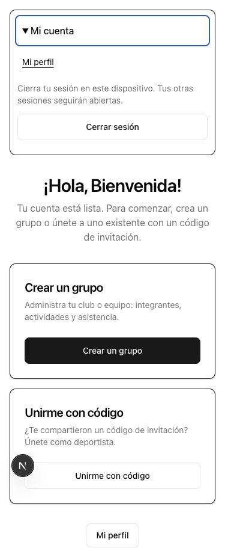
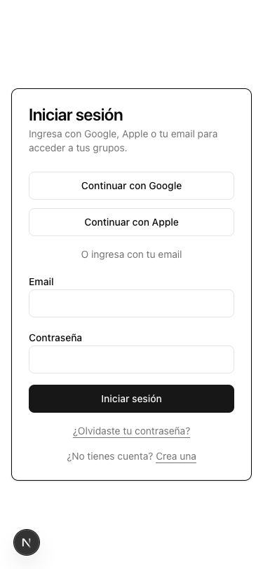

# Evidencia de #101 — Cierre de sesión

Validación local del 03-10-2026 con Chrome, Next.js y Supabase local. Todas las cuentas y grupos utilizados son sintéticos.

## Antes y después

Antes: commit base `d7dff870f2b2cdca1198036c2682676a5ef3cc11`, sin acción de salida en la navegación del grupo.

| Antes, 375 px | Después, 375 px |
| --- | --- |
|  |  |







## Comprobaciones

- Grupo, perfil, mis grupos, pupilos y bienvenida: menú abierto con Enter en Chrome; botón de salida con altura mínima de 44 px.
- Las cinco superficies se comprobaron a 320, 375, 768, 1024 y 1440 px: `scrollWidth` igual al ancho de la ventana, sin desplazamiento horizontal.
- Salida desde pupilos con Enter: estado «Cerrando sesión…», control deshabilitado y redirección a `/login`.
- Volver atrás y recargar después de salir mantiene login; abrir la URL privada del grupo muestra «No encontrado», sin contenido del grupo.
- Vitest verifica fallo de Supabase, excepción de red, fallo de escritura de cookies, mensaje genérico sin datos internos, reintento y prevención de doble envío.
- Integración real con Supabase local verifica eliminación de cookies HttpOnly, invalidación del refresh token local, conservación de una segunda sesión de la misma cuenta y salida idempotente.
- Typecheck y build de producción: PASS. El build conserva el aviso preexistente de Next.js sobre migrar la convención `middleware` a `proxy`.

## Reproducción automatizada

```sh
pnpm --filter @asisteam/web test
RUN_SIGN_OUT_INTEGRATION=1 pnpm --filter @asisteam/web exec vitest run src/app/login/sign-out.integration.test.ts
pnpm --filter @asisteam/web typecheck
pnpm --filter @asisteam/web build
```

La integración requiere Supabase local iniciado y rechaza hosts remotos. Crea una cuenta sintética sin grupo y elimina exclusivamente ese fixture al terminar.

## Límite de la validación manual

El zoom nativo de navegador al 200 % queda pendiente de comprobación manual. El atajo enviado mediante el control de pestaña no alteró el zoom y la lectura del navegador nativo tardó más de siete minutos; no se considera una prueba superada. La matriz de anchos anterior sí se verificó sobre el DOM renderizado y las capturas.
